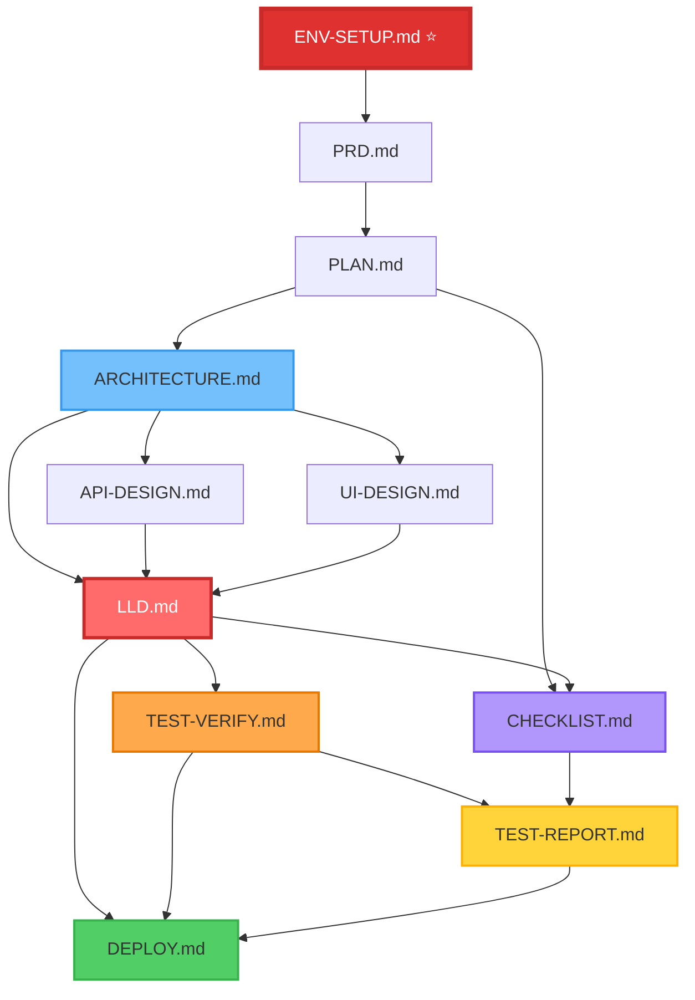

# 📚 [프로젝트명] - 개발 문서 가이드

**최종 업데이트**: [작성일]

---

## 📖 문서 개요

이 디렉토리는 **[프로젝트 설명]**의 모든 개발 문서 템플릿을 포함하고 있습니다.

각 템플릿은 프로젝트의 특정 단계(기획, 설계, 개발, 배포)에서 사용되며, **체계적이고 일관된 개발 프로세스**를 보장합니다.

---

## 🎯 문서의 목적

- ✅ **표준화된 개발 프로세스** 제공
- ✅ **문서 간 일관성** 유지
- ✅ **개발자 온보딩 시간 단축**
- ✅ **프로젝트 품질 및 유지보수성 향상**
- ✅ **테스트 기반 개발(TDD) 강제**

---

## 📂 문서 목록 및 설명

### 0. **ENV-SETUP.md** ⭐ (개발 환경 초기 설정 가이드) - 필수 선행 작업!
- **목적**: 개발 시작 전 필수 환경 설정 및 검증
- **대상**: 모든 개발자 (프로젝트 시작 시 첫 번째로 참조)
- **주요 내용**:
  - **Phase 0**: 사전 준비 (필요한 서비스 및 도구 목록)
  - **Phase 1**: 로컬 개발 도구 설치 (Node.js, Git, Docker, CLI)
  - **Phase 2**: 서비스 계정 생성 (BaaS, Auth, AI, 배포, 모니터링)
  - **Phase 3**: API 키 및 토큰 수집 (안전한 관리 가이드)
  - **Phase 4**: 데이터베이스 설정 (PostgreSQL, Supabase, Prisma 등)
  - **Phase 5**: MCP 서버 설치 및 설정 (Claude Desktop 연동)
  - **Phase 6**: 환경 변수 설정 (.env 파일 생성 및 검증)
  - **Phase 7**: 환경 검증 (전체 통합 테스트)
  - 트러블슈팅 가이드
  - 보안 체크리스트
- **사용 시점**: 프로젝트 착수 전 최우선 완료 (PLAN.md 시작 전)
- **완료 기준**: 모든 Phase 완료, 개발 환경 검증 성공
- **템플릿**: ENV-SETUP-TEMPLATE.md
- **⚠️ 중요**: ENV-SETUP.md 완료 없이는 개발 시작 불가!

---

### 1. **PRD.md** (제품 요구사항 문서)
- **목적**: 프로젝트의 비즈니스 요구사항과 기능 명세 정의
- **대상**: PM, 기획자, 개발 리드
- **주요 내용**:
  - 프로젝트 배경 및 목표
  - 핵심 기능 목록
  - 사용자 스토리
  - 성공 지표 (KPI)
  - 우선순위 및 일정
- **사용 시점**: 프로젝트 시작 전 기획 단계
- **템플릿**: PRD-TEMPLATE.md

---

### 2. **PLAN.md** (프로젝트 계획 문서)
- **목적**: 프로젝트 전체 로드맵 및 기술 스택 선정
- **대상**: 기술 리드, 아키텍트, PM
- **주요 내용**:
  - 기술 스택 선정 이유
  - 핵심 컴포넌트 목록
  - 개발 로드맵 (Phase별)
  - 환경 변수 및 설정
  - 학습 리소스
  - 체크리스트
- **사용 시점**: 프로젝트 착수 단계
- **버전 정책**: 모든 기술 버전은 공식 출처에서 검증 필수
- **템플릿**: PLAN-TEMPLATE.md

---

### 3. **ARCHITECTURE.md** ⭐ (고수준 아키텍처 설계)
- **목적**: 시스템 전체의 아키텍처 설계 및 구조 정의
- **대상**: 아키텍트, 시니어 개발자
- **주요 내용**:
  - 시스템 아키텍처 다이어그램 (Mermaid)
  - 컴포넌트 구조 및 책임
  - 데이터 흐름 및 통신 방식
  - **모노레포 아키텍처** (Turborepo + pnpm)
  - 기술 스택 상세 (프론트엔드, 백엔드, 인프라)
  - 확장성 및 성능 고려사항
  - 보안 아키텍처
- **사용 시점**: 개발 시작 전 설계 단계
- **참조**: PLAN.md → ARCHITECTURE.md
- **템플릿**: ARCHITECTURE-TEMPLATE.md

---

### 4. **API-DESIGN.md** (API 설계 문서)
- **목적**: RESTful API 및 GraphQL 엔드포인트 명세
- **대상**: 백엔드 개발자, 프론트엔드 개발자
- **주요 내용**:
  - API 엔드포인트 목록
  - Request/Response 스키마
  - 인증 및 권한 정책
  - 에러 코드 및 처리
  - Rate Limiting
  - Webhook 명세
- **사용 시점**: 아키텍처 설계 후, 개발 시작 전
- **참조**: ARCHITECTURE.md → API-DESIGN.md
- **템플릿**: API-DESIGN-TEMPLATE.md

---

### 5. **UI-DESIGN.md** (UI/UX 디자인 가이드)
- **목적**: 일관된 UI/UX 디자인 시스템 정의
- **대상**: 프론트엔드 개발자, UI/UX 디자이너
- **주요 내용**:
  - **디자인 시스템**: shadcn/ui, DaisyUI
  - 컬러 팔레트 및 타이포그래피
  - 컴포넌트 라이브러리
  - 레이아웃 가이드
  - 반응형 디자인 원칙
  - 접근성 (a11y) 가이드
  - **필수 디자인 가이드라인** 준수
- **사용 시점**: 개발 시작 전 디자인 단계
- **금지 사항**: Material Design, Radix UI 사용 금지
- **참조**: ARCHITECTURE.md → UI-DESIGN.md
- **템플릿**: UI-DESIGN-TEMPLATE.md

---

### 6. **LLD.md** ⭐⭐⭐ (저수준 설계 문서)
- **목적**: 상세 구현 레벨의 설계 문서 (컴포넌트, 함수, 알고리즘)
- **대상**: 모든 개발자 (필수 참조 문서)
- **주요 내용**:
  - **⚠️ 개발 프로세스 및 테스트 요구사항** (필수 준수)
  - **커밋 규칙 및 전략**
  - **Git Hook을 통한 자동화된 코드 품질 관리**
    - Pre-commit: Lint Fix → Build → Unit Test
    - Pre-push: Build → E2E Test (로컬)
  - 컴포넌트 설계 (Props, 상태 관리, 주요 로직)
  - 데이터 구조 및 알고리즘
  - 함수 시그니처 (Server Actions, API)
  - 에러 처리 전략
  - 캐싱 전략
  - 보안 구현 (RLS, XSS, CSRF, Rate Limiting)
  - 성능 최적화
  - 테스트 전략 (Unit, Integration, E2E)
- **필수 준수 사항**:
  - 각 개발 단위는 **Unit Test 100% 통과** 후 다음 단계 진행
  - 전체 개발 완료 후 **Integration Test** 및 **E2E Test** 필수
  - **Git Hook 자동 검증** (커밋/푸시 시 자동 실행)
- **사용 시점**: 개발 전 과정 (설계 → 구현 → 테스트)
- **참조**:
  - ARCHITECTURE.md → LLD.md
  - API-DESIGN.md → LLD.md
  - UI-DESIGN.md → LLD.md
  - LLD.md → TEST-VERIFY.md
- **템플릿**: LLD-TEMPLATE.md

---

### 7. **TEST-VERIFY.md** ⭐ (테스트 및 검증 전략)
- **목적**: 모든 테스트 전략 및 검증 가이드
- **대상**: 모든 개발자, QA 엔지니어
- **주요 내용**:
  - **Unit Test 작성 가이드** (Vitest, Jest, React Testing Library)
  - **Integration Test 작성 가이드**
  - **E2E Test 작성 가이드** (Playwright)
  - 테스트 커버리지 목표 및 측정 방법
  - CI/CD 파이프라인 통합 전략
  - 테스트 더블 (Mock, Stub, Spy) 사용법
  - TDD (Test-Driven Development) 실천 방법
- **사용 시점**: 개발 전 과정 (테스트 작성 시 항상 참조)
- **참조**: LLD.md → TEST-VERIFY.md → **TEST-REPORT.md**
- **템플릿**: TEST-VERIFY-TEMPLATE.md

---

### 8. **TEST-REPORT.md** ⭐ (테스트 실행 리포트) - 새로 추가!
- **목적**: 전체 테스트 실행 결과 추적 및 리포팅
- **대상**: 모든 개발자, QA 엔지니어
- **주요 내용**:
  - **전체 테스트 현황** (Test Suites, Test Cases, 통과율)
  - **Day별/Phase별 테스트 진행 상황**
  - **단위 테스트 상세 결과** (파일별, 케이스별)
  - **커버리지 리포트** (Statements, Branch, Functions, Lines)
  - **테스트 실행 방법 및 명령어**
  - **테스트 커버리지 목표** (현재 vs 목표)
  - **테스트 전략** (TDD, 테스트 피라미드)
  - **Day별 추가 예정 테스트 목록**
  - **테스트 실패 이력 및 해결 방법**
- **업데이트 주기**: 매 Day/Phase 완료 후
- **실행 명령어**:
  ```bash
  # 테스트 실행
  pnpm test                    # 단위 테스트
  pnpm test:cov                # 커버리지 리포트
  pnpm test:e2e                # E2E 테스트

  # 커버리지 HTML 리포트 열기
  open coverage/lcov-report/index.html
  ```
- **사용 시점**: 개발 전 과정 (테스트 실행 시 항상 참조)
- **참조**: LLD.md → TEST-VERIFY.md → **TEST-REPORT.md**
- **템플릿**: TEST-REPORT-TEMPLATE.md
- **커버리지 목표**:
  - Unit Test: 80%+
  - Integration Test: 70%+
  - E2E Test (Critical Path): 100%
- **사용 시점**: 개발 전 과정 (테스트 작성 시 항상 참조)
- **참조**: LLD.md → TEST-VERIFY.md
- **템플릿**: TEST-VERIFY-TEMPLATE.md

---

### 9. **CHECKLIST.md** ⭐ (프로젝트 체크리스트) - 새로 추가!
- **목적**: Day별/Week별 작업 진행 상황 추적
- **대상**: 모든 개발자, PM
- **주요 내용**:
  - **전체 진행 상황** (진행률, Week별 현황)
  - **주요 마일스톤 현황** (상태 추적)
  - **Week별/Day별 체크리스트**
    - Morning/Afternoon Session 작업 목록
    - 완료 기준 및 검증 항목
    - 테스트 검증 섹션 (TEST-REPORT.md 연동)
  - **테스트 체크리스트** (Backend, Frontend, Production)
  - **배포 체크리스트** (배포 플랫폼별)
  - **문서화 체크리스트**
  - **블로커 및 이슈 추적**
  - **다음 단계** (확장 기능 목록)
- **업데이트 주기**: 매일 작업 종료 시
- **사용 시점**: 개발 전 과정 (매일 참조 및 업데이트)
- **참조**: PLAN.md → CHECKLIST.md → TEST-REPORT.md
- **템플릿**: CHECKLIST-TEMPLATE.md
- **진행률 추적**:
  - 작업 시작 시: "⏳ 진행 중" 표시
  - 작업 완료 시: 체크박스 체크 및 "✅ 완료" 표시
  - 블로커 발생 시: 이슈 추적 섹션에 기록
  - 매일 종료 시: 전체 진행률 업데이트

---

### 10. **DEPLOY.md** (배포 및 운영 가이드)
- **목적**: 프로젝트 배포 및 CI/CD 파이프라인 구성
- **대상**: DevOps 엔지니어, 백엔드 개발자
- **주요 내용**:
  - 배포 환경 설정 (Development, Staging, Production)
  - CI/CD 파이프라인 (GitHub Actions, GitLab CI 등)
  - **GitHub Actions 권한 설정 가이드** (필수)
  - 배포 전략 (Blue-Green, Canary, Rolling)
  - 모니터링 및 로깅 (Sentry, Datadog 등)
  - 롤백 전략
  - **배포 문제 해결** (Troubleshooting)
  - **배포 상태 확인 명령어** (gh CLI, curl 등)
- **사용 시점**: 개발 완료 후 배포 단계
- **참조**: LLD.md → DEPLOY.md
- **템플릿**: DEPLOY-TEMPLATE.md

---

## 🗺️ 문서 읽기 순서 (개발 프로세스별)

```
┌─────────────────────────────────────────────────────────────┐
│  프로젝트 라이프사이클별 문서 참조 순서                        │
└─────────────────────────────────────────────────────────────┘

📌 0️⃣ 환경 설정 단계 ⭐ (최우선!)
   └─> ENV-SETUP.md
       (개발 환경 초기 설정 및 검증)
       Phase 0-7: 도구 설치 → 계정 생성 → API 키 수집 →
       DB 설정 → MCP 서버 → 환경 변수 → 검증

       ⚠️ 이 단계를 완료하지 않으면 개발 시작 불가!

📌 1️⃣ 기획 단계
   └─> PRD.md
       (제품 요구사항 정의)

📌 2️⃣ 계획 단계
   └─> PLAN.md
       (기술 스택 선정, 로드맵 수립)

📌 3️⃣ 설계 단계
   ├─> ARCHITECTURE.md ⭐
   │   (고수준 아키텍처 설계)
   │
   ├─> API-DESIGN.md
   │   (API 명세 작성)
   │
   └─> UI-DESIGN.md
       (디자인 시스템 정의)

📌 4️⃣ 상세 설계 단계
   └─> LLD.md ⭐⭐⭐
       (컴포넌트, 함수, 알고리즘 상세 설계)
       (개발 프로세스 및 테스트 요구사항)

📌 5️⃣ 개발 단계
   ├─> LLD.md
   │   (구현 시 지속적 참조)
   │
   ├─> CHECKLIST.md ⭐
   │   (Day별 작업 추적 및 진행 상황 관리)
   │
   ├─> TEST-VERIFY.md ⭐
   │   (각 개발 단위별 테스트 작성)
   │
   └─> TEST-REPORT.md ⭐
       (테스트 결과 및 커버리지 추적)

📌 6️⃣ 배포 단계
   └─> DEPLOY.md
       (CI/CD 구성 및 배포)

📌 7️⃣ 운영 및 유지보수
   ├─> DEPLOY.md
   │   (모니터링, 트러블슈팅)
   │
   ├─> TEST-REPORT.md
   │   (회귀 테스트 결과 추적)
   │
   └─> CHECKLIST.md
       (버그 수정 및 기능 추가 작업 관리)
```

---

## 🔗 문서 간 참조 관계도



**범례**:
- ⭐ **진한 빨간색**: ENV-SETUP.md (최우선 필수 문서, 개발 시작 전 완료!)
- 🔴 **빨간색**: LLD.md (핵심 문서, 개발 시 필수 참조)
- 🟠 **주황색**: TEST-VERIFY.md (테스트 전략)
- 🔵 **파란색**: ARCHITECTURE.md (아키텍처 설계)
- 🟢 **초록색**: DEPLOY.md (배포 및 운영)
- 🟣 **보라색**: CHECKLIST.md (작업 추적 및 진행 상황 관리)
- 🟡 **노란색**: TEST-REPORT.md (테스트 결과 및 커버리지 보고)

---

## 💼 사용 시나리오별 가이드

### 시나리오 1: 새로운 프로젝트 시작
0. **ENV-SETUP.md** ⭐ 완료 → 개발 환경 설정 및 검증 (필수 선행!)
1. **PRD.md** 작성 → 요구사항 정의
2. **PLAN.md** 작성 → 기술 스택 및 로드맵 수립
3. **ARCHITECTURE.md** 작성 → 시스템 아키텍처 설계
4. **API-DESIGN.md** 작성 → API 명세
5. **UI-DESIGN.md** 작성 → 디자인 시스템
6. **LLD.md** 작성 → 상세 설계
7. 개발 시작 (LLD + TEST-VERIFY 참조)

---

### 시나리오 2: 새로운 기능 추가
1. **CHECKLIST.md** → Week/Day 작업 항목 확인 ⭐
2. **PRD.md** 업데이트 → 새 기능 요구사항 추가
3. **ARCHITECTURE.md** 검토 → 기존 아키텍처에 미치는 영향 분석
4. **API-DESIGN.md** 업데이트 (필요 시) → 새 API 엔드포인트 추가
5. **LLD.md** 업데이트 → 새 컴포넌트/함수 설계
6. **TEST-VERIFY.md** 참조 → 테스트 작성
7. 개발 시작:
   - Git Hook 자동 검증 (Lint → Build → Unit Test)
   - 각 개발 단위별 100% 테스트 통과 확인
   - 전체 완료 후 Integration/E2E 테스트
8. **TEST-REPORT.md** 업데이트 (테스트 결과 기록) ⭐
9. **CHECKLIST.md** 완료 체크 ⭐
10. **DEPLOY.md** 참조 → 배포

---

### 시나리오 3: 버그 수정
1. **CHECKLIST.md** → 새로운 버그 수정 작업 추가 ⭐
2. **LLD.md** 참조 → 관련 컴포넌트/함수 찾기
3. **TEST-VERIFY.md** 참조 → 실패하는 테스트 케이스 작성 (TDD)
4. 버그 수정
5. 테스트 통과 확인
6. **TEST-REPORT.md** 업데이트 (회귀 테스트 결과 기록) ⭐
7. **CHECKLIST.md** 버그 수정 완료 체크 ⭐
8. Git commit (Pre-commit Hook 자동 실행)
9. Git push (Pre-push Hook 자동 실행, E2E 테스트 로컬)
10. **DEPLOY.md** 참조 → Hotfix 배포

---

### 시나리오 4: 코드 리뷰 준비
1. **LLD.md** 참조 → 설계 의도 확인
2. **TEST-VERIFY.md** 참조 → 테스트 커버리지 확인
3. Git Hook 통과 여부 확인:
   - Pre-commit: ✅ Lint Fix, Build, Unit Test
   - Pre-push: ✅ Build, E2E Test (로컬)
4. 코드 리뷰 요청

---

### 시나리오 5: 배포 및 모니터링
1. **DEPLOY.md** 참조:
   - GitHub Actions 권한 확인
   - CI/CD 파이프라인 실행
   - 배포 상태 확인 명령어 실행
2. 배포 후 모니터링:
   - [모니터링 도구] 에러 로그 확인
   - 성능 메트릭 확인
3. 문제 발생 시:
   - **DEPLOY.md** 배포 문제 해결 섹션 참조
   - 롤백 전략 실행

---

## ⚠️ 필수 준수 사항

### 1. 테스트 기반 개발 (TDD) 강제

**LLD.md**에 정의된 규칙:

```
✅ 각 개발 단위는 Unit Test 100% 통과 후 다음 단계 진행
✅ 전체 개발 완료 후 Integration Test + E2E Test 필수
✅ Git Hook을 통한 자동 검증
✅ 모든 테스트 결과를 TEST-REPORT.md에 기록 ⭐
```

**TEST-REPORT.md 업데이트 의무** ⭐:
- 각 Day/Phase 작업 완료 후 테스트 결과 즉시 기록
- 테스트 커버리지 변화 추적
- 실패 이력 및 해결 방법 문서화

**금지 사항**:
- ❌ Unit Test가 실패한 상태에서 다음 개발 단위 작업 시작
- ❌ "나중에 테스트 작성하겠습니다" 방식의 개발
- ❌ 테스트 없이 기능만 구현하는 행위
- ❌ 테스트 결과를 TEST-REPORT.md에 기록하지 않는 행위 ⭐

---

### 2. Git Hook 자동 품질 관리

**Pre-commit Hook** (커밋 전):
1. 🔧 Lint Fix → ESLint 자동 수정
2. 🏗️ Build → TypeScript 컴파일 검증
3. 🧪 Unit Test → Vitest/Jest 실행

**Pre-push Hook** (푸시 전):
1. 🏗️ Build → TypeScript 컴파일 검증
2. 🎭 E2E Test → Playwright 실행 (로컬에서만, CI/CD 제외)

**⚠️ 중요**: E2E 테스트는 비용 문제로 로컬에서만 실행됩니다.

---

### 3. 커밋 메시지 컨벤션

```bash
<type>(<scope>): <subject>

# 예시
feat(auth): 사용자 로그인 기능 추가
fix(api): 데이터 조회 시 null 처리 오류 수정
test(user): 사용자 생성 Unit Test 추가
```

**Type 종류**:
- `feat`: 새로운 기능
- `fix`: 버그 수정
- `test`: 테스트 코드 추가/수정
- `refactor`: 코드 리팩토링
- `docs`: 문서 수정
- `style`: 코드 스타일 변경
- `chore`: 빌드 프로세스 변경
- `perf`: 성능 개선

---

### 4. 작업 진행 관리 및 문서화 ⭐

**CHECKLIST.md 필수 사용**:

```
✅ 모든 Day별/Week별 작업은 CHECKLIST.md에서 확인
✅ 작업 시작 전 해당 Day/Week 체크리스트 읽기
✅ 작업 완료 후 즉시 체크박스 체크
✅ 블로커 발생 시 CHECKLIST.md에 기록
```

**작업 흐름**:
1. **작업 시작 전**: CHECKLIST.md에서 해당 Day/Week 작업 항목 확인
2. **개발 중**: LLD.md 참조하며 구현
3. **테스트 작성**: TEST-VERIFY.md 참조
4. **테스트 완료**: TEST-REPORT.md 업데이트
5. **작업 완료**: CHECKLIST.md 체크박스 체크

**금지 사항**:
- ❌ CHECKLIST.md 확인 없이 작업 시작
- ❌ 완료된 작업을 체크하지 않는 행위
- ❌ 블로커를 기록하지 않고 넘어가는 행위

---

### 5. 문서 버전 검증

**PLAN.md** 및 모든 기술 문서:
- ✅ 모든 기술 버전은 **공식 출처**에서 검증 필수
- ✅ GitHub Releases, npm 공식 페이지 참조
- ❌ 웹 검색 결과만으로 버전 결정 금지

**예시**:
```
❌ 잘못된 예: Zod 3.25+ (웹 검색)
✅ 올바른 예: Zod 4.1.12+ (https://github.com/colinhacks/zod/releases 검증)
```

---

### 6. 디자인 시스템 준수

**UI-DESIGN.md** 필수 가이드라인:
- ✅ shadcn/ui, DaisyUI 사용
- ❌ Material Design, Radix UI 사용 금지

---

## 📊 테스트 커버리지 목표

| 테스트 유형 | 최소 커버리지 | 권장 커버리지 |
|------------|--------------|--------------|
| Unit Test | 80% | 90%+ |
| Integration Test | 70% | 80%+ |
| E2E Test (Critical Path) | 100% | 100% |

**커버리지 측정**:
```bash
npm run test:coverage
# 또는
pnpm test:coverage

# 상세 리포트 확인
open coverage/index.html
```

---

## 🚀 빠른 시작 가이드

### 1. 문서 템플릿 복사
```bash
# 새 프로젝트에 템플릿 복사
cp -r format/ ../[프로젝트명]/docs/
```

### 2. 각 템플릿 작성 순서 (⚠️ 순서 엄수!)
0. **ENV-SETUP-TEMPLATE.md** → ENV-SETUP.md 작성 및 완료 ⭐ (최우선!)
   - Phase 0-7 모두 완료 후 검증 필수
   - 완료 기준: 로컬 환경 정상 동작 확인
1. PRD-TEMPLATE.md → PRD.md 작성 (요구사항 정의)
2. PLAN-TEMPLATE.md → PLAN.md 작성 (기술 스택 및 로드맵)
3. ARCHITECTURE-TEMPLATE.md → ARCHITECTURE.md 작성 (시스템 설계)
4. LLD-TEMPLATE.md → LLD.md 작성 (상세 설계)
5. 개발 시작

### 3. Git Hook 설정
```bash
# Husky 설치
pnpm add -D husky

# 초기화
npx husky install

# Pre-commit Hook 생성
npx husky add .husky/pre-commit "npm run pre-commit"

# Pre-push Hook 생성
npx husky add .husky/pre-push "npm run pre-push"
```

### 4. package.json 스크립트 추가
```json
{
  "scripts": {
    "prepare": "husky install",
    "pre-commit": "npm run lint:fix && npm run build && npm run test:unit",
    "pre-push": "npm run build && npm run test:e2e",
    "lint:fix": "eslint . --fix",
    "build": "tsc && vite build",
    "test:unit": "vitest run",
    "test:integration": "vitest run --config vitest.integration.config.ts",
    "test:e2e": "playwright test",
    "test:coverage": "vitest run --coverage"
  }
}
```

---

## 🔍 문서 검색 가이드

### 주제별 빠른 참조

| 주제 | 참조 문서 |
|------|----------|
| 요구사항 정의 | PRD.md |
| 기술 스택 선정 | PLAN.md |
| 시스템 아키텍처 | ARCHITECTURE.md |
| 모노레포 구조 | ARCHITECTURE.md (모노레포 섹션) |
| API 설계 | API-DESIGN.md |
| 디자인 시스템 | UI-DESIGN.md |
| 컴포넌트 설계 | LLD.md (컴포넌트 설계 섹션) |
| 함수 시그니처 | LLD.md (함수 시그니처 섹션) |
| 에러 처리 | LLD.md (에러 처리 전략 섹션) |
| 캐싱 전략 | LLD.md (캐싱 전략 섹션) |
| 보안 구현 | LLD.md (보안 구현 섹션) |
| 성능 최적화 | LLD.md (성능 최적화 섹션) |
| Unit Test | TEST-VERIFY.md (Unit Test 섹션) |
| Integration Test | TEST-VERIFY.md (Integration Test 섹션) |
| E2E Test | TEST-VERIFY.md (E2E Test 섹션) |
| TDD 방법론 | LLD.md (개발 프로세스 섹션) |
| Git Hook 설정 | LLD.md (Git Hook 섹션) |
| 커밋 규칙 | LLD.md (커밋 규칙 섹션) |
| CI/CD 파이프라인 | DEPLOY.md |
| GitHub Actions | DEPLOY.md (배포 설정 가이드) |
| 배포 트러블슈팅 | DEPLOY.md (배포 문제 해결 섹션) |

---

## 💡 팁 및 권장 사항

### 1. 문서 작성 팁
- 📝 **구체적으로 작성**: 템플릿의 `[...]` 플레이스홀더를 실제 값으로 대체
- 🔄 **지속적 업데이트**: 문서는 살아있는 문서로, 구현 과정에서 계속 업데이트
- 🎯 **일관성 유지**: 모든 문서에서 동일한 용어 사용

### 2. 개발 중 참조 순서
1. **설계 시**: ARCHITECTURE → LLD
2. **구현 시**: LLD (지속적 참조)
3. **테스트 시**: TEST-VERIFY
4. **배포 시**: DEPLOY

### 3. 코드 리뷰 시 체크리스트
- [ ] LLD.md의 설계 패턴 준수 여부
- [ ] Unit Test 커버리지 80% 이상
- [ ] Git Hook 통과 여부
- [ ] 커밋 메시지 컨벤션 준수
- [ ] 에러 처리 전략 적용
- [ ] 보안 고려사항 반영

---

## 📞 문서 관련 문의

문서 관련 질문이나 개선 사항은 다음을 참조하세요:

1. **문서 구조 이해**: 이 README.md의 "문서 간 참조 관계도" 참조
2. **개발 프로세스 질문**: LLD.md의 "개발 프로세스 및 테스트 요구사항" 섹션
3. **테스트 전략 질문**: TEST-VERIFY.md
4. **배포 관련 질문**: DEPLOY.md의 "배포 문제 해결" 섹션

---

## 📜 문서 변경 이력

### [작성일]
- ✅ 초기 README.md 작성
- ✅ 8개 템플릿 문서 참조 관계 정의
- ✅ 개발 프로세스별 문서 읽기 순서 추가
- ✅ 사용 시나리오별 가이드 추가
- ✅ 필수 준수 사항 명시

---

**이 README는 프로젝트의 발전과 함께 지속적으로 업데이트됩니다.**
