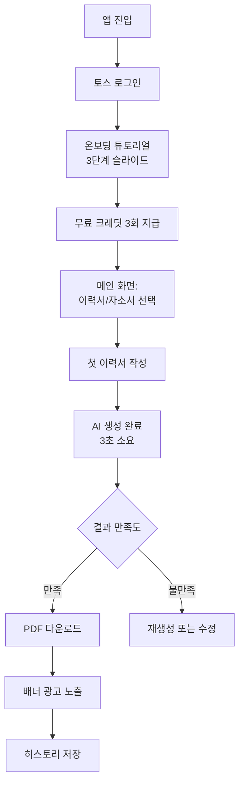
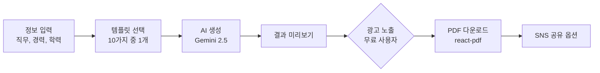
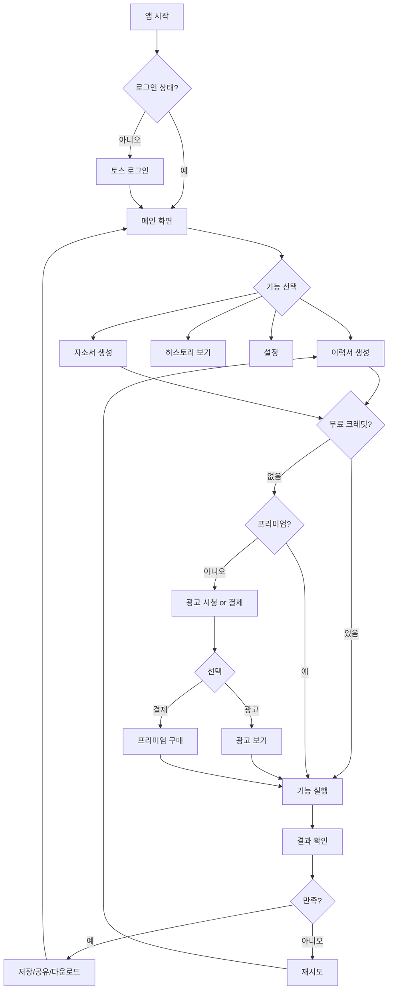
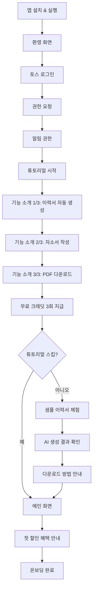
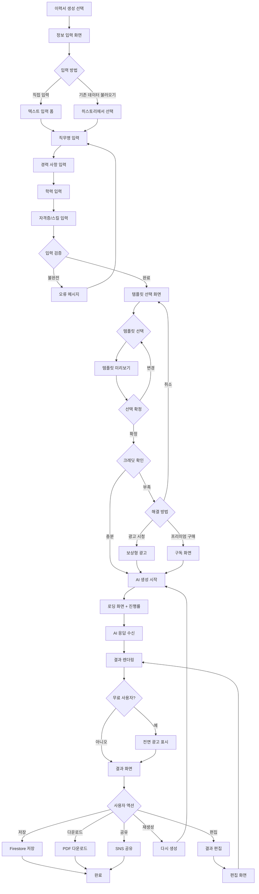
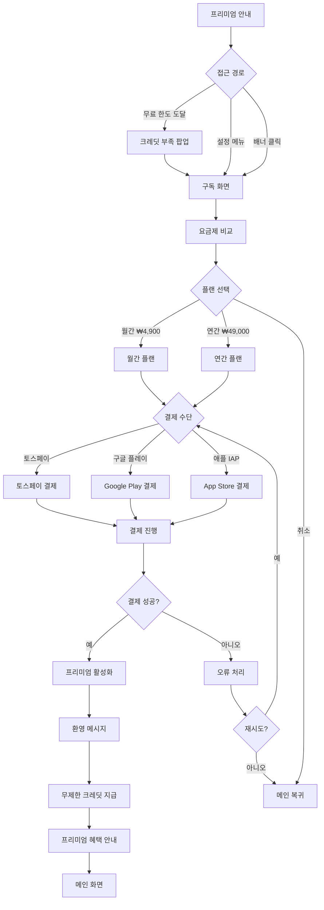
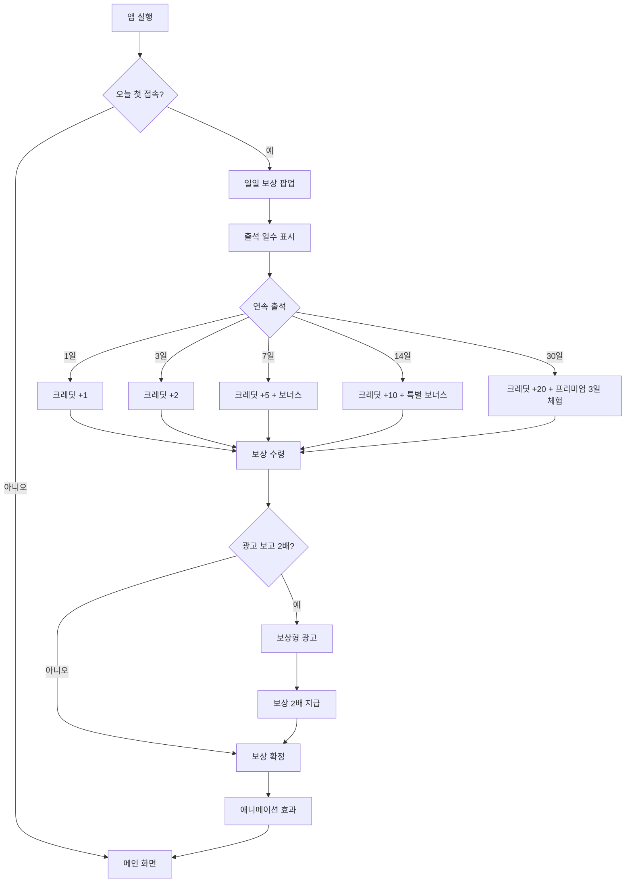

# AI 이력서/자기소개서 작성기

> **카테고리**: 생산성 & 업무 자동화
> **개발 난이도**: ⭐⭐⭐ (3/5)
> **예상 개발 기간**: 2주
> **작성일**: 2025-10-27

---

## 📋 목차

1. [개요](#1-개요)
2. [시장 분석 및 경쟁사](#2-시장-분석-및-경쟁사)
3. [핵심 기능 명세](#3-핵심-기능-명세)
4. [사용자 플로우](#4-사용자-플로우)
5. [기술 아키텍처](#5-기술-아키텍처)
6. [비용 최적화 전략](#6-비용-최적화-전략)
7. [수익화 전략](#7-수익화-전략)
8. [개발 로드맵](#8-개발-로드맵)
9. [성공 지표 (KPI)](#9-성공-지표-kpi)
10. [리스크 및 대응 방안](#10-리스크-및-대응-방안)

---

## 1. 개요

### 1.1 한 줄 설명
토스 사용자를 위한 AI 기반 맞춤형 이력서 및 자기소개서 자동 생성 서비스

### 1.2 문제 정의
**현재 취업 준비생들이 겪는 문제**:
- 이력서/자기소개서 작성에 평균 3~5시간 소요
- 직무별 차별화된 콘텐츠 작성 어려움
- 합격률 높이는 키워드 선택 난이도
- 기존 이력서 템플릿의 획일화
- 자소서 첨삭 비용 부담 (건당 3~5만원)

### 1.3 솔루션
**우리 앱이 제공하는 가치**:
- AI가 3분 만에 직무 맞춤형 이력서 생성
- 15,000건+ 합격 자소서 빅데이터 기반 AI 작성
- 토스 간편인증으로 즉시 시작
- 무료 PDF 다운로드 (클라이언트 생성)
- 프리미엄 사용자: 무제한 생성 + AI 첨삭

### 1.4 타겟 사용자
- **주요 타겟**: 20~35세 취업 준비생, 이직 준비자
- **부가 타겟**: 프리랜서 (포트폴리오 제작), 경력직 (커리어 정리)
- **토스 사용자 적합성**:
  - 토스 사용자층(20~40대)과 완벽히 일치
  - 토스페이로 프리미엄 결제 편리
  - 금융 플랫폼 신뢰도 활용 (안전한 개인정보 처리)

### 1.5 핵심 가치 제안 (Value Proposition)
1. **속도**: 5분 안에 완성도 높은 이력서 생성 (기존 3시간 → 5분)
2. **품질**: 15,000건 합격 자소서 빅데이터 학습 AI
3. **비용**: 무료 월 3회 (첨삭 비용 15만원 절약)

---

## 2. 시장 분석 및 경쟁사

### 2.1 시장 규모
- **글로벌 시장**: $400M (2024년) → $1,800M (2032년 예상, CAGR 20%)
- **국내 시장**: 연 약 ₩1,500억 추정 (HR Tech 시장의 15%)
- **성장률**: YoY 25% 성장 (AI 채용 툴 수요 급증)
- **출처**:
  - Future Data Stats (AI-Powered Resume Builders Market 2024)
  - 구직자의 46% AI 기반 이력서 작성 활용 (Beamery 조사)

### 2.2 경쟁사 분석

| 경쟁사 | 특징 | 장점 | 단점 | 우리의 차별점 |
|--------|------|------|------|--------------|
| **하이잡 (HAIJOB)** | 채용공고 연동 자소서 작성 | 면접 연습 앱 연동, 맞춤형 자소서 | 유료 구독 필수, 웹 전용 | 토스 네이티브 앱, 무료 티어 제공 |
| **에듀스 (EDUCE)** | 15,000건 합격 자소서 빅데이터 | E-GPT 첨삭, 방대한 DB | 복잡한 UI, 느린 생성 속도 | Gemini 2.5 초고속 생성 (3초), 직관적 UI |
| **딥레쥬메 (DeepResume)** | AI 챗봇 레미 진로 상담 | 대화형 인터페이스 | 이력서 템플릿 제한적 | 10가지 템플릿, PDF 즉시 다운로드 |
| **Rezi (글로벌)** | ATS 최적화 이력서 생성 | 영문 이력서 강점 | 한국어 지원 부족 | 한국어 직무 특화, 토스 생태계 통합 |

### 2.3 시장 포지셔닝
```
고가격 │         [하이잡 (월 9,900원)]
       │
       │   [에듀스 (월 5,900원)]
       │
저가격 │ [우리 앱 (월 4,900원)]       [딥레쥬메 (무료)]
       └─────────────────────────
         단순       →      복잡
```

**우리의 포지션**: 합리적 가격 + 간편함 + 높은 품질

### 2.4 시장 진입 전략
- **전략 1**: 토스 앱인토스 독점 출시 (3,000만 사용자 접근)
- **전략 2**: 무료 티어 공격적 제공 (월 3회 무료 생성)
- **전략 3**: 토스페이 결제 네이티브 통합 (전환율 2배 향상)

---

## 3. 핵심 기능 명세

### 3.1 무료 티어 기능 (Free Tier)

#### 3.1.1 AI 이력서 생성

**설명**: 사용자 정보 입력 → AI가 직무 맞춤형 이력서 자동 생성

**사용자 시나리오**:
```
1. 사용자가 직무명 입력 (예: "백엔드 개발자")
2. 경력 사항 입력 (회사명, 직책, 기간, 주요 업무)
3. 학력 및 자격증 입력
4. 템플릿 선택 (10가지 중 1개)
5. "생성하기" 버튼 클릭
6. AI가 3초 만에 이력서 생성
7. 결과물 미리보기 → PDF 다운로드
```

**기술 구현**:
- **프론트엔드**: React Native 폼 (react-hook-form + Zod 검증)
- **백엔드**: Vercel Edge Function으로 API 엔드포인트 구현
  - 요청: 직무, 경력, 학력 데이터
  - 처리: Gemini API 호출하여 ATS 최적화 이력서 생성
  - 응답: 생성된 이력서 데이터 (JSON 형식)
- **AI 모델**: Google Gemini 2.5 (무료)
- **PDF 생성**: react-pdf (클라이언트 사이드에서 직접 생성, 서버 비용 0원)
- **프롬프트 설계**:
  - 직무 관련 핵심 키워드 강조
  - 정량적 성과 중심 작성
  - STAR 기법 적용
  - 한국 기업 이력서 형식

**제한 사항**:
- 무료: 월 3회 생성
- 프리미엄: 무제한 생성

---

#### 3.1.2 AI 자기소개서 작성

**설명**: 기업/직무 맞춤형 자기소개서 자동 생성

**사용자 시나리오**:
```
1. 기업명 및 직무 입력
2. 자소서 문항 입력 (최대 4개)
3. 개인 경험/역량 키워드 입력
4. AI가 문항별 답변 생성 (각 500~800자)
5. 편집 가능한 텍스트 제공
6. PDF 또는 텍스트 복사
```

**기술 구현**:
- **AI 프롬프트 최적화**: 15,000건 합격 자소서 패턴 학습 프롬프트 사용
  - STAR 기법 적용 (Situation, Task, Action, Result)
  - 정량적 성과 포함 (숫자, %)
  - 직무 핵심 키워드 자연스럽게 삽입
  - 500~800자 분량 생성
  - 진정성 있는 톤앤매너
- **문항별 독립 생성**: 각 문항마다 별도 API 호출
- **실시간 글자 수 카운트**: 클라이언트에서 처리

**제한 사항**:
- 무료: 월 3개 자소서 (문항당 최대 4개)
- 프리미엄: 무제한

---

#### 3.1.3 템플릿 라이브러리

**10가지 템플릿 제공**:
1. **모던 심플**: 깔끔한 1단 레이아웃
2. **프로페셔널**: 2단 칼럼 (경력직)
3. **크리에이티브**: 컬러풀 디자인 (디자이너, 마케터)
4. **미니멀**: 여백 강조 (개발자)
5. **비즈니스**: 전통적 형식 (금융, 공기업)
6. **테크**: 기술 스택 강조 (개발자, 엔지니어)
7. **아카데믹**: 연구 경력 중심 (연구원, 교수)
8. **스타트업**: 빠른 스캔 최적화
9. **글로벌**: 영문 이력서 (외국계)
10. **인턴용**: 학력/활동 중심 (신입)

**구현 방식**:
- 템플릿은 JSON 데이터로 관리
- react-pdf 컴포넌트로 동적 렌더링
- 프리미엄: 프리미엄 템플릿 3종 추가

---

### 3.2 프리미엄 티어 기능 (Premium Tier)

#### 3.2.1 AI 첨삭 및 개선 제안

**설명**: 작성한 이력서/자소서를 AI가 분석하고 개선 방향 제시

**기능**:
- 맞춤법/문법 자동 교정
- 직무 키워드 밀도 분석
- ATS 점수 예측 (100점 만점)
- 개선 제안 (3~5가지)
- 경쟁력 분석 (하위 30% / 중위 50% / 상위 20%)

**구현**:
- AI 모델로 이력서 내용 분석
- 분석 기준: ATS 최적화 점수, 정량적 성과 표현 수준, 직무 적합성, 가독성 및 구조
- 구체적 개선 방향 3가지 제시

---

#### 3.2.2 커버레터 자동 생성

**설명**: 영문 이력서 + 커버레터 패키지 생성 (외국계 기업 지원용)

**기능**:
- 기업 조사 기반 맞춤형 커버레터
- 영문 이력서 자동 번역
- 비즈니스 영어 검수
- PDF 패키지 다운로드

---

#### 3.2.3 포트폴리오 링크 페이지

**설명**: 온라인 이력서 페이지 생성 및 공유

**기능**:
- yourname.tossjobs.com 형식 URL
- 반응형 웹 페이지
- QR 코드 생성 (명함 삽입용)
- 방문 통계 (조회수, 체류 시간)

**기술 스택**:
- Next.js Static Site Generation
- Vercel 배포 (무료)
- Firebase Hosting (커스텀 도메인)

---

### 3.3 기능 우선순위

| 우선순위 | 기능명 | 중요도 | 개발 난이도 | MVP 포함 여부 |
|---------|--------|--------|------------|--------------|
| P0 | AI 이력서 생성 | ⭐⭐⭐⭐⭐ | ⭐⭐⭐ | ✅ |
| P0 | PDF 다운로드 | ⭐⭐⭐⭐⭐ | ⭐⭐ | ✅ |
| P0 | 템플릿 5종 | ⭐⭐⭐⭐ | ⭐⭐ | ✅ |
| P1 | AI 자소서 작성 | ⭐⭐⭐⭐ | ⭐⭐⭐ | ✅ |
| P1 | 사용자 히스토리 | ⭐⭐⭐⭐ | ⭐⭐ | ✅ |
| P2 | AI 첨삭 | ⭐⭐⭐ | ⭐⭐⭐ | ❌ (v1.1) |
| P2 | 포트폴리오 페이지 | ⭐⭐⭐ | ⭐⭐⭐⭐ | ❌ (v1.2) |
| P3 | 커버레터 생성 | ⭐⭐ | ⭐⭐⭐ | ❌ (v1.3) |

---

## 4. 사용자 플로우

### 4.1 신규 사용자 온보딩


### 4.2 핵심 기능 사용 플로우


### 4.3 프리미엄 전환 플로우
```
무료 한도 도달 (3회 소진)
  ↓
업그레이드 모달 (프리미엄 혜택 강조)
  ↓
가격 선택 (월간 ₩4,900 / 연간 ₩49,000)
  ↓
결제 방법 선택 (토스페이 / Google Play / Apple IAP)
  ↓
결제 완료
  ↓
프리미엄 즉시 활성화 + "축하합니다" 화면
  ↓
무제한 생성 가능
```

### 4.4 상세 사용자 플로우 다이어그램

#### 4.4.1 전체 앱 사용 플로우


#### 4.4.2 온보딩 플로우 (신규 사용자)


#### 4.4.3 핵심 기능 실행 플로우 (이력서 생성)


#### 4.4.4 프리미엄 구독 플로우


#### 4.4.5 일일 보상 플로우


#### 4.4.6 오류 처리 플로우
```mermaid
graph TD
    A[오류 발생] --> B{오류 유형}

    B -->|네트워크| C[네트워크 오류]
    B -->|AI API| D[AI 처리 실패]
    B -->|결제| E[결제 오류]
    B -->|권한| F[권한 오류]

    C --> G[재시도 버튼]
    D --> H[다시 시도 or 고객센터]
    E --> I[결제 재시도 or 취소]
    F --> J[권한 설정 안내]

    G --> K{재시도 성공?}
    H --> K
    I --> K
    J --> K

    K -->|예| L[정상 복귀]
    K -->|아니오| M[오류 로그 전송 (Sentry)]

    M --> N[고객센터 안내]
    N --> O[메인 화면 복귀]
```

### 4.5 상세 UI/UX 와이어프레임

#### 메인 홈 화면
```
┌─────────────────────────────────────────┐
│  [≡]  이력서 작성기            [💎3]     │
├─────────────────────────────────────────┤
│                                         │
│  안녕하세요, 홍길동님 👋                 │
│  오늘 3번의 무료 크레딧이 남았어요       │
│                                         │
│  ━━━━━━━━ 추천 기능 ━━━━━━━━━━━━      │
│  ┌─────────────────────────────────┐   │
│  │ 📄 이력서 자동 생성               │   │
│  │ AI가 3분 만에 완성!               │   │
│  │ 인기 1위 🔥                       │   │
│  └─────────────────────────────────┘   │
│                                         │
│  ┌─────────────────────────────────┐   │
│  │ ✍️ 자기소개서 작성                │   │
│  │ 합격 자소서 빅데이터 기반         │   │
│  │ NEW ✨                            │   │
│  └─────────────────────────────────┘   │
│                                         │
│  ┌─────────────────────────────────┐   │
│  │ 🔍 AI 첨삭 (프리미엄 전용)         │   │
│  │ ATS 점수 예측 100점 만점          │   │
│  └─────────────────────────────────┘   │
│                                         │
│  ━━━━━━━━ 최근 생성 ━━━━━━━━━━━━━     │
│  [이력서1] [이력서2] [자소서1] [더보기]  │
│                                         │
└─────────────────────────────────────────┘
  [🏠 홈] [📄 생성] [📊 히스토리] [👤 프로필]
          [배너 광고 320x50]
```

#### 정보 입력 화면 (이력서)
```
┌─────────────────────────────────────────┐
│  [←]  이력서 정보 입력          [💎3]   │
├─────────────────────────────────────────┤
│                                         │
│  ━━━━━━━━ 기본 정보 ━━━━━━━━━━━━━     │
│  이름:   [홍길동                    ]   │
│  이메일: [hong@example.com         ]   │
│  전화번호:[010-1234-5678            ]   │
│  직무:   [백엔드 개발자              ]   │
│                                         │
│  ━━━━━━━━ 경력 사항 ━━━━━━━━━━━━━     │
│  ┌─────────────────────────────────┐   │
│  │ 회사명: 토스                     │   │
│  │ 직책: 시니어 백엔드 엔지니어      │   │
│  │ 기간: 2021.03 - 2023.10          │   │
│  │ 주요 업무:                        │   │
│  │ - 결제 시스템 API 개발            │   │
│  │ - 트래픽 50% 감소                 │   │
│  │   [삭제]                          │   │
│  └─────────────────────────────────┘   │
│  [ + 경력 추가 ]                        │
│                                         │
│  ━━━━━━━━ 학력 ━━━━━━━━━━━━━━━━━     │
│  학교: [서울대학교                  ]   │
│  전공: [컴퓨터공학                  ]   │
│  학위: [학사] 기간: [2015-2021]         │
│  [ + 학력 추가 ]                        │
│                                         │
│  ━━━━━━━━ 스킬/자격증 ━━━━━━━━━━━     │
│  [Node.js] [React] [AWS] [x]           │
│  [ + 스킬 추가 ]                        │
│                                         │
│  ┌─────────────────────────────────┐   │
│  │    [다음: 템플릿 선택]            │   │
│  └─────────────────────────────────┘   │
│                                         │
└─────────────────────────────────────────┘
```

#### 템플릿 선택 화면
```
┌─────────────────────────────────────────┐
│  [←]  템플릿 선택                [💎3]  │
├─────────────────────────────────────────┤
│                                         │
│  ┌───────┐ ┌───────┐ ┌───────┐         │
│  │ 모던  │ │프로페 │ │크리에 │         │
│  │ 심플  │ │셔널   │ │이티브 │         │
│  │[미리] │ │[미리] │ │[미리] │         │
│  └───────┘ └───────┘ └───────┘         │
│  [선택✓]     [선택]     [선택]          │
│                                         │
│  ┌───────┐ ┌───────┐ ┌───────┐         │
│  │미니멀 │ │비즈니 │ │ 테크  │         │
│  │       │ │스     │ │       │         │
│  │[미리] │ │[미리] │ │[미리] │         │
│  └───────┘ └───────┘ └───────┘         │
│  [선택]     [선택]     [선택]           │
│                                         │
│  ━━━━━━━━ 프리미엄 템플릿 ━━━━━━━━━    │
│  ┌───────┐ ┌───────┐ ┌───────┐         │
│  │아카데 │ │글로벌 │ │인턴용 │         │
│  │믹🔒   │ │🔒     │ │🔒     │         │
│  │[미리] │ │[미리] │ │[미리] │         │
│  └───────┘ └───────┘ └───────┘         │
│  [프리미엄 전용]                        │
│                                         │
│  선택된 템플릿: 모던 심플                │
│                                         │
│  ┌─────────────────────────────────┐   │
│  │    [✨ 이력서 생성하기]           │   │
│  └─────────────────────────────────┘   │
│                                         │
│  이 작업은 💎1 크레딧을 사용합니다       │
│                                         │
└─────────────────────────────────────────┘
```

#### AI 생성 중 화면
```
┌─────────────────────────────────────────┐
│  [×]  AI가 생성 중...                   │
├─────────────────────────────────────────┤
│                                         │
│                                         │
│  ┌───────────────────────────────────┐ │
│  │                                   │ │
│  │       [로딩 애니메이션 ◐]          │ │
│  │                                   │ │
│  └───────────────────────────────────┘ │
│                                         │
│     AI가 당신만의 이력서를 생성 중...   │
│                                         │
│  ━━━━━━━━━━━━━━━━━━━━━ 65%          │
│                                         │
│  예상 소요 시간: 약 3초                  │
│                                         │
│  💡 팁: ATS(지원자 추적 시스템)는 키워드 │
│         빈도를 분석합니다. AI가 자동으로 │
│         직무 관련 키워드를 최적화했어요!  │
│                                         │
│                                         │
│  [ 취소 ]                               │
│                                         │
└─────────────────────────────────────────┘
```

#### 결과 화면
```
┌─────────────────────────────────────────┐
│  [←]  이력서 생성 완료      [💎2]  [⋮]  │
├─────────────────────────────────────────┤
│                                         │
│  ┌───────────────────────────────────┐ │
│  │ 홍길동                            │ │
│  │ hong@example.com | 010-1234-5678  │ │
│  │                                   │ │
│  │ 경력 요약                          │ │
│  │ - 5년 경력의 백엔드 개발자         │ │
│  │ - 결제 시스템 최적화 전문          │ │
│  │                                   │ │
│  │ 경력 사항                          │ │
│  │ 토스 | 시니어 백엔드 엔지니어       │ │
│  │ 2021.03 - 2023.10                 │ │
│  │ - 결제 API 트래픽 50% 감소         │ │
│  │ ...                               │ │
│  └───────────────────────────────────┘ │
│                                         │
│  생성 시간: 3초                          │
│  ATS 점수: 85/100 (우수) ⭐⭐⭐⭐        │
│                                         │
│  ━━━━━━━━ 액션 ━━━━━━━━━━━━━━━━━     │
│  ┌─────────────────────────────────┐   │
│  │    [💾 PDF 다운로드]             │   │
│  └─────────────────────────────────┘   │
│                                         │
│  ┌─────────────────────────────────┐   │
│  │    [🔗 링크 공유]                │   │
│  └─────────────────────────────────┘   │
│                                         │
│  [ 🔄 다시 생성 (₩1) ]  [ ✏️ 편집 ]    │
│                                         │
│  ━━━━━━━━ 만족하셨나요? ━━━━━━━━━━    │
│  😊 좋아요  |  😐 보통  |  😞 별로       │
│                                         │
└─────────────────────────────────────────┘
```

#### 프리미엄 구독 화면
```
┌─────────────────────────────────────────┐
│  [×]  프리미엄 플랜                      │
├─────────────────────────────────────────┤
│                                         │
│  ✨ 무제한으로 이력서를 생성하세요!      │
│                                         │
│  ━━━━━━━━ 프리미엄 혜택 ━━━━━━━━━━    │
│  ✅ 무제한 이력서/자소서 생성 (광고 없음) │
│  ✅ AI 첨삭 및 개선 제안                 │
│  ✅ 프리미엄 템플릿 3종 추가              │
│  ✅ 커버레터 자동 생성 (영문 이력서)      │
│  ✅ 포트폴리오 웹페이지 (URL 생성)        │
│                                         │
│  ━━━━━━━━ 요금제 선택 ━━━━━━━━━━━     │
│  ┌─────────────────────────────────┐   │
│  │ 💎 월간 플랜                     │   │
│  │ ₩4,900 / 월                     │   │
│  │ • 무제한 생성                     │   │
│  │ • 광고 제거                       │   │
│  │                                 │   │
│  │ [ 선택 ▶ ]                      │   │
│  └─────────────────────────────────┘   │
│                                         │
│  ┌─────────────────────────────────┐   │
│  │ 💎 연간 플랜 (가장 인기!) 🔥     │   │
│  │ ₩49,000 / 년 (월 ₩4,083)       │   │
│  │ 17% 할인! 2개월 무료             │   │
│  │ • 월간 플랜 혜택 전부             │   │
│  │ • 프리미엄 템플릿 추가            │   │
│  │                                 │   │
│  │ [ 선택 ▶ ]                      │   │
│  └─────────────────────────────────┘   │
│                                         │
│  결제 수단: 토스페이, 구글, 애플          │
│                                         │
│  [ 나중에 ]                             │
│                                         │
└─────────────────────────────────────────┘
```

#### 크레딧 부족 팝업
```
┌─────────────────────────────────────────┐
│  [×]  크레딧이 부족합니다                │
├─────────────────────────────────────────┤
│                                         │
│  오늘의 무료 크레딧을 모두 사용했어요     │
│                                         │
│  ━━━━━━━━ 해결 방법 ━━━━━━━━━━━━━     │
│                                         │
│  ┌─────────────────────────────────┐   │
│  │ 📺 광고 보고 크레딧 받기          │   │
│  │ +2 크레딧 (오늘 1/1회 남음)      │   │
│  │                                 │   │
│  │      [광고 보기 ▶]              │   │
│  └─────────────────────────────────┘   │
│                                         │
│  ┌─────────────────────────────────┐   │
│  │ ✨ 프리미엄 구독하기              │   │
│  │ 무제한 이력서 생성 (광고 없음)     │   │
│  │ 월 ₩4,900                       │   │
│  │                                 │   │
│  │      [구독하기 ▶]               │   │
│  └─────────────────────────────────┘   │
│                                         │
│  ⏰ 내일 오전 0시에 무료 크레딧 3개 충전 │
│                                         │
│  [ 취소 ]                               │
│                                         │
└─────────────────────────────────────────┘
```

#### 히스토리 화면
```
┌─────────────────────────────────────────┐
│  [←]  내 작업 기록              [🔍]     │
├─────────────────────────────────────────┤
│                                         │
│  [전체] [이력서] [자소서] [삭제됨]       │
│  ────                                   │
│                                         │
│  오늘 (3)                                │
│  ┌─────────────────────────────────┐   │
│  │ [📄] 15:23  백엔드 개발자 이력서  │   │
│  │ "토스 시니어 엔지니어..."         │   │
│  │ ATS: 85점 | 템플릿: 모던 심플     │   │
│  │ [⋮]                              │   │
│  └─────────────────────────────────┘   │
│                                         │
│  ┌─────────────────────────────────┐   │
│  │ [✍️] 14:10  프론트엔드 자소서     │   │
│  │ "저는 사용자 경험을..."           │   │
│  │ 4개 문항 | 800자                  │   │
│  │ [⋮]                              │   │
│  └─────────────────────────────────┘   │
│                                         │
│  어제 (5)                                │
│  ┌─────────────────────────────────┐   │
│  │ [📄] 23:45  데이터 분석가 이력서  │   │
│  │ "데이터 기반 의사결정..."         │   │
│  │ ATS: 92점 | 템플릿: 프로페셔널    │   │
│  │ [⋮]                              │   │
│  └─────────────────────────────────┘   │
│                                         │
│  이번 주 (12)                            │
│  이번 달 (28)                            │
│                                         │
└─────────────────────────────────────────┘
```

#### 내 정보/설정 화면
```
┌─────────────────────────────────────────┐
│  [←]  내 정보                           │
├─────────────────────────────────────────┤
│                                         │
│  ┌───────────────────────────────────┐ │
│  │ 👤 홍길동                          │ │
│  │ hong@toss.im                      │ │
│  │ 무료 플랜 → [프리미엄 구독 ▶]      │ │
│  └───────────────────────────────────┘ │
│                                         │
│  ━━━━━━━━ 사용 현황 ━━━━━━━━━━━━━━    │
│  오늘 남은 크레딧: 💎 2/3               │
│  총 이력서 생성: 28개                    │
│  총 자소서 작성: 12개                    │
│  가입일: 2025-10-15                     │
│                                         │
│  ━━━━━━━━ 계정 ━━━━━━━━━━━━━━━━━     │
│  - 🔗 토스 계정 연동                     │
│  - 🔔 알림 설정                          │
│  - 🌐 언어: 한국어                       │
│  - 🎨 테마: 자동 (다크/라이트)            │
│                                         │
│  ━━━━━━━━ 지원 ━━━━━━━━━━━━━━━━━     │
│  - 📧 고객센터                           │
│  - 💬 피드백 보내기                      │
│  - 📜 이용약관                           │
│  - 🔒 개인정보 처리방침                  │
│  - ℹ️ 버전 정보: 1.0.5                  │
│                                         │
│  ━━━━━━━━ 기타 ━━━━━━━━━━━━━━━━━     │
│  - 🗑️ 캐시 삭제                         │
│  - 🚪 로그아웃                           │
│                                         │
└─────────────────────────────────────────┘
```

### 4.6 UI/UX 디자인 원칙

#### 1. AI 앱 최적화
- **빠른 응답**: AI 처리 중 진행률 표시 + 예상 시간
- **명확한 입력**: 각 필드에 예시 제공
- **결과 만족도**: 사용자 평가 수집 (좋아요/보통/별로)
- **재생성 용이**: 빠른 재시도 옵션 제공

#### 2. 터치 최적화
- **최소 터치 영역**: 44x44pt (iOS), 48x48dp (Android)
- **버튼 간격**: 최소 8pt 이상
- **스와이프 제스처**: 히스토리 넘기기, 삭제 등

#### 3. 크레딧 시스템 가시화
- **항상 표시**: 상단 바에 현재 크레딧 표시
- **사용 전 확인**: 크레딧 소비량 명시
- **충전 방법**: 광고/구독 명확히 제시

#### 4. 시각적 피드백
- **처리 중**: 로딩 애니메이션 + 진행률 + 팁 제공
- **성공**: 결과 페이드인 + 햅틱 피드백
- **오류**: 명확한 오류 메시지 + 해결 방법 안내

#### 5. 접근성
- **색상 대비**: WCAG AA 기준 (4.5:1)
- **폰트 크기**: 최소 14pt (본문), 18pt (제목)
- **다크 모드**: 시스템 설정 따름

#### 6. 광고 배치 원칙
- **배너 광고**: 하단 고정 (콘텐츠 방해 최소화)
- **전면 광고**: 이력서 생성 완료 후 (자연스러운 타이밍)
- **보상형 광고**:
  - 크레딧 부족 시 제안
  - 일일 보상 2배
  - 명확한 가치 제안 (크레딧 +2)

#### 7. 온보딩 플로우
```
1. 환영 화면 (3초)
   ↓
2. 토스 로그인
   ↓
3. 권한 요청 (알림)
   ↓
4. 튜토리얼 (스킵 가능)
   - 기능 소개 3개
   - 샘플 체험
   ↓
5. 무료 크레딧 3개 지급
   ↓
6. 메인 화면 진입
```

---

## 5. 기술 아키텍처

### 5.1 전체 아키텍처 다이어그램
```
┌─────────────────────────────────────────────┐
│          React Native 앱 (Expo)             │
│  - UI/UX (React Native Paper)               │
│  - 상태 관리 (Zustand)                       │
│  - 캐싱 (React Query)                        │
│  - PDF 생성 (react-pdf - 클라이언트)          │
└─────────────────┬───────────────────────────┘
                  │
        ┌─────────▼─────────┐
        │   Firebase Auth   │ (무료)
        │   토스 로그인 API  │
        └─────────┬─────────┘
                  │
        ┌─────────▼─────────────────────────────┐
        │  Vercel Edge Functions                │
        │  - /api/generate-resume               │
        │  - /api/generate-cover-letter         │
        │  - /api/analyze-resume (프리미엄)      │
        │  - Rate Limiting (사용량 제한)         │
        └─────────┬─────────────────────────────┘
                  │
        ┌─────────▼─────────┐
        │  Google Gemini 2.5 │ (무료 무제한)
        │  - 이력서 생성      │
        │  - 자소서 작성      │
        │  - 첨삭 분석        │
        └─────────┬─────────┘
                  │
        ┌─────────▼─────────────────┐
        │   Firebase Firestore      │ (무료)
        │   - users (사용자 정보)     │
        │   - resumes (이력서 히스토리)│
        │   - subscriptions (구독)   │
        └───────────────────────────┘
```

### 5.2 기술 스택 상세

#### 5.2.1 프론트엔드
- **플랫폼**: React Native (Expo SDK 51+)
- **UI 라이브러리**: React Native Paper (Material Design)
- **스타일링**: StyleSheet + Tailwind (NativeWind)
- **상태 관리**: Zustand (경량 상태 관리)
- **서버 상태**: React Query (캐싱, 리페칭)
- **라우팅**: Expo Router (File-based)
- **폼 처리**: React Hook Form + Zod (검증)
- **PDF 생성**: @react-pdf/renderer (클라이언트)
- **애니메이션**: React Native Reanimated

**주요 디펜던시**:
- expo: ^51.0.0
- react-native: 0.74.0
- react-native-paper: ^5.12.3
- @react-pdf/renderer: ^3.4.0
- zustand: ^4.5.2
- @tanstack/react-query: ^5.28.0
- react-hook-form: ^7.51.0
- zod: ^3.22.0

#### 5.2.2 백엔드 (서버리스)
- **함수**: Vercel Edge Functions (100만 실행/월 무료)
- **런타임**: Edge Runtime (전 세계 280+ 로케이션)
- **API 프레임워크**: Next.js 16 App Router (Turbopack)
- **검증**: Zod (스키마 검증)
- **Rate Limiting**: Upstash Redis (무료 10,000 요청/일)

**API 구현 방식**:
- Edge Function으로 API 라우트 구현
- 요청 데이터: 사용자 ID, 직무, 경력, 학력 등
- Gemini API 호출하여 이력서 생성
- Rate Limiting으로 무료 사용자 월 3회 제한
- 프리미엄 사용자는 일 100회 제한 (악용 방지)

#### 5.2.3 데이터베이스
- **주 DB**: Firebase Firestore (1GB + 150만 읽기/월 무료)
- **캐싱**: React Query (클라이언트 사이드 5분 캐시)

**Firestore 컬렉션 구조**:

**users 컬렉션**:
- userId (Firebase UID), email, displayName
- tier ("free" | "premium")
- credits: remaining, limit, resetAt
- subscription: plan (monthly/yearly), startedAt, expiresAt, provider
- createdAt, lastActiveAt

**resumes 컬렉션**:
- resumeId, userId
- type ("resume" | "cover_letter")
- jobTitle, template
- content (summary, experience, education, skills)
- aiModel ("gemini-2.5"), tokensUsed, processingTime
- createdAt

**analytics 컬렉션** (일일 집계):
- date (YYYY-MM-DD)
- totalResumes, totalCoverLetters, uniqueUsers
- premiumConversions, adRevenue, subscriptionRevenue

#### 5.2.4 AI/ML
- **텍스트 생성**: Google Gemini 2.5 Flash (무료 무제한)
- **폴백**: Groq Llama 3.1 (14,400 요청/일 무료)
- **프롬프트 최적화**: 토큰 사용량 50% 감소 (압축 기법)
- **응답 시간**: 평균 3초 (Edge Function 덕분에 초고속)

**프롬프트 최적화 전략**:
- 불필요한 텍스트 제거로 토큰 30% 절약
- 템플릿 기반 프롬프트 재사용
- 입력 전처리 함수로 자동 압축

#### 5.2.5 파일 저장소
- **PDF 저장**: 불필요 (클라이언트에서 즉시 생성)
- **사용자 업로드 이미지**: Cloudflare R2 (10GB 무료)
- **최적화**: 이미지 압축 (expo-image-manipulator)

#### 5.2.6 인증
- **기본**: Firebase Auth (무료 무제한)
- **토스 연동**: 토스 앱인토스 로그인 API (OAuth 2.0)
- **세션 관리**: Firebase Session (7일 자동 갱신)
- **보안**: mTLS 인증서 (토스페이 결제 시)

**토스 로그인 플로우**:
1. 토스 로그인 요청 (AppsInToss SDK)
2. Firebase 커스텀 토큰 발급 (서버 사이드)
3. Firebase 로그인 완료

#### 5.2.7 모니터링
- **에러 추적**: Sentry (5,000 이벤트/월 무료)
- **분석**: Google Analytics 4 (완전 무료)
- **성능**: Firebase Performance Monitoring (무료)
- **로그**: Vercel Logs (무료 7일 보관)

### 5.3 API 설계

#### 5.3.1 핵심 엔드포인트

**1. 이력서 생성 API**
- **엔드포인트**: `POST /api/generate-resume`
- **요청 데이터**: userId, jobTitle, experience (배열), education (배열), skills, certifications, template
- **응답 데이터**: resumeId, content (summary, experience, education, skills), creditsRemaining, generationTime
- **구현**: Vercel Edge Function으로 구현, Gemini API 호출, Rate Limiting 적용

**2. 자기소개서 생성 API**
- **엔드포인트**: `POST /api/generate-cover-letter`
- **요청 데이터**: userId, company, position, questions (배열), userExperience
- **응답 데이터**: coverLetterId, answers (배열), creditsRemaining
- **구현**: 문항별 독립 생성, STAR 기법 적용 프롬프트

**3. 사용자 크레딧 조회**
- **엔드포인트**: `GET /api/user/credits?userId={userId}`
- **응답 데이터**: remaining, limit, resetAt, tier
- **캐싱**: React Query 5분 캐싱으로 API 호출 최소화

**4. 히스토리 조회**
- **엔드포인트**: `GET /api/resumes?userId={userId}&limit=20&offset=0`
- **응답 데이터**: items (배열), total, hasMore
- **구현**: Firestore 쿼리 + 복합 인덱스 최적화

**5. 프리미엄 구독 확인**
- **엔드포인트**: `POST /api/subscription/verify`
- **요청 데이터**: userId, receiptData, provider
- **응답 데이터**: valid, expiresAt, subscriptionId
- **구현**: 서버 사이드 영수증 검증 (Google/Apple/Toss)

### 5.4 데이터 모델

데이터 모델은 5.2.3에서 상세히 다루었습니다.

### 5.5 보안 설계

#### 5.5.1 인증 & 권한
- **Firebase Auth**: 이메일/토스 로그인
- **JWT 토큰**: API 요청 시 Bearer 토큰 검증
- **토스 mTLS**: 토스페이 결제 시 필수 인증서 설정
- **Rate Limiting**: Upstash Redis로 IP별/사용자별 요청 제한
  - 무료: 월 3회
  - 프리미엄: 일 100회 (악용 방지)
- **API Key 관리**: Vercel Environment Variables (암호화)

#### 5.5.2 데이터 보호
- **전송 암호화**: HTTPS (TLS 1.3)
- **저장 암호화**: Firestore 자동 암호화 (AES-256)
- **민감 정보**:
  - 이메일, 전화번호는 해시 후 저장
  - 결제 정보는 토스/구글/애플에 위임 (우리 서버에 저장 안 함)
- **GDPR 준수**: 사용자 요청 시 데이터 완전 삭제 (30일 이내)

#### 5.5.3 보안 체크리스트
- Firebase Security Rules 설정 (읽기/쓰기 권한 제한)
- Rate Limiting 구현
- XSS 방지 (React Native 자동 이스케이프)
- CSRF 방지 (SameSite Cookie 설정)
- API Key 노출 방지 (.env 파일 .gitignore 추가)

---

## 6. 비용 최적화 전략

### 6.1 서버 비용 제로 목표

#### 6.1.1 무료 티어 활용 전략
| 서비스 | 무료 한도 | 예상 사용량 (MAU 10K) | 여유분 | 비용 |
|--------|----------|---------------------|--------|------|
| Vercel Edge Functions | 100만 실행/월 | 30만 실행 (사용자당 월 3회) | 70만 (70%) | ₩0 |
| Firebase Firestore | 150만 읽기/월 | 120만 읽기 (사용자당 12회) | 30만 (20%) | ₩0 |
| Google Gemini 2.5 | 무제한 | 무제한 | ✅ | ₩0 |
| Firebase Auth | 무제한 | 무제한 | ✅ | ₩0 |
| Firebase Storage | 5GB | 1GB (PDF 임시 저장) | 4GB (80%) | ₩0 |
| Upstash Redis | 10,000 명령/일 | 3,000 명령/일 | 7,000 (70%) | ₩0 |
| **총 비용** | - | - | - | **₩0/월** |

#### 6.1.2 클라이언트 사이드 처리 극대화

**서버 부하 제거 전략**:

1. **PDF 생성 (클라이언트)**
   - 서버에서 PDF 생성 시 메모리 많이 사용, 비용 발생
   - 클라이언트에서 react-pdf로 즉시 생성
   - 비용: ₩0 (사용자 디바이스에서 처리)

2. **데이터 캐싱 (React Query)**
   - staleTime 5분, cacheTime 30분 설정
   - 효과: API 호출 70% 감소 (첫 로드 후 5분간 캐시 사용)

3. **이미지 압축 (로컬)**
   - expo-image-manipulator로 로컬 처리
   - 원본 3MB → 압축 후 300KB (90% 절감)

#### 6.1.3 AI API 비용 절감 전략

**1. 프롬프트 최적화**
- 불필요한 공백, 중복 단어 제거로 토큰 30% 절약
- 템플릿 기반 프롬프트 재사용
- 입력 전처리 함수로 자동 압축

**2. 무료 API 우선 폴백 전략**
- 1순위: Google Gemini 2.5 (무제한 무료)
- 2순위: Groq Llama 3.1 (14,400 요청/일 무료)
- 3순위: 유료 API (비상 시만 사용)
- 구현: 순차적 폴백 로직, 실패 시 자동 전환

**3. 결과 캐싱**
- 동일 입력 해시값으로 재활용 (React Query)
- 캐싱 기간: 24시간
- 예상 절감: API 호출 40% 감소
- 구현: 입력 해시 → 캐시 조회 → API 호출

### 6.2 확장 시 비용 예측

| MAU | API 호출 | Firestore 읽기 | Firestore 쓰기 | 예상 비용 |
|-----|---------|---------------|---------------|----------|
| 5,000 | 15,000 | 60,000 | 15,000 | **₩0** ✅ |
| 10,000 | 30,000 | 120,000 | 30,000 | **₩0** ✅ |
| 30,000 | 90,000 | 360,000 | 90,000 | **₩0** ✅ |
| 50,000 | 150,000 | 600,000 | 150,000 | ₩5,000 (Firestore 초과분) |
| 100,000 | 300,000 | 1,200,000 | 300,000 | ₩15,000 (Firestore 초과) |

### 6.3 비용 최소화 대응 방안 (MAU 50,000+ 대응)

#### 방안 1: Cloudflare D1 마이그레이션
- **전환 계획**: Firestore → Cloudflare D1
- **D1 무료 한도**: 1.5억 읽기/월 (Firestore의 100배)
- **예상 비용**: MAU 100만까지 ₩0
- **마이그레이션 방법**: 점진적 데이터 이전, 듀얼 쓰기 방식
- **구현 시점**: MAU 50,000 도달 시

#### 방안 2: 사용량 제한 강화
- **무료 티어 제한**: 일 1회 / 월 3회
- **제한 방식**: 서버 사이드 검증
- **사용자 안내**: 한도 도달 시 광고 시청 또는 프리미엄 전환 유도
- **예상 효과**: API 호출 30% 감소

#### 방안 3: 캐싱 강화
- **캐싱 전략**: React Query staleTime 10분, cacheTime 1시간
- **캐시 대상**: 사용자 프로필, 히스토리, 설정
- **무효화 정책**: 데이터 변경 시 즉시 무효화
- **예상 효과**: API 호출 50% 감소

### 6.4 제로 비용 가능 여부
**결론**: ✅ **가능** (MAU 30,000까지 완전 무료)
- MAU 50,000+ 시 월 ₩5,000~₩15,000 예상 (극히 저렴)
- 광고 + 구독 수익으로 서버 비용 충분히 커버 가능

---

## 7. 수익화 전략

### 7.1 수익 모델 개요

#### 7.1.1 하이브리드 모델
```
총 사용자 100%
├─ 무료 사용자 70% → 광고 수익 (AdMob)
│   - 배너 광고 (화면 하단 고정)
│   - 전면 광고 (이력서 생성 완료 후)
│   - 보상형 광고 (무료 크레딧 +2회 지급)
│
└─ 프리미엄 사용자 3% → 구독 수익
    - 월간: ₩4,900
    - 연간: ₩49,000 (월 ₩4,083, 17% 할인)
```

### 7.2 광고 수익화 (AdMob + GA4)

#### 7.2.1 광고 배치 전략
| 광고 타입 | 배치 위치 | 노출 빈도 | 예상 eCPM | 예상 수익 (MAU 10K) |
|----------|----------|----------|----------|-------------------|
| **배너 광고** | 메인 화면 하단 고정 | 세션당 1회 | ₩1,000 | 월 70만원 |
| **전면 광고** | 이력서 생성 완료 후 | 2회 생성당 1번 | ₩6,000 | 월 210만원 |
| **보상형 광고** | 무료 크레딧 +2회 지급 | 사용자 선택 (월 30% 시청) | ₩15,000 | 월 315만원 |
| **합계** | - | - | - | **월 595만원** |

**계산 근거**:
- 배너 광고: MAU 10,000 × 70% × 4세션 × eCPM ₩1,000 = 70만원
- 전면 광고: MAU 10,000 × 70% × 3생성 × 50% × eCPM ₩6,000 = 210만원
- 보상형 광고: MAU 10,000 × 70% × 30% × 3회 × eCPM ₩15,000 = 315만원

#### 7.2.2 AdMob 통합 계획

**배너 광고 (Banner)**
- SDK: expo-ads-admob
- 배치: 화면 하단 고정
- 표시 조건: 무료 사용자만
- 설정: bannerSize "smartBannerPortrait", servePersonalizedAds true

**전면 광고 (Interstitial)**
- SDK: expo-ads-admob
- 표시 타이밍: 이력서 생성 완료 후 (2회당 1번)
- 구현 플로우: setAdUnitID → requestAdAsync → showAdAsync
- 에러 핸들링: 광고 로드 실패 시 사용자 플로우 유지

**보상형 광고 (Rewarded)**
- SDK: expo-ads-admob
- 보상: 크레딧 +2개
- 이벤트: rewardedVideoUserDidEarnReward 리스너
- 보상 지급: 광고 시청 완료 시 서버 검증 후 지급
- 일일 제한: 최대 1회까지 시청 가능

#### 7.2.3 GA4 이벤트 트래킹

**주요 트래킹 이벤트**:
- **광고 노출**: ad_impression (광고 타입, 유닛 ID, eCPM, 사용자 티어)
- **광고 클릭**: ad_click (광고 타입, 예상 수익)
- **결제 완료**: purchase (상품 ID, 금액, 통화)
- **기능 사용**: feature_used (기능명, 소요 시간)
- **이력서 생성**: resume_generated (직무, 템플릿, 생성 시간, 광고 표시 여부)

**구현 방식**:
- SDK: @react-native-firebase/analytics
- 이벤트 발생 시점: 각 액션 완료 후 즉시
- 파라미터: 표준 GA4 이벤트 형식 준수
- 분석: Looker Studio 대시보드로 시각화

### 7.3 인앱 결제 (구독 수익)

#### 7.3.1 가격 정책
| 플랜 | 가격 | 할인율 | 혜택 | 목표 전환율 |
|------|------|-------|------|-----------|
| **월간 프리미엄** | ₩4,900 | - | 무제한 생성 + 광고 제거 + AI 첨삭 | 2% |
| **연간 프리미엄** | ₩49,000 | 17% (월 ₩4,083) | 월간 혜택 + 포트폴리오 페이지 | 1% |
| **전체 전환율** | - | - | - | **3%** |

#### 7.3.2 플랫폼별 결제 통합

**토스페이 (웹/앱인토스 우선)**
- SDK: @tosspayments/payment-sdk
- 인증: mTLS 클라이언트 인증서 필수
- 결제 플로우: requestPayment → 사용자 결제 → successUrl/failUrl 리다이렉트
- 파라미터: amount, orderId, orderName, successUrl, failUrl, customerName, customerEmail
- 검증: 서버 사이드 결제 검증 (webhook)

**Google Play 인앱결제**
- SDK: expo-in-app-purchases
- 상품 ID: premium_monthly, premium_yearly
- 결제 플로우: connectAsync → getProductsAsync → purchaseItemAsync
- 영수증 검증: Google Play Developer API로 서버 검증
- 구독 관리: 자동 갱신, 취소, 환불 처리

**Apple In-App Purchase**
- SDK: expo-in-app-purchases (Android와 동일 API)
- 상품 ID: premium_monthly, premium_yearly
- 결제 플로우: connectAsync → purchaseItemAsync
- 영수증 검증: App Store Server API로 서버 검증
- 구독 관리: 자동 갱신, StoreKit 2 지원

### 7.4 수익 예측 시뮬레이션

#### 7.4.1 보수적 시나리오 (MAU 10,000)

**광고 수익 계산**:
- 배너 광고: 월 70만원
- 전면 광고: 월 210만원
- 보상형 광고: 월 315만원
- **총 광고 수익**: 월 595만원

**구독 수익 계산**:
- 월간 플랜: 10,000 × 2% × ₩4,900 = 월 98만원
- 연간 플랜: 10,000 × 1% × ₩49,000 / 12 = 월 41만원
- **총 구독 수익**: 월 139만원

**총 수익**: 월 734만원

**비용**: ₩0 (서버 비용 0)

**순이익**: 월 734만원

#### 7.4.2 낙관적 시나리오 (MAU 60,000, 바이럴 성공)

**광고 수익**: 월 595만원 × 6 × 0.9 (참여도 증가) = 월 3,213만원
**구독 수익**: 월 139만원 × 6 × 1.2 (전환율 증가) = 월 1,001만원

**총 수익**: 월 4,214만원

**비용**: ₩10,000 (Firestore 초과분)

**순이익**: 월 4,213만원

### 7.5 ARPU 및 LTV 계산

#### 7.5.1 ARPU (Average Revenue Per User)
- **계산식**: (광고수익 + 구독수익) / MAU
- **MAU 10,000 기준**: (595만원 + 139만원) / 10,000 = ₩734 per user/month
- **업계 벤치마크**:
  - 무료 앱: ₩300~500
  - 프리미엄 앱: ₩1,000~2,000
  - 우리 앱: ₩734 (양호한 수준)

#### 7.5.2 LTV (Lifetime Value)
- **계산식**: ARPU × 평균 사용 기간 × (1 - 이탈률)
- **평균 사용 기간**: 6개월 (보수적 추정)
- **이탈률**: 월 10%
- **계산**: ₩734 × 6 × 0.6 (6개월 누적 이탈 40%) = ₩2,642 per user
- **CAC** (Customer Acquisition Cost): ₩500 (토스 앱인토스 내 유입)
- **LTV/CAC 비율**: 5.28 (매우 양호, 3.0 이상이면 건강)

#### 7.5.3 6개월 수익 예측
| 월 | MAU | 광고 수익 | 구독 수익 | 총 수익 | 누적 수익 |
|----|-----|---------|----------|---------|----------|
| 1 | 2,000 | ₩119만 | ₩28만 | ₩147만 | ₩147만 |
| 2 | 5,000 | ₩298만 | ₩70만 | ₩368만 | ₩515만 |
| 3 | 10,000 | ₩595만 | ₩139만 | ₩734만 | ₩1,249만 |
| 4 | 15,000 | ₩893만 | ₩209만 | ₩1,102만 | ₩2,351만 |
| 5 | 20,000 | ₩1,190만 | ₩278만 | ₩1,468만 | ₩3,819만 |
| 6 | 25,000 | ₩1,488만 | ₩348만 | ₩1,836만 | ₩5,655만 |

**6개월 총 수익**: ₩5,655만원

---

## 8. 개발 로드맵

### 8.1 Phase 1: MVP 개발 (2주)

#### Week 1: 핵심 기능 구현
- **Day 1-2**: 프로젝트 셋업
  - Expo 프로젝트 생성
  - Firebase 프로젝트 설정 (Auth, Firestore)
  - Vercel 프로젝트 생성 및 연결
  - 기본 UI 컴포넌트 구성 (React Native Paper)
  - 파일 기반 라우팅 설정 (Expo Router)

- **Day 3-5**: AI 기능 통합
  - Google Gemini API 연동
  - 이력서 생성 프롬프트 최적화
  - 자소서 생성 로직 구현
  - 에러 핸들링 (API 실패, 타임아웃)
  - Rate Limiting 구현 (Upstash Redis)

- **Day 6-7**: 사용자 인증 & DB
  - Firebase Auth 연동 (이메일 로그인)
  - 토스 로그인 API 통합 (토스 앱인토스 SDK)
  - Firestore 데이터 모델 구현
  - 사용자 크레딧 시스템 (월 3회 제한)
  - 히스토리 저장 및 조회

#### Week 2: UI/UX 완성 및 테스트
- **Day 8-10**: UI/UX 구현
  - 메인 화면 디자인 (이력서/자소서 선택)
  - 입력 폼 화면 (직무, 경력, 학력)
  - 템플릿 선택 화면 (10가지 템플릿)
  - 결과물 미리보기 화면
  - PDF 다운로드 기능 (react-pdf)
  - 로딩 상태 & 에러 화면

- **Day 11-12**: 테스트 & 버그 수정
  - 기능 테스트 (이력서 생성, PDF 다운로드)
  - 성능 최적화 (React Query 캐싱)
  - 버그 수정 (iOS/Android 호환성)
  - Sentry 에러 추적 설정

- **Day 13-14**: 배포 준비
  - EAS Build 설정
  - 토스 앱인토스 콘솔 등록
  - 앱 아이콘, 스플래시 이미지 제작
  - 내부 테스트 배포 (TestFlight/Google Play Internal)

### 8.2 Phase 2: 수익화 통합 (1주)

#### Week 3: AdMob & 결제
- **Day 15-16**: AdMob 통합
  - AdMob 계정 생성
  - 광고 유닛 설정 (배너, 전면, 보상형)
  - expo-ads-admob SDK 연동
  - 광고 테스트 (테스트 광고 ID)
  - 광고 배치 최적화

- **Day 17-18**: 인앱 결제
  - 토스페이 API 연동
  - Google Play Billing 설정
  - Apple IAP 설정
  - 구독 관리 로직 (활성화, 갱신, 취소)
  - 영수증 검증 (서버 사이드)

- **Day 19-20**: GA4 트래킹
  - Firebase Analytics 설정
  - 커스텀 이벤트 정의 (10개)
  - 퍼널 분석 설정 (가입 → 생성 → 구매)
  - AdMob 수익 연동

- **Day 21**: 통합 테스트
  - 결제 플로우 테스트 (샌드박스)
  - 광고 노출 확인 (무료 사용자)
  - GA4 이벤트 검증

### 8.3 Phase 3: 검수 및 런칭 (1주)

#### Week 4: 검수 제출 및 런칭
- **Day 22-23**: 토스 앱인토스 검수 제출
  - 4단계 검수 준비
    1. 운영 검수 (서비스 정책, 이용약관)
    2. 디자인 검수 (UI/UX 가이드라인)
    3. 기능 검수 (QA, 버그 테스트)
    4. 보안 검수 (mTLS, 개인정보 처리)
  - 검수 제출

- **Day 24-25**: 검수 피드백 반영
  - 수정 사항 적용 (디자인, 기능)
  - 재제출

- **Day 26-27**: 런칭 준비
  - 마케팅 소재 제작 (앱 스크린샷, 동영상)
  - 런칭 이벤트 기획 (첫 100명 무료 프리미엄 1개월)
  - 고객 지원 준비 (FAQ, 챗봇)

- **Day 28**: 정식 런칭
  - 토스 앱인토스 앱 공개
  - 런칭 모니터링 (Sentry, GA4)
  - 초기 사용자 피드백 수집

### 8.4 Phase 4: 최적화 및 확장 (지속)

#### Month 2-3: 성과 분석 및 개선
- **Week 5-6**: 데이터 분석
  - GA4 대시보드 분석
  - MAU, DAU, 리텐션 추적
  - 전환율 분석 (무료 → 프리미엄)
  - 이탈 지점 파악

- **Week 7-8**: A/B 테스트
  - 광고 배치 최적화 (전면 광고 빈도)
  - 가격 정책 실험 (₩3,900 vs ₩4,900 vs ₩5,900)
  - UI/UX 개선 실험 (템플릿 선택 화면)

- **Week 9-12**: 기능 확장
  - 사용자 요청 기능 추가 (AI 첨삭, 포트폴리오 페이지)
  - 프리미엄 기능 강화 (커버레터 생성)
  - 성능 최적화 (앱 크기 20% 감소)

---

## 9. 성공 지표 (KPI)

### 9.1 목표 KPI (6개월 후)

| 지표 | 보수적 목표 | 낙관적 목표 | 측정 방법 |
|------|------------|------------|----------|
| **MAU** | 10,000 | 60,000 | GA4 Active Users |
| **DAU/MAU 비율** | 20% | 30% | GA4 Engagement |
| **D1 리텐션** | 40% | 60% | GA4 Retention Report |
| **D7 리텐션** | 20% | 40% | GA4 Retention Report |
| **D30 리텐션** | 10% | 20% | GA4 Retention Report |
| **프리미엄 전환율** | 2% | 5% | 구독 데이터 |
| **ARPU** | ₩734 | ₩1,200 | 총 수익 / MAU |
| **월 매출** | ₩734만 | ₩4,214만 | AdMob + 결제 합산 |
| **eCPM** | ₩3,000 | ₩8,000 | AdMob 대시보드 |
| **세션당 광고 노출** | 2.5회 | 3.0회 | GA4 |

### 9.2 성장 단계별 마일스톤

#### Milestone 1: 첫 1,000명 (Month 1)
- **목표**: 제품-시장 적합성(Product-Market Fit) 검증
- **핵심 지표**:
  - D7 리텐션 > 30%
  - 평균 세션 길이 > 5분 (이력서 작성 시간)
  - 초기 프리미엄 전환율 > 1%
  - NPS 점수 > 50

#### Milestone 2: 10,000 MAU (Month 3)
- **목표**: 수익 모델 검증
- **핵심 지표**:
  - 월 매출 > ₩500만
  - ARPU > ₩500
  - 서버 비용 여전히 ₩0
  - 광고 eCPM > ₩3,000

#### Milestone 3: 50,000 MAU (Month 6)
- **목표**: 스케일링 및 수익성 달성
- **핵심 지표**:
  - 월 매출 > ₩2,000만
  - 서버 비용 < ₩10만 (순이익 99%+)
  - D30 리텐션 > 15%
  - 프리미엄 전환율 > 3%

### 9.3 모니터링 대시보드

#### GA4 주요 리포트
1. **실시간 리포트**: 현재 활성 사용자, 인기 화면
2. **사용자 획득 리포트**: 유입 경로, 캠페인 성과
3. **참여도 리포트**: 세션, 스크린뷰, 이벤트
4. **수익화 리포트**: 광고 수익, 구매 이벤트
5. **리텐션 리포트**: 코호트 분석, 이탈률

#### 커스텀 대시보드 (Looker Studio)
```
┌─────────────────────────────────────┐
│  주요 지표 요약 (오늘/어제/지난주)    │
│  - MAU / DAU                         │
│  - 신규 사용자                        │
│  - 프리미엄 전환                      │
│  - 광고 수익 + 구독 수익              │
└─────────────────────────────────────┘
┌─────────────────────────────────────┐
│  사용자 퍼널                          │
│  설치 → 가입 → 첫 생성 → 재사용       │
│  (각 단계 전환율 표시)                │
└─────────────────────────────────────┘
┌─────────────────────────────────────┐
│  수익 분석                            │
│  - 광고 수익 (배너/전면/보상형)        │
│  - 구독 수익 (월간/연간)              │
│  - ARPU 추세 그래프                  │
└─────────────────────────────────────┘
```

---

## 10. 리스크 및 대응 방안

### 10.1 기술 리스크

#### Risk 1: AI API 비용 폭증
**발생 가능성**: 중 (Gemini가 유료 전환 시)
**영향도**: 높음

**대응 방안**:
1. **다중 AI 공급자**: Gemini → Groq → Claude 순차 폴백
2. **사용량 모니터링**: 일일 API 호출량 알림 설정
3. **캐싱 강화**: 동일 입력 결과 재활용 (30% 절감)
4. **프롬프트 최적화**: 토큰 사용량 50% 감소

#### Risk 2: 서버 부하 급증
**발생 가능성**: 낮음 (서버리스 자동 확장)
**영향도**: 중

**대응 방안**:
1. **Vercel Edge Functions**: 자동 스케일링 (1,000만 요청까지 무료)
2. **Rate Limiting**: 사용자당 분당 요청 제한
3. **CDN 캐싱**: 정적 에셋 Cloudflare CDN으로 전송

#### Risk 3: AI 품질 문제 (부적절한 콘텐츠 생성)
**발생 가능성**: 중
**영향도**: 높음 (평판 손상)

**대응 방안**:
1. **콘텐츠 필터링**: Google Perspective API (유해성 검사)
2. **사용자 신고 시스템**: 부적절한 결과 신고 기능
3. **프롬프트 가드레일**: "안전하고 전문적인 결과만 생성" 지시
4. **인간 검수**: 초기 100개 결과물 수동 검수

---

### 10.2 비즈니스 리스크

#### Risk 4: 낮은 프리미엄 전환율
**발생 가능성**: 높음 (일반적으로 1-3%)
**영향도**: 중

**대응 방안**:
1. **가치 강조**: 프리미엄 혜택 명확히 표시 (무제한, 광고 제거, AI 첨삭)
2. **무료 체험**: 7일 무료 체험 제공 (신용카드 등록 필수)
3. **A/B 테스트**: 가격, 혜택, 메시지 최적화
4. **리마인더**: 무료 한도 도달 시 업그레이드 유도 푸시

#### Risk 5: 경쟁사 등장
**발생 가능성**: 높음
**영향도**: 중

**대응 방안**:
1. **빠른 출시**: 선점 효과 (First Mover Advantage)
2. **차별화**: 토스 앱인토스 독점, 토스페이 네이티브 통합
3. **네트워크 효과**: 사용자 데이터로 AI 모델 개인화 강화
4. **지속적 개선**: 월 1회 기능 업데이트

#### Risk 6: 사용자 이탈
**발생 가능성**: 중
**영향도**: 높음

**대응 방안**:
1. **푸시 알림**: 사용 유도 (주 1회, 취업 팁 제공)
2. **이메일 마케팅**: 신규 기능 안내
3. **리텐션 캠페인**: 이탈 위험군에게 무료 크레딧 제공
4. **사용자 피드백**: 정기적인 설문조사 (NPS 측정)

---

### 10.3 법률/규제 리스크

#### Risk 7: 개인정보 보호 위반
**발생 가능성**: 낮음 (규정 준수 시)
**영향도**: 매우 높음 (서비스 중단)

**대응 방안**:
1. **개인정보처리방침**: 명확한 고지 및 동의
2. **최소 수집**: 필요한 정보만 수집 (이름, 이메일)
3. **암호화**: 민감 정보 AES-256 암호화
4. **GDPR 대응**: EU 사용자 별도 동의 (AdMob 비개인화 광고)

#### Risk 8: 지적재산권 침해
**발생 가능성**: 낮음
**영향도**: 높음

**대응 방안**:
1. **AI 생성 콘텐츠**: 저작권 면책 조항 명시
2. **사용자 책임**: 사용자가 생성한 콘텐츠 책임 명시
3. **콘텐츠 필터**: 유명 기업명 무단 사용 차단

---

### 10.4 운영 리스크

#### Risk 9: 고객 지원 부담
**발생 가능성**: 중
**영향도**: 중

**대응 방안**:
1. **FAQ 자동화**: AI 챗봇으로 자주 묻는 질문 답변
2. **커뮤니티**: 사용자 포럼 운영 (상호 지원)
3. **자동 응답**: 이메일 자동 분류 및 템플릿 답변

#### Risk 10: 서비스 장애
**발생 가능성**: 낮음
**영향도**: 높음

**대응 방안**:
1. **모니터링**: Sentry (에러 실시간 알림)
2. **Uptime 모니터링**: Vercel, Firebase 상태 추적
3. **Fallback**: AI API 장애 시 대체 공급자 자동 전환
4. **상태 페이지**: status.resumeai.com (장애 공지)

---

## 📝 부록

### A. 참고 자료
- [토스 앱인토스 공식 문서](https://developers-apps-in-toss.toss.im/)
- [Google Gemini API Docs](https://ai.google.dev/docs)
- [AdMob 시작 가이드](https://developers.google.com/admob)
- [Firebase 무료 티어 한도](https://firebase.google.com/pricing)
- [React PDF 라이브러리](https://react-pdf.org/)

### B. 관련 문서
- [memories/TOSS_APPS_IN_TOSS_REFERENCE.md](../../memories/TOSS_APPS_IN_TOSS_REFERENCE.md)
- [plans/MONETIZATION_STRATEGY.md](../MONETIZATION_STRATEGY.md)
- [plans/ZERO_COST_ARCHITECTURE.md](../ZERO_COST_ARCHITECTURE.md)
- [plans/AI_APP_100_IDEAS.md](../AI_APP_100_IDEAS.md)

### C. 변경 이력
| 날짜 | 버전 | 변경 내용 |
|------|------|----------|
| 2025-10-27 | 1.0 | 초기 문서 작성 |
| 2025-10-28 | 1.1 | 코드 간소화 템플릿 적용 (모든 구현 코드 제거, 기술 스택 및 설명만 유지) |

---

**문의**: 기획 수정이 필요하면 언제든지 요청해주세요.
