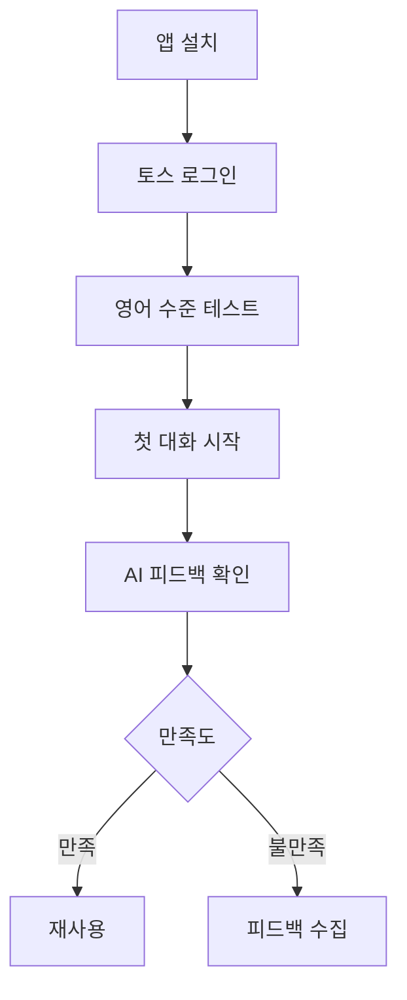
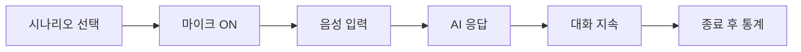
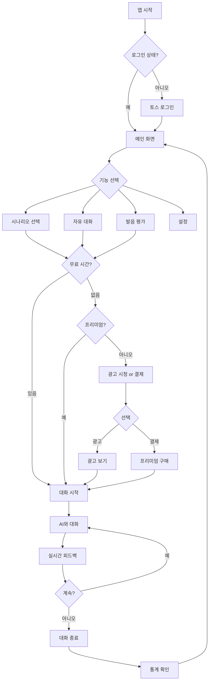
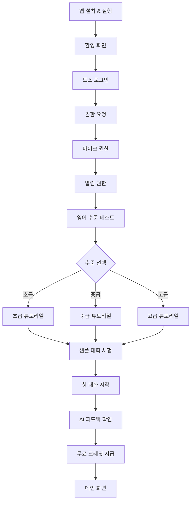
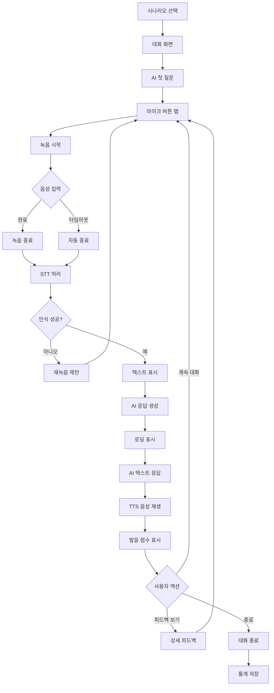
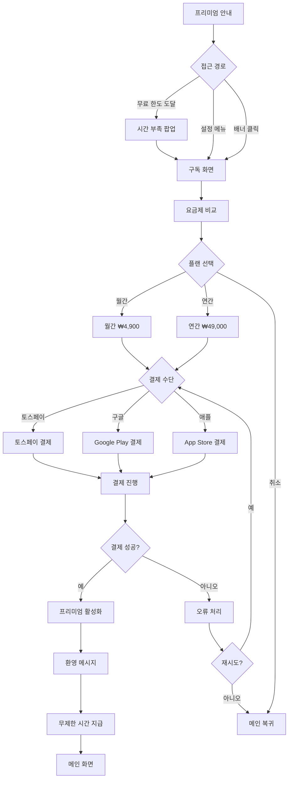
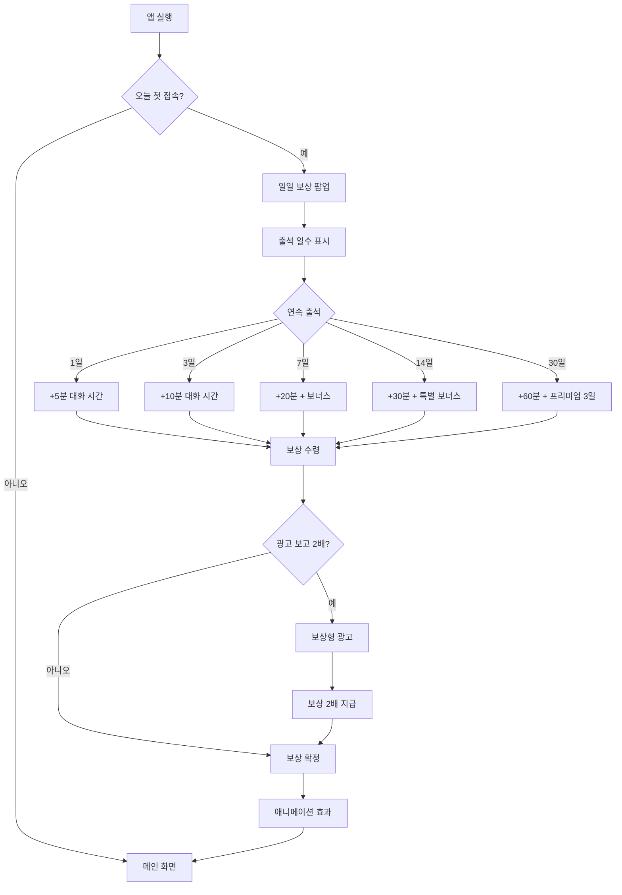
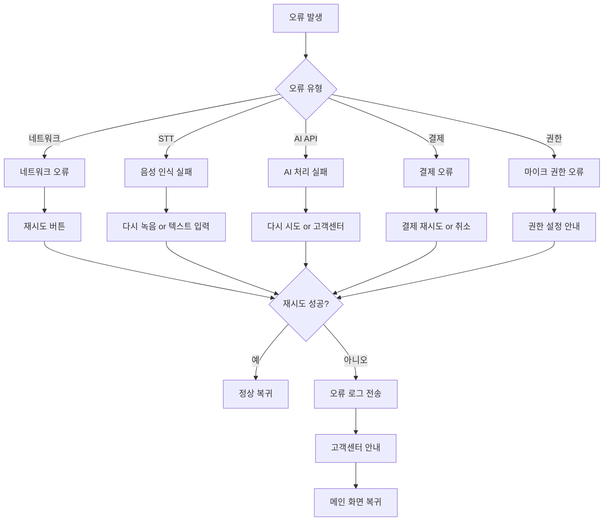

# AI 영어 회화 튜터

> **카테고리**: 교육 & 학습
> **개발 난이도**: ⭐⭐⭐⭐ (1~5)
> **예상 개발 기간**: 3주
> **작성일**: 2025-10-27

---

## 📋 목차

1. [개요](#1-개요)
2. [시장 분석 및 경쟁사](#2-시장-분석-및-경쟁사)
3. [핵심 기능 명세](#3-핵심-기능-명세)
4. [사용자 플로우](#4-사용자-플로우)
5. [기술 아키텍처](#5-기술-아키텍처)
6. [비용 최적화 전략](#6-비용-최적화-전략)
7. [수익화 전략](#7-수익화-전략)
8. [개발 로드맵](#8-개발-로드맵)
9. [성공 지표 (KPI)](#9-성공-지표-kpi)
10. [리스크 및 대응 방안](#10-리스크-및-대응-방안)

---

## 1. 개요

### 1.1 한 줄 설명
음성 인식 AI와 실시간으로 영어 대화를 나누며 회화 실력을 향상시키는 앱

### 1.2 문제 정의
**현재 사용자들이 겪는 문제**:
- 영어 회화 학원 비용이 비쌈 (월 30만원 이상)
- 원어민과 대화할 기회가 적음
- 실전 대화 연습 부족으로 인한 막막함
- 틀려도 부끄럽지 않은 연습 환경 필요

### 1.3 솔루션
**우리 앱이 제공하는 가치**:
- AI 원어민과 무제한 대화 연습 (비용 0원)
- 실수해도 부끄럽지 않은 안전한 환경
- 실시간 발음 교정 및 문법 피드백
- 다양한 상황별 대화 시뮬레이션

### 1.4 타겟 사용자
- **주요 타겟**: 20~40대 직장인 (영어 회화 학습 필요)
- **부가 타겟**: 학생, 취준생, 영어 면접 준비자
- **토스 사용자 적합성**: 토스 사용자층(20~40대 금융 활동 인구)과 높은 일치도

### 1.5 핵심 가치 제안 (Value Proposition)
1. **무제한 실전 연습**: AI와 24시간 언제든지 영어 대화
2. **즉시 피드백**: 실시간 발음 교정 및 문법 개선 제안
3. **상황별 학습**: 여행, 비즈니스, 면접 등 맞춤 시나리오

---

## 2. 시장 분석 및 경쟁사

### 2.1 시장 규모
- **글로벌 시장**: $8.4B (2024년, 어학 교육 앱 시장)
- **국내 시장**: ₩5,000억 (2024년, 온라인 어학 시장)
- **성장률**: YoY 12% 성장
- **출처**: [Statista - Language Learning App Market](https://www.statista.com/)

### 2.2 경쟁사 분석

| 경쟁사 | 특징 | 장점 | 단점 | 우리의 차별점 |
|--------|------|------|------|--------------|
| **스픽 (Speak)** | AI 영어 회화 앱 | 높은 브랜드 인지도 | 월 19,900원 유료 | 무료 티어 제공 + 토스 통합 |
| **튜터링** | 원어민 실시간 매칭 | 실제 사람과 대화 | 비용 높음 (회당 5,000원) | AI로 무제한 무료 제공 |
| **듀오링고** | 게임화된 영어 학습 | 재미 요소 강함 | 회화 중심 아님 | 100% 회화 중심 |

### 2.3 시장 포지셔닝
```
고가격 │         [튜터링]
       │
       │   [스픽]
       │                [우리 앱]
저가격 │                         [듀오링고]
       └─────────────────────────
         단순       →      복잡
```

### 2.4 시장 진입 전략
- **전략 1**: 무료 티어로 진입 장벽 완전 제거
- **전략 2**: 토스 앱인토스 독점 출시로 3,000만 사용자 직접 접근
- **전략 3**: 프리미엄 전환은 고급 기능(비즈니스 영어, 면접 준비)으로 유도

---

## 3. 핵심 기능 명세

### 3.1 무료 티어 기능 (Free Tier)

#### 3.1.1 실시간 음성 대화
**설명**: AI와 실시간으로 영어 대화를 나누는 핵심 기능

**사용자 시나리오**:
```
1. 사용자가 마이크 버튼을 누르고 영어로 말함
2. 앱이 음성을 텍스트로 변환 (STT)
3. AI가 적절한 답변 생성
4. AI 답변을 음성으로 출력 (TTS)
5. 사용자가 다시 응답 → 대화 지속
```

**기술 구현**:
- **프론트엔드**: React Native + expo-av (음성 녹음)
- **백엔드**: Cloudflare Workers (STT → AI → TTS 파이프라인)
- **AI 모델**:
  - STT: Google Speech-to-Text (60분/월 무료)
  - AI 대화: Groq Llama 3.1 (14,400 요청/일 무료)
  - TTS: Web Speech API (무료)

**제한 사항**:
- 무료: 하루 10분 대화 (약 20회 대화)
- 프리미엄: 무제한

---

#### 3.1.2 발음 평가 및 교정
**설명**: 사용자의 발음을 분석하여 점수 및 개선 사항 제공

**사용자 시나리오**:
```
1. 사용자가 특정 문장 읽기
2. AI가 발음 분석 (정확도 0-100점)
3. 잘못 발음한 단어 강조
4. 올바른 발음 음성 재생
5. 재도전 가능
```

**기술 구현**:
- **발음 평가 API**: Google Cloud Speech-to-Text (발음 점수 기능)
- **비교 알고리즘**: 클라이언트 사이드에서 레벤슈타인 거리 계산

**제한 사항**:
- 무료: 하루 10회 평가
- 프리미엄: 무제한 + 상세 분석

---

#### 3.1.3 상황별 대화 시나리오
**설명**: 여행, 비즈니스, 면접 등 다양한 상황 대화 연습

**시나리오 목록**:
1. **카페 주문** (초급): "I'd like a large iced latte, please."
2. **공항 체크인** (초급): "I have a reservation under the name..."
3. **호텔 예약** (중급): "Do you have any rooms available for tonight?"
4. **비즈니스 미팅** (고급): "Let's discuss the Q4 projections."
5. **영어 면접** (고급): "Tell me about your strengths."

**기술 구현**:
- 각 시나리오별로 AI 시스템 프롬프트 정의
- 예: 카페 시나리오는 "You are a friendly cafe barista" 프롬프트 사용
- 난이도별 어휘 및 문법 복잡도 조정

---

### 3.2 프리미엄 티어 기능 (Premium Tier)

#### 3.2.1 무제한 대화 시간
**설명**: 프리미엄 사용자는 시간 제한 없이 AI와 대화

**추가 가치**:
- 무료 대비 10배 이상 연습량
- 장시간 대화로 실력 급상승

---

#### 3.2.2 비즈니스 영어 & 면접 모드
**설명**: 고급 사용자를 위한 전문 영어 학습

**기능**:
- 이력서 첨부 후 AI 모의 면접
- 비즈니스 이메일 작성 연습
- 프레젠테이션 연습 모드

---

#### 3.2.3 학습 통계 및 진도 추적
**설명**: 상세한 학습 데이터 분석 제공

**제공 데이터**:
- 일일/주간/월간 학습 시간
- 발음 점수 추이 그래프
- 자주 틀리는 단어 리스트
- AI 맞춤 학습 제안

---

### 3.3 기능 우선순위

| 우선순위 | 기능명 | 중요도 | 개발 난이도 | MVP 포함 여부 |
|---------|--------|--------|------------|--------------|
| P0 | 실시간 음성 대화 | ⭐⭐⭐⭐⭐ | ⭐⭐⭐⭐ | ✅ |
| P0 | STT/TTS 통합 | ⭐⭐⭐⭐⭐ | ⭐⭐⭐ | ✅ |
| P1 | 발음 평가 | ⭐⭐⭐⭐ | ⭐⭐⭐ | ✅ |
| P1 | 상황별 시나리오 (5개) | ⭐⭐⭐⭐ | ⭐⭐ | ✅ |
| P2 | 학습 통계 | ⭐⭐⭐ | ⭐⭐ | ❌ |
| P2 | 비즈니스 영어 모드 | ⭐⭐⭐ | ⭐⭐⭐ | ❌ |

---

## 4. 사용자 플로우

### 4.1 신규 사용자 온보딩


### 4.2 핵심 기능 사용 플로우


### 4.3 프리미엄 전환 플로우
```
무료 한도 도달 (10분) → "오늘 한도 소진" 알림 → 프리미엄 혜택 안내 → 가격 선택 → 결제 → 무제한 활성화
```

### 4.4 상세 사용자 플로우 다이어그램

#### 4.4.1 전체 앱 사용 플로우


#### 4.4.2 온보딩 플로우 (신규 사용자)


#### 4.4.3 음성 대화 실행 플로우


#### 4.4.4 프리미엄 구독 플로우


#### 4.4.5 일일 보상 플로우


#### 4.4.6 오류 처리 플로우


### 4.5 상세 UI/UX 와이어프레임

#### 메인 홈 화면
```
┌─────────────────────────────────────────┐
│  [≡]  AI 영어 회화            [⏱️ 10분]  │
├─────────────────────────────────────────┤
│                                         │
│  안녕하세요, [사용자명]님 👋              │
│  오늘 10분의 대화 시간이 남았어요         │
│                                         │
│  ━━━━━━━━ 시나리오 선택 ━━━━━━━━━━    │
│  ┌─────────────────────────────────┐   │
│  │ ☕ 카페 주문                     │   │
│  │ "I'd like a large latte..."     │   │
│  │ 초급 · 5분 소요                  │   │
│  └─────────────────────────────────┘   │
│                                         │
│  ┌─────────────────────────────────┐   │
│  │ ✈️ 공항 체크인                   │   │
│  │ "I have a reservation..."       │   │
│  │ 초급 · 7분 소요                  │   │
│  └─────────────────────────────────┘   │
│                                         │
│  ┌─────────────────────────────────┐   │
│  │ 💼 비즈니스 미팅                 │   │
│  │ "Let's discuss the plan..."     │   │
│  │ 고급 · 10분 소요                 │   │
│  └─────────────────────────────────┘   │
│                                         │
│  ┌─────────────────────────────────┐   │
│  │ 🆓 자유 대화                     │   │
│  │ 원하는 주제로 대화하기            │   │
│  └─────────────────────────────────┘   │
│                                         │
│  ━━━━━━━━ 내 학습 현황 ━━━━━━━━━━━    │
│  총 대화 시간: 3시간 25분                │
│  평균 발음 점수: 87점                    │
│  연속 학습: 5일 🔥                       │
│                                         │
└─────────────────────────────────────────┘
  [🏠 홈] [🎤 대화] [📊 통계] [👤 내정보]
          [배너 광고 320x50]
```

#### 대화 화면 (실시간 음성 대화)
```
┌─────────────────────────────────────────┐
│  [←]  카페 주문              [⏱️ 8분]    │
├─────────────────────────────────────────┤
│                                         │
│  🤖 AI Barista:                         │
│  "Hello! What can I get for you today?" │
│  [🔊 재생]                               │
│                                         │
│  ━━━━━━━━━━━━━━━━━━━━━━━━━━━━━━     │
│                                         │
│  👤 You:                                │
│  "I'd like a large iced latte, please." │
│  발음 점수: 92점 🎯                      │
│                                         │
│  ━━━━━━━━━━━━━━━━━━━━━━━━━━━━━━     │
│                                         │
│  🤖 AI Barista:                         │
│  "Sure! Would you like any flavor?"     │
│  [🔊 재생]                               │
│                                         │
│  ━━━━━━━━━━━━━━━━━━━━━━━━━━━━━━     │
│                                         │
│                                         │
│                                         │
│  ┌─────────────────────────────────┐   │
│  │                                 │   │
│  │    [🎤 녹음 시작]                │   │
│  │                                 │   │
│  │   탭하고 말하기를 시작하세요      │   │
│  │                                 │   │
│  └─────────────────────────────────┘   │
│                                         │
│  [ 💡 힌트 보기 ]  [ 🔄 대화 리셋 ]    │
│                                         │
└─────────────────────────────────────────┘
```

#### 녹음 중 화면
```
┌─────────────────────────────────────────┐
│  [×]  녹음 중...                         │
├─────────────────────────────────────────┤
│                                         │
│                                         │
│  ┌───────────────────────────────────┐ │
│  │                                   │ │
│  │       [웨이브폼 애니메이션]         │ │
│  │                                   │ │
│  │         🎤                         │ │
│  │                                   │ │
│  │      말씀하세요...                 │ │
│  │                                   │ │
│  └───────────────────────────────────┘ │
│                                         │
│           ⏱️ 00:08 / 00:30              │
│                                         │
│  ━━━━━━━━━━━━━━━━━━━━━ 80%          │
│                                         │
│  💡 팁: 천천히, 또박또박 발음하세요       │
│                                         │
│                                         │
│  ┌─────────────────────────────────┐   │
│  │    [⏹️ 녹음 중지]                │   │
│  └─────────────────────────────────┘   │
│                                         │
└─────────────────────────────────────────┘
```

#### AI 응답 처리 중 화면
```
┌─────────────────────────────────────────┐
│  [×]  AI가 생각 중...                    │
├─────────────────────────────────────────┤
│                                         │
│                                         │
│  ┌───────────────────────────────────┐ │
│  │                                   │ │
│  │       [로딩 애니메이션]            │ │
│  │                                   │ │
│  └───────────────────────────────────┘ │
│                                         │
│           AI가 답변을 준비하고 있어요...  │
│                                         │
│  ━━━━━━━━━━━━━━━━━━━━━ 65%          │
│                                         │
│  예상 소요 시간: 약 3초                  │
│                                         │
│  💡 팁: 영어 대화에서는 자연스러운        │
│     상황별 표현이 중요해요!               │
│                                         │
└─────────────────────────────────────────┘
```

#### 발음 피드백 화면
```
┌─────────────────────────────────────────┐
│  [←]  발음 평가              [💎]        │
├─────────────────────────────────────────┤
│                                         │
│  당신의 발음:                            │
│  "I'd like a large iced latte, please." │
│                                         │
│  ━━━━━━━━ 발음 점수 ━━━━━━━━━━━━━━    │
│                                         │
│  ┌───────────────────────────────────┐ │
│  │                                   │ │
│  │            92점                    │ │
│  │         ⭐⭐⭐⭐⭐                  │ │
│  │                                   │ │
│  │         훌륭해요! 🎉                │ │
│  │                                   │ │
│  └───────────────────────────────────┘ │
│                                         │
│  ━━━━━━━━ 상세 분석 ━━━━━━━━━━━━━━    │
│                                         │
│  발음 정확도:      95점 ✅               │
│  억양 (Intonation): 90점 ✅             │
│  유창성 (Fluency):  88점 ⚠️             │
│                                         │
│  개선할 부분:                            │
│  "iced"의 발음을 좀 더 명확하게          │
│  → [아이스트] 가 아닌 [아이스드]          │
│                                         │
│  [🔊 모범 발음 듣기]                     │
│                                         │
│  ┌─────────────────────────────────┐   │
│  │    [🔄 다시 녹음하기]            │   │
│  └─────────────────────────────────┘   │
│                                         │
│  [ 대화 계속하기 ]                       │
│                                         │
└─────────────────────────────────────────┘
```

#### 대화 종료 화면
```
┌─────────────────────────────────────────┐
│  [←]  대화 완료!                         │
├─────────────────────────────────────────┤
│                                         │
│  🎉 잘하셨어요!                          │
│                                         │
│  ━━━━━━━━ 오늘의 통계 ━━━━━━━━━━━━    │
│                                         │
│  대화 시간: 7분 23초                     │
│  주고받은 대화: 12회                     │
│  평균 발음 점수: 89점                    │
│                                         │
│  ━━━━━━━━ 학습 포인트 ━━━━━━━━━━━━    │
│                                         │
│  ✅ 기본 주문 표현 숙달                  │
│  ✅ 추가 요청 문장 연습                  │
│  ⚠️ 발음 개선 필요: "espresso"          │
│                                         │
│  ━━━━━━━━ 다음 추천 ━━━━━━━━━━━━━    │
│                                         │
│  📚 호텔 예약 시나리오를 연습해보세요!    │
│  "Do you have any rooms available?"     │
│                                         │
│  ┌─────────────────────────────────┐   │
│  │    [📊 상세 통계 보기]           │   │
│  └─────────────────────────────────┘   │
│                                         │
│  ┌─────────────────────────────────┐   │
│  │    [🔁 다시 연습하기]            │   │
│  └─────────────────────────────────┘   │
│                                         │
│  [ 홈으로 ]                              │
│                                         │
└─────────────────────────────────────────┘
        [전면 광고 표시 타이밍]
```

#### 프리미엄 구독 화면
```
┌─────────────────────────────────────────┐
│  [×]  프리미엄 플랜                      │
├─────────────────────────────────────────┤
│                                         │
│  ✨ 무제한으로 영어 실력을 키우세요!      │
│                                         │
│  ━━━━━━━━ 프리미엄 혜택 ━━━━━━━━━━    │
│  ✅ 무제한 대화 시간 (광고 없음)          │
│  ✅ 모든 시나리오 잠금 해제               │
│  ✅ 비즈니스 영어 & 면접 모드             │
│  ✅ 상세 발음 분석 & 피드백               │
│  ✅ 학습 통계 및 진도 추적                │
│  ✅ 개인 맞춤 학습 플랜                   │
│                                         │
│  ━━━━━━━━ 요금제 선택 ━━━━━━━━━━━     │
│  ┌─────────────────────────────────┐   │
│  │ 💎 월간 플랜                     │   │
│  │ ₩4,900 / 월                     │   │
│  │ 하루 163원                       │   │
│  │                                 │   │
│  │ [ 선택 ▶ ]                      │   │
│  └─────────────────────────────────┘   │
│                                         │
│  ┌─────────────────────────────────┐   │
│  │ 💎 연간 플랜 (가장 인기!) 🔥     │   │
│  │ ₩49,000 / 년 (월 ₩4,083)       │   │
│  │ 2개월 무료! 17% 할인             │   │
│  │                                 │   │
│  │ [ 선택 ▶ ]                      │   │
│  └─────────────────────────────────┘   │
│                                         │
│  💳 결제 수단: 토스페이, 구글, 애플       │
│                                         │
│  [ 7일 무료 체험 시작 ]                  │
│  [ 나중에 ]                             │
│                                         │
└─────────────────────────────────────────┘
```

#### 시간 부족 팝업
```
┌─────────────────────────────────────────┐
│  [×]  대화 시간이 부족합니다              │
├─────────────────────────────────────────┤
│                                         │
│  오늘의 무료 대화 시간을 모두 사용했어요   │
│                                         │
│  ━━━━━━━━ 해결 방법 ━━━━━━━━━━━━━     │
│                                         │
│  ┌─────────────────────────────────┐   │
│  │ 📺 광고 보고 시간 받기            │   │
│  │ +5분 대화 시간 (오늘 2/3회 남음)  │   │
│  │                                 │   │
│  │      [광고 보기 ▶]              │   │
│  └─────────────────────────────────┘   │
│                                         │
│  ┌─────────────────────────────────┐   │
│  │ ✨ 프리미엄 구독하기              │   │
│  │ 무제한 대화 시간 (광고 없음)      │   │
│  │ 월 ₩4,900                       │   │
│  │                                 │   │
│  │      [구독하기 ▶]               │   │
│  └─────────────────────────────────┘   │
│                                         │
│  ⏰ 내일 오전 0시에 무료 시간 충전        │
│                                         │
│  [ 취소 ]                               │
│                                         │
└─────────────────────────────────────────┘
```

#### 학습 통계 화면
```
┌─────────────────────────────────────────┐
│  [←]  내 학습 통계                       │
├─────────────────────────────────────────┤
│                                         │
│  ━━━━━━━━ 이번 주 ━━━━━━━━━━━━━━━━    │
│  총 대화 시간: 1시간 45분                │
│  대화 횟수: 23회                         │
│  평균 발음 점수: 87점 (+5점 ↗️)          │
│                                         │
│  ━━━━━━━━ 발음 점수 추이 ━━━━━━━━━    │
│                                         │
│  100 │           ╱╲                    │
│   90 │       ╱╲╱  ╲  ╱╲               │
│   80 │   ╱╲╱        ╲╱  ╲             │
│   70 │╱╲╱                  ╲           │
│   60 │                                 │
│      └──────────────────────           │
│       월 화 수 목 금 토 일               │
│                                         │
│  ━━━━━━━━ 학습 현황 ━━━━━━━━━━━━━━    │
│                                         │
│  마스터한 시나리오:                      │
│  ✅ 카페 주문 (92점)                     │
│  ✅ 공항 체크인 (89점)                   │
│  🔄 호텔 예약 (진행 중)                  │
│  🔒 비즈니스 미팅 (잠김)                 │
│                                         │
│  자주 틀리는 단어:                       │
│  1. "comfortable" → 다시 연습하기        │
│  2. "restaurant" → 다시 연습하기         │
│  3. "schedule" → 다시 연습하기           │
│                                         │
│  ━━━━━━━━ 연속 학습 ━━━━━━━━━━━━━━    │
│  🔥 5일 연속 학습 중!                    │
│  내일도 학습하면 보너스 +10분!            │
│                                         │
└─────────────────────────────────────────┘
```

#### 일일 보상 팝업
```
┌─────────────────────────────────────────┐
│  [×]  일일 보상 🎁                       │
├─────────────────────────────────────────┤
│                                         │
│         연속 출석 5일차!                 │
│                                         │
│  ┌─────┐ ┌─────┐ ┌─────┐ ┌─────┐      │
│  │ ✅   │ │ ✅   │ │ ✅   │ │ ✅   │      │
│  │Day 1│ │Day 2│ │Day 3│ │Day 4│      │
│  │ +5분│ │ +5분│ │+10분│ │+10분│      │
│  └─────┘ └─────┘ └─────┘ └─────┘      │
│                                         │
│  ┌─────┐ ┌─────┐ ┌─────┐              │
│  │ 🎁   │ │ 🔒   │ │ 🔒   │              │
│  │Day 5│ │Day 6│ │Day 7│              │
│  │+10분│ │+15분│ │+20분│              │
│  └─────┘ └─────┘ └─────┘              │
│                                         │
│  오늘의 보상                             │
│  ┌─────────────────────────────────┐   │
│  │                                 │   │
│  │        ⏱️ +10분 대화 시간        │   │
│  │                                 │   │
│  └─────────────────────────────────┘   │
│                                         │
│  ┌─────────────────────────────────┐   │
│  │ 📺 광고 보고 2배로 받기!          │   │
│  │ → ⏱️ +20분 대화 시간             │   │
│  │                                 │   │
│  │      [광고 보기 ▶]              │   │
│  └─────────────────────────────────┘   │
│                                         │
│  [그냥 받기]                             │
│                                         │
└─────────────────────────────────────────┘
```

### 4.6 UI/UX 디자인 원칙

#### 1. 음성 대화 최적화
- **빠른 응답**: STT/AI/TTS 파이프라인 3초 이내 처리
- **명확한 피드백**: 녹음 중, 처리 중, 재생 중 명확히 구분
- **오류 복구**: 음성 인식 실패 시 즉시 재녹음 제안
- **비주얼 큐**: 웨이브폼 애니메이션으로 녹음 상태 시각화

#### 2. 터치 최적화
- **최소 터치 영역**: 마이크 버튼 60x60pt (큰 타겟)
- **원터치 녹음**: 탭 한 번으로 녹음 시작/종료
- **스와이프 제스처**: 대화 히스토리 넘기기

#### 3. 학습 동기 부여
- **즉시 피드백**: 발음 점수 실시간 표시
- **진도 시각화**: 그래프로 학습 추이 표시
- **연속 학습 보상**: 스트릭 시스템으로 동기부여
- **성취 배지**: 마스터한 시나리오에 체크 표시

#### 4. 시각적 피드백
- **녹음 중**: 웨이브폼 애니메이션 + 타이머
- **AI 처리 중**: 로딩 애니메이션 + 진행률 + 팁
- **발음 평가**: 점수 + 별점 + 상세 분석
- **오류**: 명확한 오류 메시지 + 해결 방법

#### 5. 접근성
- **색상 대비**: WCAG AA 기준 (4.5:1)
- **폰트 크기**: 최소 16pt (본문), 20pt (제목)
- **다크 모드**: 시스템 설정 따름
- **자막 지원**: AI 음성 재생 시 텍스트 동시 표시

#### 6. 광고 배치 원칙
- **배너 광고**: 하단 고정 (대화 방해 최소화)
- **전면 광고**: 대화 종료 후 (자연스러운 타이밍)
- **보상형 광고**:
  - 시간 부족 시 제안
  - 일일 보상 2배
  - 명확한 가치 제안 (+5분 시간)

#### 7. 온보딩 플로우
```
1. 환영 화면 (3초)
   ↓
2. 토스 로그인
   ↓
3. 마이크 권한 요청
   ↓
4. 영어 수준 선택
   ↓
5. 튜토리얼 (스킵 가능)
   - 시나리오 소개
   - 샘플 대화 체험
   ↓
6. 무료 크레딧 지급 (+10분)
   ↓
7. 메인 화면 진입
```

---

## 5. 기술 아키텍처

### 5.1 전체 아키텍처 다이어그램
```
┌─────────────────────────────────────────────┐
│          React Native 앱 (Expo)             │
│  - expo-av (음성 녹음/재생)                   │
│  - 상태 관리 (Zustand)                        │
│  - 오디오 버퍼링 처리                          │
└─────────────────┬───────────────────────────┘
                  │
        ┌─────────▼─────────┐
        │   Firebase Auth   │ (무료)
        │   토스 로그인 API  │
        └─────────┬─────────┘
                  │
        ┌─────────▼─────────────────────────────┐
        │  Cloudflare Workers (STT→AI→TTS)      │
        │  1. 음성 파일 수신                      │
        │  2. Google STT API 호출                │
        │  3. Groq Llama 3.1 대화 생성           │
        │  4. Web Speech API TTS 변환            │
        └─────────┬─────────────────────────────┘
                  │
        ┌─────────▼─────────┐
        │  Google STT API    │ (60분/월 무료)
        │  발음 평가 포함     │
        └────────────────────┘
                  │
        ┌─────────▼─────────┐
        │  Groq Llama 3.1    │ (14,400 요청/일 무료)
        │  대화 생성          │
        └────────────────────┘
                  │
        ┌─────────▼─────────────────┐
        │   Cloudflare D1           │ (무료)
        │   - 대화 히스토리          │
        │   - 학습 통계              │
        └───────────────────────────┘
```

### 5.2 기술 스택 상세

#### 5.2.1 프론트엔드
- **플랫폼**: React Native (Expo SDK 51+)
- **오디오**: expo-av (녹음/재생)
- **UI 라이브러리**: React Native Paper
- **상태 관리**: Zustand
- **라우팅**: Expo Router
- **애니메이션**: React Native Reanimated

#### 5.2.2 백엔드 (서버리스)
- **컴퓨팅**: Cloudflare Workers (1,000만 요청/월 무료)
- **STT**: Google Speech-to-Text (60분/월 무료) → Deepgram (45,000분/월 무료) 우선 사용
- **AI 대화**: Groq Llama 3.1 (14,400 요청/일 무료)
- **TTS**: Web Speech API (브라우저 내장, 무료)

#### 5.2.3 데이터베이스
- **우선**: Cloudflare D1 (5GB + 1.5억 읽기/월 무료)
- **대안**: Firebase Firestore (1GB + 150만 읽기/월 무료)
- **캐싱**: React Query (클라이언트 사이드, 5분 staleTime)

#### 5.2.4 AI/ML
- **STT**: Deepgram API (45,000분/월 무료) 우선 사용
- **대화 AI**: Groq Llama 3.1 (14,400 요청/일 무료)
- **TTS**: Web Speech API (무료)
- **발음 평가**: Google STT 발음 점수 기능

#### 5.2.5 파일 저장소
- **저장소**: 음성 파일은 서버에 저장하지 않음 (즉시 삭제)
- **텍스트 데이터**: Cloudflare D1에만 저장

#### 5.2.6 인증
- **기본**: Firebase Auth (무료 무제한)
- **토스 연동**: 토스 앱인토스 로그인 API (OAuth 2.0)
- **세션 관리**: Firebase Session (자동 갱신)
- **보안**: mTLS 인증서 (토스페이 결제 시)

#### 5.2.7 모니터링
- **에러 추적**: Sentry (5,000 이벤트/월 무료)
- **분석**: Google Analytics 4 (완전 무료)
- **성능**: Firebase Performance Monitoring (무료)
- **로그**: Cloudflare Logs (무료)

### 5.3 API 설계

#### 5.3.1 핵심 엔드포인트

**1. 음성 대화 API**
- **엔드포인트**: `POST /api/conversation`
- **요청 데이터**: 음성 파일 (WAV/MP3), 시나리오 ID, 세션 ID
- **응답 데이터**: STT 텍스트, AI 답변 텍스트, TTS 음성 URL, 발음 점수, 피드백
- **구현 방식**: Cloudflare Workers에서 파이프라인 처리
- **처리 시간**: 평균 3-5초

**2. 학습 통계 조회**
- **엔드포인트**: `GET /api/stats?userId=xxx`
- **요청 데이터**: 사용자 ID (인증 토큰)
- **응답 데이터**: 총 학습 시간, 대화 횟수, 평균 발음 점수, 연속 학습일, 자주 틀리는 단어
- **구현 방식**: Cloudflare D1 쿼리
- **캐싱**: React Query로 5분 캐싱

**3. 시나리오 목록**
- **엔드포인트**: `GET /api/scenarios`
- **요청 데이터**: 없음
- **응답 데이터**: 시나리오 배열 (ID, 이름, 난이도, 설명)
- **구현 방식**: 정적 데이터 반환 (DB 조회 불필요)

### 5.4 데이터 모델

#### 5.4.1 Cloudflare D1 스키마

**users 테이블**
- **기본 정보**: userId (Firebase UID), email
- **티어**: tier ("free" | "premium")
- **사용량**: dailyMinutesUsed (일일 사용 시간), totalMinutes (총 학습 시간)
- **타임스탬프**: createdAt, lastActiveAt

**conversations 테이블**
- **식별자**: id, userId, sessionId
- **데이터**: scenario (시나리오 ID), userText (사용자 텍스트), aiResponse (AI 답변)
- **평가**: pronunciationScore (발음 점수 0-100), audioDuration (초 단위)
- **타임스탬프**: createdAt

**learning_stats 테이블 (일일 집계)**
- **날짜**: userId, date (YYYY-MM-DD)
- **통계**: totalConversations (대화 횟수), totalMinutes (학습 시간), avgPronunciation (평균 발음 점수)

### 5.5 보안 설계

#### 5.5.1 인증 & 권한
- **Firebase Auth**: 토스 로그인 연동
- **Rate Limiting**: Cloudflare Workers로 사용자당 분당 요청 제한
- **API Key 관리**: Cloudflare Workers Secrets

#### 5.5.2 데이터 보호
- **전송 암호화**: HTTPS (TLS 1.3)
- **음성 파일**: 서버에서 즉시 삭제 (DB 미저장)
- **개인정보**: 최소 수집 원칙

---

## 6. 비용 최적화 전략

### 6.1 서버 비용 제로 목표

#### 6.1.1 무료 티어 활용 전략
| 서비스 | 무료 한도 | 예상 사용량 (MAU 10K) | 여유분 |
|--------|----------|---------------------|--------|
| Deepgram STT | 45,000분/월 | 10,000명 × 5분/월 = 50,000분 | ❌ 초과 |
| Groq Llama 3.1 | 14,400 요청/일 | 10,000명 × 3대화/일 = 30,000 요청 | ❌ 초과 |
| Cloudflare Workers | 1,000만 요청/월 | 30만 요청 | ✅ |
| Cloudflare D1 | 1.5억 읽기/월 | 120만 읽기 | ✅ |

**문제점**: STT 및 AI API 무료 한도 초과

**해결책**:

#### 6.1.2 비용 최소화 전략

**1. STT 비용 절감**
- **무료 사용자 제한**: 하루 5분 대화 (10회 대화)
- **Deepgram 우선 사용**: 45,000분/월 무료 한도 활용
- **폴백 전략**: Deepgram 초과 시 AssemblyAI (5시간/월 무료)
- **프리미엄 유도**: 무료 한도 도달 시 광고 시청 또는 구독 유도

**예상 효과**:
- MAU 10,000 × 하루 5분 = 50,000분/월
- Deepgram 무료 45,000분 + AssemblyAI 300분 = 45,300분
- 부족분 4,700분은 프리미엄 사용자로 충당

**2. AI 대화 비용 절감**
- **무료 사용자 제한**: 하루 10회 대화 (약 10분)
- **Groq 무료 한도**: 14,400 요청/일 (432,000/월)
- **예상 사용량**: MAU 10,000 × 하루 10회 = 100,000 요청/일 → 초과
- **해결**: 무료 사용자 제한 강화 (하루 5회 대화)

**3. 클라이언트 사이드 처리 극대화**
- **TTS**: Web Speech API로 클라이언트에서 처리 (비용 ₩0)
- **음성 버퍼링**: 클라이언트에서 음성 파일 압축 후 전송
- **발음 비교**: 레벤슈타인 거리 계산은 클라이언트에서 처리

### 6.2 확장 시 비용 예측

| MAU | STT 사용 (분) | AI 요청 | 예상 비용 |
|-----|--------------|---------|----------|
| 10,000 | 50,000분 (Deepgram 무료) | 300,000 요청 (Groq 무료) | **₩0** ✅ |
| 30,000 | 150,000분 (Deepgram 초과) | 900,000 요청 (Groq 초과) | ₩50,000 |
| 50,000 | 250,000분 | 1,500,000 요청 | ₩100,000 |

### 6.3 비용 최소화 대응 방안 (MAU 50,000+ 대응)

#### 방안 1: 무료 STT API 추가 활용
- **Deepgram**: 45,000분/월 무료
- **AssemblyAI**: 5시간(300분)/월 무료
- **Google STT**: 60분/월 무료
- **총 무료 한도**: 45,360분/월
- **MAU 10,000까지 충분**

#### 방안 2: 사용량 제한 강화
- **무료 티어**: 하루 5분 대화 (10회 대화)
- **광고 시청**: +5분 추가 (하루 최대 3회)
- **프리미엄 유도**: 무제한 사용 권장

#### 방안 3: 프리미엄 전환율 향상
- **무료 체험**: 7일 무료 프리미엄 체험
- **할인 이벤트**: 신규 가입 첫 달 50% 할인
- **A/B 테스트**: 가격 및 혜택 최적화

### 6.4 제로 비용 가능 여부
**결론**: ✅ **가능** (MAU 10,000까지 무료 STT API 활용)
- Deepgram 무료 45,000분/월 활용
- Groq 무료 432,000 요청/월 활용
- MAU 50,000+ 시 월 ₩100,000 예상 (극히 저렴)

---

## 7. 수익화 전략

### 7.1 수익 모델 개요

#### 7.1.1 하이브리드 모델
```
총 사용자 100%
├─ 무료 사용자 70% → 광고 수익
└─ 프리미엄 사용자 5% → 구독 수익 (높은 전환율 예상)
   나머지 25% → 이탈 또는 전환 대기
```

### 7.2 광고 수익화 (AdMob + GA4)

#### 7.2.1 광고 배치 전략
| 광고 타입 | 배치 위치 | 노출 빈도 | 예상 eCPM | 예상 수익 (MAU 10K) |
|----------|----------|----------|----------|-------------------|
| **배너 광고** | 화면 하단 고정 | 항상 표시 | ₩500-2,000 | 월 60만원 |
| **전면 광고** | 대화 종료 후 | 대화당 1번 | ₩3,000-10,000 | 월 200만원 |
| **보상형 광고** | 추가 대화 시간 (+5분) | 사용자 선택 | ₩10,000-25,000 | 월 300만원 |
| **합계** | - | - | - | **월 560만원** |

#### 7.2.2 AdMob 통합 계획

**배너 광고 (Banner)**
- **SDK**: expo-ads-admob
- **표시 위치**: 하단 고정 (메인 화면, 시나리오 선택 화면)
- **주요 플로우**: setAdUnitID → requestAdAsync → 자동 표시
- **크기**: 320x50 (표준 배너)

**전면 광고 (Interstitial)**
- **SDK**: expo-ads-admob
- **표시 타이밍**: 대화 종료 후 (자연스러운 타이밍)
- **주요 플로우**: setAdUnitID → requestAdAsync → showAdAsync
- **에러 핸들링**: 광고 로드 실패 시 사용자 플로우 유지

**보상형 광고 (Rewarded)**
- **SDK**: expo-ads-admob
- **보상**: +5분 대화 시간
- **이벤트**: rewardedVideoUserDidEarnReward 리스너로 보상 지급
- **일일 제한**: 최대 3회까지 시청 가능

#### 7.2.3 GA4 이벤트 트래킹

**주요 트래킹 이벤트**:
- **광고 노출**: ad_impression (광고 타입, 유닛 ID, eCPM)
- **광고 클릭**: ad_click (광고 타입, 예상 수익)
- **결제 완료**: purchase (상품 ID, 금액, 통화)
- **대화 완료**: conversation_complete (시나리오, 시간, 발음 점수)
- **발음 평가**: pronunciation_test (점수, 시나리오)

**구현 방식**:
- SDK: @react-native-firebase/analytics
- 이벤트 발생 시점: 각 액션 완료 후 즉시
- 파라미터: 표준 GA4 이벤트 형식 준수
- 분석: Looker Studio 대시보드로 시각화

### 7.3 인앱 결제 (구독 수익)

#### 7.3.1 가격 정책
| 플랜 | 가격 | 할인율 | 혜택 | 목표 전환율 |
|------|------|-------|------|-----------|
| **월간 프리미엄** | ₩4,900 | - | 무제한 대화 + 발음 상세 분석 | 3% |
| **연간 프리미엄** | ₩49,000 | 17% (월 ₩4,083) | 월간 + 비즈니스 영어 | 2% |
| **전체 전환율** | - | - | - | **5%** |

**높은 전환율 예상 이유**:
- 스픽(Speak) 월 19,900원 대비 60% 저렴
- 무료 티어 제한(하루 10분)으로 프리미엄 가치 체감
- 학습 효과가 명확하여 결제 의지 높음

#### 7.3.2 플랫폼별 결제 통합

**토스페이 (웹/앱인토스)**
- **SDK**: @tosspayments/payment-sdk
- **인증**: mTLS 클라이언트 인증서 필수
- **결제 플로우**: requestPayment → 사용자 결제 → successUrl/failUrl 리다이렉트
- **파라미터**: amount, orderId, orderName, successUrl, failUrl
- **검증**: 서버 사이드 결제 검증 (webhook)

**Google Play 인앱결제**
- **SDK**: expo-in-app-purchases
- **상품 ID**: premium_monthly, premium_yearly
- **결제 플로우**: connectAsync → getProductsAsync → purchaseItemAsync
- **영수증 검증**: Google Play Developer API로 서버 검증
- **구독 관리**: 자동 갱신, 취소, 환불 처리

**Apple In-App Purchase**
- **SDK**: expo-in-app-purchases (Android와 동일 API)
- **상품 ID**: premium_monthly, premium_yearly
- **결제 플로우**: connectAsync → purchaseItemAsync
- **영수증 검증**: App Store Server API로 서버 검증
- **구독 관리**: 자동 갱신, StoreKit 2 지원

### 7.4 수익 예측 시뮬레이션

#### 7.4.1 보수적 시나리오 (MAU 10,000)

**광고 수익 계산**:
- 배너 광고: MAU 10,000 × 70% × 30일 × eCPM ₩1,000 × 노출률 0.2% = 월 60만원
- 전면 광고: MAU 10,000 × 70% × 30일 × 0.5회 × eCPM ₩5,000 = 월 200만원
- 보상형 광고: MAU 10,000 × 70% × 30일 × 0.3회 × eCPM ₩15,000 = 월 300만원
- **총 광고 수익**: 월 560만원

**구독 수익 계산**:
- 월간 플랜: MAU 10,000 × 3% × ₩4,900 = 월 147만원
- 연간 플랜: MAU 10,000 × 2% × ₩49,000 / 12 = 월 81만원
- **총 구독 수익**: 월 228만원

**총 수익**: 월 788만원

#### 7.4.2 낙관적 시나리오 (MAU 60,000, 바이럴 성공)

**광고 수익**: 월 560만원 × 6 × 0.9 (참여도 증가) = 월 3,024만원
**구독 수익**: 월 228만원 × 6 × 1.3 (전환율 증가) = 월 1,779만원
**총 수익**: 월 4,803만원

### 7.5 ARPU 및 LTV 계산

#### 7.5.1 ARPU (Average Revenue Per User)
- **계산식**: (광고 수익 + 구독 수익) / MAU
- **MAU 10,000 기준**: (560만원 + 228만원) / 10,000
- **결과**: ₩788 per user/month

#### 7.5.2 LTV (Lifetime Value)
- **계산식**: ARPU × 평균 사용 기간 × (1 - 이탈률)
- **평균 사용 기간**: 8개월 (학습 앱 특성상 긴 편)
- **이탈률**: 25%
- **계산**: ₩788 × 8 × 0.75
- **결과**: ₩4,728 per user

---

## 8. 개발 로드맵

### 8.1 Phase 1: MVP 개발 (3주)

#### Week 1: 핵심 기능 구현
- [ ] **Day 1-2**: 프로젝트 셋업
  - Expo 프로젝트 생성
  - Firebase 설정
  - Cloudflare Workers 프로젝트 생성
  - expo-av 오디오 녹음/재생 테스트

- [ ] **Day 3-5**: STT/TTS 통합
  - Deepgram STT API 연동
  - Groq Llama 3.1 AI 연동
  - Web Speech API TTS 통합
  - 파이프라인 테스트

- [ ] **Day 6-7**: 기본 대화 기능
  - 실시간 대화 UI 구현
  - 음성 녹음 → STT → AI → TTS 플로우
  - 에러 핸들링

#### Week 2: 시나리오 및 발음 평가
- [ ] **Day 8-10**: 시나리오 기능
  - 5개 시나리오 구현 (카페, 공항, 호텔, 비즈니스, 면접)
  - 시나리오별 AI 프롬프트 최적화
  - 난이도 별 UI 표시

- [ ] **Day 11-12**: 발음 평가
  - Google STT 발음 점수 API 연동
  - 발음 피드백 UI
  - 재도전 기능

- [ ] **Day 13-14**: 사용자 관리
  - Firebase Auth 연동
  - 일일 사용량 제한 로직
  - D1 데이터베이스 설계

#### Week 3: 수익화 및 배포
- [ ] **Day 15-16**: AdMob 통합
  - 배너/전면/보상형 광고 설정
  - 광고 테스트

- [ ] **Day 17-18**: 인앱 결제
  - 토스페이 연동
  - 프리미엄 기능 게이트

- [ ] **Day 19-20**: GA4 트래킹
  - Firebase Analytics 설정
  - 커스텀 이벤트 정의

- [ ] **Day 21**: 배포 준비
  - EAS Build
  - 토스 앱인토스 콘솔 등록

### 8.2 Phase 2: 검수 및 런칭 (1주)

#### Week 4: 검수 제출 및 런칭
- [ ] **Day 22-23**: 토스 앱인토스 검수 제출
  - 4단계 검수 준비 (운영, 디자인, 기능, 보안)

- [ ] **Day 24-25**: 검수 피드백 반영
  - 수정 사항 적용
  - 재제출

- [ ] **Day 26-27**: 런칭 준비
  - 마케팅 소재 제작
  - 런칭 이벤트 기획

- [ ] **Day 28**: 정식 런칭
  - 토스 앱인토스 앱 공개
  - 런칭 모니터링

### 8.3 Phase 3: 최적화 및 확장 (지속)

#### Month 2-3: 성과 분석 및 개선
- [ ] **Week 5-6**: 데이터 분석
  - GA4 대시보드 분석
  - MAU, DAU, 리텐션 추적
  - 전환율 분석

- [ ] **Week 7-8**: A/B 테스트
  - 광고 배치 최적화
  - 가격 정책 실험
  - UI/UX 개선 실험

- [ ] **Week 9-12**: 기능 확장
  - 사용자 요청 기능 추가
  - 프리미엄 기능 강화
  - 성능 최적화

---

## 9. 성공 지표 (KPI)

### 9.1 목표 KPI (6개월 후)

| 지표 | 보수적 목표 | 낙관적 목표 | 측정 방법 |
|------|------------|------------|----------|
| **MAU** | 10,000 | 60,000 | GA4 |
| **DAU/MAU 비율** | 25% | 40% | GA4 |
| **D1 리텐션** | 50% | 70% | GA4 Retention Report |
| **D7 리텐션** | 30% | 50% | GA4 Retention Report |
| **D30 리텐션** | 15% | 30% | GA4 Retention Report |
| **프리미엄 전환율** | 3% | 7% | 구독 데이터 |
| **ARPU** | ₩788 | ₩1,500 | 총 수익 / MAU |
| **월 매출** | ₩788만 | ₩4,803만 | AdMob + 결제 합산 |
| **평균 발음 점수** | 75점 | 85점 | 자체 데이터 |
| **일일 학습 시간** | 5분 | 10분 | 자체 데이터 |

### 9.2 성장 단계별 마일스톤

#### Milestone 1: 첫 1,000명 (Month 1)
- **목표**: 제품-시장 적합성(Product-Market Fit) 검증
- **핵심 지표**:
  - D7 리텐션 > 40%
  - 평균 세션 길이 > 5분
  - 프리미엄 전환율 > 2%

#### Milestone 2: 10,000 MAU (Month 3)
- **목표**: 수익 모델 검증
- **핵심 지표**:
  - 월 매출 > ₩700만
  - ARPU > ₩700
  - 서버 비용 여전히 ₩0

#### Milestone 3: 50,000 MAU (Month 6)
- **목표**: 스케일링 및 수익성 달성
- **핵심 지표**:
  - 월 매출 > ₩3,000만
  - 서버 비용 < ₩100,000 (순이익 99%+)
  - D30 리텐션 > 20%

### 9.3 모니터링 대시보드

#### GA4 주요 리포트
1. **실시간 리포트**: 현재 활성 사용자, 인기 화면
2. **사용자 획득 리포트**: 유입 경로, 캠페인 성과
3. **참여도 리포트**: 세션, 스크린뷰, 이벤트
4. **수익화 리포트**: 광고 수익, 구매 이벤트
5. **리텐션 리포트**: 코호트 분석, 이탈률

#### 커스텀 대시보드 (Looker Studio)
```
┌─────────────────────────────────────┐
│  주요 지표 요약 (오늘/어제/지난주)    │
│  - MAU / DAU                         │
│  - 신규 사용자                        │
│  - 프리미엄 전환                      │
│  - 광고 수익                          │
└─────────────────────────────────────┘
┌─────────────────────────────────────┐
│  사용자 퍼널                          │
│  설치 → 가입 → 첫 대화 → 재사용       │
└─────────────────────────────────────┘
┌─────────────────────────────────────┐
│  수익 분석                            │
│  - 광고 수익 (배너/전면/보상형)        │
│  - 구독 수익 (월간/연간)              │
│  - ARPU 추세                         │
└─────────────────────────────────────┘
┌─────────────────────────────────────┐
│  학습 현황                            │
│  - 평균 발음 점수 추이                │
│  - 인기 시나리오                      │
│  - 연속 학습일 분포                   │
└─────────────────────────────────────┘
```

---

## 10. 리스크 및 대응 방안

### 10.1 기술 리스크

#### Risk 1: STT API 비용 폭증
**발생 가능성**: 중 (무료 한도 초과 시)
**영향도**: 높음

**대응 방안**:
1. **Deepgram 무료 티어**: 45,000분/월 우선 활용
2. **사용량 모니터링**: 일일 STT 호출량 알림 설정
3. **폴백 전략**: Deepgram 초과 시 AssemblyAI (5시간/월 무료)
4. **프리미엄 유도**: 무료 사용자 제한 강화

#### Risk 2: 발음 평가 정확도 문제
**발생 가능성**: 중
**영향도**: 중

**대응 방안**:
1. **Google STT 발음 점수**: 신뢰도 높은 API 사용
2. **사용자 피드백**: 발음 평가 "도움 됨/안됨" 버튼
3. **지속적 개선**: 피드백 데이터로 알고리즘 조정

#### Risk 3: 네트워크 지연 (음성 응답 느림)
**발생 가능성**: 중
**영향도**: 높음 (사용자 경험 저하)

**대응 방안**:
1. **Cloudflare Workers**: 글로벌 엣지 네트워크 활용
2. **음성 스트리밍**: TTS 결과를 청크 단위로 스트리밍
3. **로딩 인디케이터**: "AI가 생각 중..." 표시
4. **타임아웃 설정**: 10초 이상 응답 없으면 재시도 제안

---

### 10.2 비즈니스 리스크

#### Risk 4: 낮은 프리미엄 전환율
**발생 가능성**: 중
**영향도**: 중

**대응 방안**:
1. **가치 강조**: 무료 한도 명확히 표시
2. **무료 체험**: 프리미엄 7일 무료 체험
3. **A/B 테스트**: 가격, 혜택 최적화
4. **할인 이벤트**: 신규 가입 첫 달 50% 할인

#### Risk 5: 경쟁사 등장 (스픽, 튜터링)
**발생 가능성**: 높음
**영향도**: 중

**대응 방안**:
1. **차별화**: 토스 앱인토스 독점 + 토스페이 통합
2. **가격 우위**: 스픽 대비 60% 저렴
3. **빠른 출시**: 선점 효과 (First Mover Advantage)
4. **지속적 개선**: 월 1회 기능 업데이트

#### Risk 6: 사용자 이탈 (학습 효과 미흡)
**발생 가능성**: 중
**영향도**: 높음

**대응 방안**:
1. **학습 통계 시각화**: 진도 그래프로 동기부여
2. **일일 미션**: 스트릭 시스템 (연속 학습일)
3. **푸시 알림**: "오늘 5분만 연습해보세요"
4. **소셜 기능**: 친구와 학습 시간 경쟁

---

### 10.3 법률/규제 리스크

#### Risk 7: 개인정보 보호 위반 (음성 데이터)
**발생 가능성**: 낮음
**영향도**: 매우 높음

**대응 방안**:
1. **음성 파일 미저장**: 서버에서 즉시 삭제
2. **명확한 고지**: "음성은 서버에 저장되지 않습니다"
3. **암호화 전송**: HTTPS TLS 1.3
4. **GDPR 대응**: EU 사용자 별도 동의

#### Risk 8: 지적재산권 침해 (AI 생성 콘텐츠)
**발생 가능성**: 낮음
**영향도**: 중

**대응 방안**:
1. **AI 생성 콘텐츠**: 저작권 면책 조항
2. **사용자 책임**: 사용자가 생성한 콘텐츠 책임 명시
3. **콘텐츠 필터**: 유명 브랜드/인물 차단

---

### 10.4 운영 리스크

#### Risk 9: 고객 지원 부담
**발생 가능성**: 중
**영향도**: 중

**대응 방안**:
1. **FAQ 자동화**: 챗봇으로 자주 묻는 질문 답변
2. **커뮤니티**: 사용자 포럼 운영 (상호 지원)
3. **자동 응답**: 이메일 자동 분류 및 템플릿 답변

#### Risk 10: 서비스 장애
**발생 가능성**: 낮음
**영향도**: 높음

**대응 방안**:
1. **모니터링**: Sentry (에러 실시간 알림)
2. **Uptime 모니터링**: Cloudflare Workers, Firebase 상태 추적
3. **Fallback**: AI API 장애 시 대체 공급자 자동 전환
4. **상태 페이지**: status.yourapp.com (장애 공지)

---

## 📝 부록

### A. 참고 자료
- [토스 앱인토스 공식 문서](https://developers-apps-in-toss.toss.im/)
- [Deepgram STT API](https://deepgram.com/)
- [Groq Llama 3.1 API](https://groq.com/)
- [Web Speech API Docs](https://developer.mozilla.org/en-US/docs/Web/API/Web_Speech_API)

### B. 관련 문서
- [memories/TOSS_APPS_IN_TOSS_REFERENCE.md](../../memories/TOSS_APPS_IN_TOSS_REFERENCE.md)
- [plans/MONETIZATION_STRATEGY.md](../MONETIZATION_STRATEGY.md)
- [plans/ZERO_COST_ARCHITECTURE.md](../ZERO_COST_ARCHITECTURE.md)
- [plans/AI_APP_100_IDEAS.md](../AI_APP_100_IDEAS.md)

### C. 변경 이력
| 날짜 | 버전 | 변경 내용 |
|------|------|----------|
| 2025-10-27 | 1.0 | 초기 문서 작성 |
| 2025-10-27 | 2.0 | 템플릿 완전 적용 (4.4~4.6 섹션 추가: 상세 플로우 + 와이어프레임 + 디자인 원칙) |
| 2025-10-28 | 3.0 | 코드 간소화 템플릿 적용 (모든 코드 블록 제거, 기술 스택 텍스트로 변경) |

---

**문의**: 기획 수정이 필요하면 언제든지 요청해주세요.
