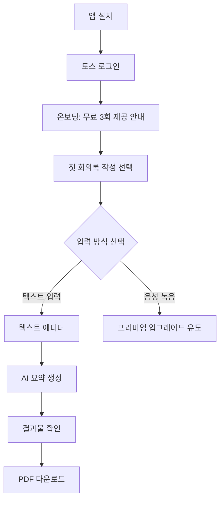
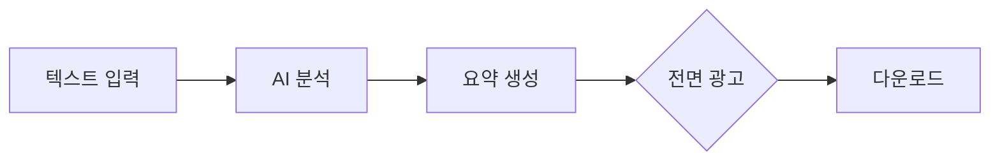
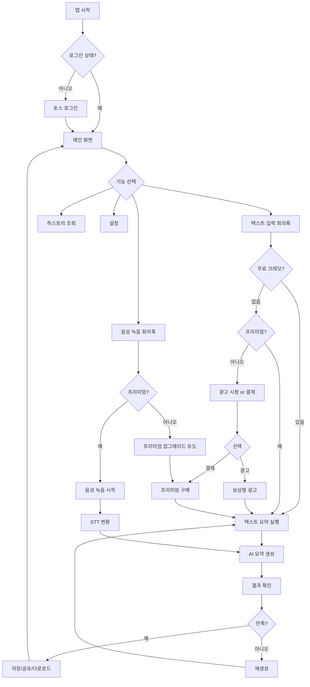
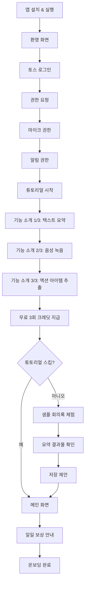
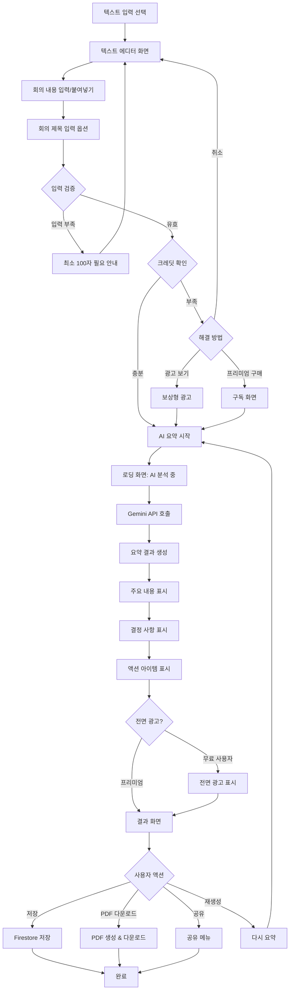
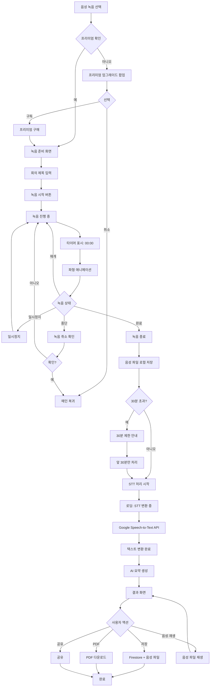
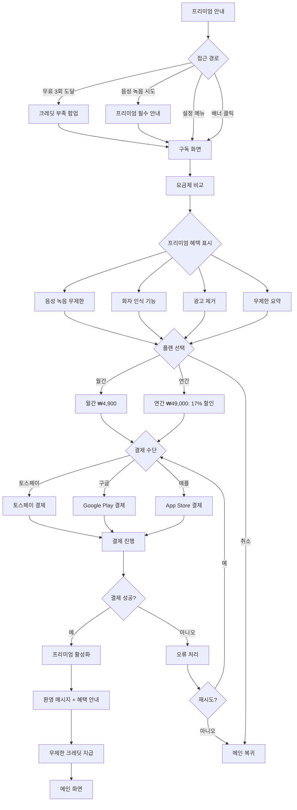
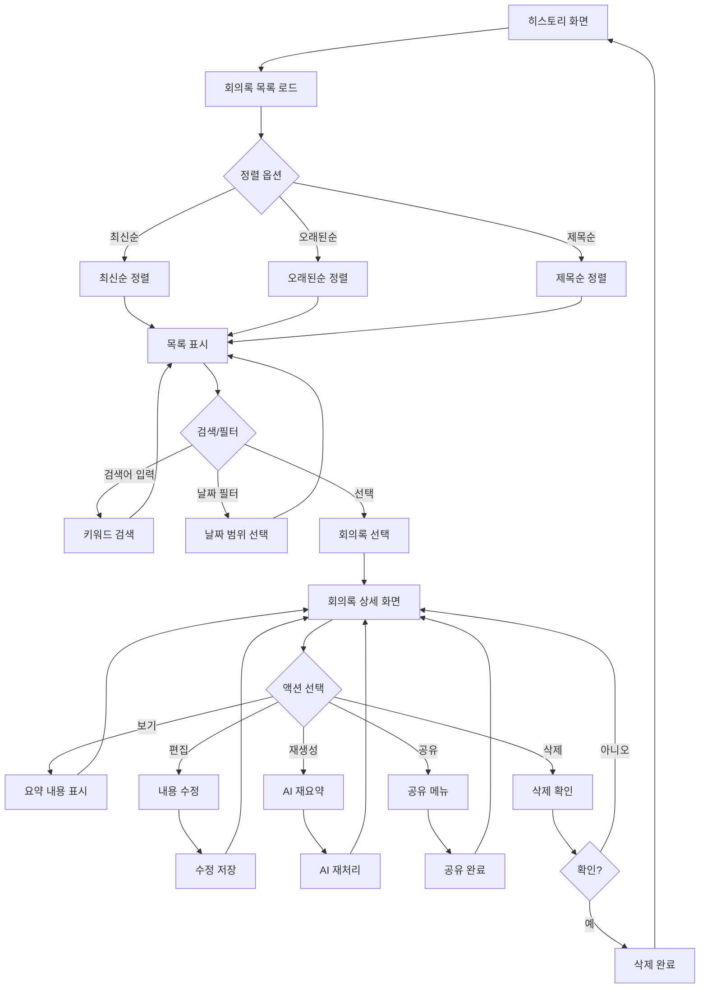

# AI 회의록 자동 정리기

> **카테고리**: 생산성 & 업무 자동화
> **개발 난이도**: ⭐⭐⭐⭐ (1~5)
> **예상 개발 기간**: 3주
> **작성일**: 2025-10-27

---

## 📋 목차

1. [개요](#1-개요)
2. [시장 분석 및 경쟁사](#2-시장-분석-및-경쟁사)
3. [핵심 기능 명세](#3-핵심-기능-명세)
4. [사용자 플로우](#4-사용자-플로우)
5. [기술 아키텍처](#5-기술-아키텍처)
6. [비용 최적화 전략](#6-비용-최적화-전략)
7. [수익화 전략](#7-수익화-전략)
8. [개발 로드맵](#8-개발-로드맵)
9. [성공 지표 (KPI)](#9-성공-지표-kpi)
10. [리스크 및 대응 방안](#10-리스크-및-대응-방안)

---

## 1. 개요

### 1.1 한 줄 설명
회의 음성/텍스트를 AI가 자동으로 요약하여 주요 내용, 결정 사항, 액션 아이템을 추출하는 생산성 도구

### 1.2 문제 정의
**현재 사용자들이 겪는 문제**:
- 회의 후 수동으로 회의록 작성에 평균 30분 소요
- 중요한 결정 사항이나 액션 아이템 누락
- 참석자별 발언 내용 기억 어려움
- 회의 내용을 팀원들에게 공유하기 번거로움

### 1.3 솔루션
**우리 앱이 제공하는 가치**:
- AI가 회의 내용을 자동으로 요약 (3분 이내)
- 결정 사항과 액션 아이템 자동 추출
- 참석자별 발언 내용 분류
- 회의록을 PDF/텍스트로 즉시 공유

### 1.4 타겟 사용자
- **주요 타겟**: 25~45세 직장인 (팀장, PM, 기획자)
- **부가 타겟**: 프리랜서, 스타트업 창업자
- **토스 사용자 적합성**: 토스 사용자 중 직장인 비율 높음, 업무 효율화에 민감

### 1.5 핵심 가치 제안 (Value Proposition)
1. **시간 절약**: 30분 → 3분으로 회의록 작성 시간 90% 단축
2. **완벽한 기록**: AI가 모든 발언 내용 분석하여 누락 없이 기록
3. **액션 추적**: 할 일과 담당자를 자동으로 추출하여 업무 추적 용이

---

## 2. 시장 분석 및 경쟁사

### 2.1 시장 규모
- **글로벌 시장**: $2.3억 (2024년, Speech-to-Text 시장)
- **국내 시장**: ₩300억 (2024년, 비즈니스 협업 도구 시장)
- **성장률**: YoY 28% 성장
- **출처**: MarketsandMarkets, 한국정보통신산업협회

### 2.2 경쟁사 분석

| 경쟁사 | 특징 | 장점 | 단점 | 우리의 차별점 |
|--------|------|------|------|--------------|
| Otter.ai | 실시간 STT + AI 요약 | 정확한 영어 인식 | 한국어 미지원, 월 $20 | 한국어 특화, 무료 플랜 |
| Clova Note | 네이버 음성 인식 | 한국어 인식 우수 | 요약 기능 약함 | AI 요약 강화, 액션 아이템 추출 |
| Notion AI | 텍스트 요약 기능 | 노션 생태계 통합 | 음성 녹음 없음 | 음성 녹음 + AI 요약 통합 |

### 2.3 시장 포지셔닝
```
고가격 │         [Otter.ai $20]
       │
       │   [우리 앱 ₩4,900]
       │                [Clova Note 무료]
저가격 │
       └─────────────────────────
         단순       →      복잡
```

### 2.4 시장 진입 전략
- **전략 1**: 무료 플랜으로 사용자 확보 (텍스트 입력 전용)
- **전략 2**: 토스 직장인 사용자 타겟 마케팅
- **전략 3**: 프리미엄 기능(음성 인식)으로 수익화

---

## 3. 핵심 기능 명세

### 3.1 무료 티어 기능 (Free Tier)

#### 3.1.1 텍스트 붙여넣기 → AI 요약
**설명**: 사용자가 회의 내용을 직접 타이핑하거나 붙여넣으면 AI가 요약

**사용자 시나리오**:
```
1. 사용자가 회의 내용 텍스트 입력/붙여넣기
2. "요약하기" 버튼 클릭
3. AI가 다음 항목 자동 추출:
   - 회의 주제
   - 주요 내용 (3~5개 불릿 포인트)
   - 결정 사항
   - 액션 아이템 (담당자 + 마감일)
```

**기술 구현**:
- **프론트엔드**: React Native TextInput 컴포넌트 (멀티라인 지원)
- **백엔드**: Vercel Edge Function으로 AI API 호출 처리
- **AI 모델**: Google Gemini 2.5 (무료 무제한)

**제한 사항**:
- 무료: 월 3회 요약 제한
- 프리미엄: 무제한

---

#### 3.1.2 회의록 저장 및 히스토리
**설명**: 생성된 회의록을 자동 저장하고 과거 히스토리 조회

**기술 구현**:
- **DB**: Firebase Firestore로 회의록 데이터 저장
- **검색**: 날짜별, 키워드별 필터링 지원

---

#### 3.1.3 회의록 공유
**설명**: 회의록을 PDF/텍스트로 다운로드 또는 링크 공유

**기술 구현**:
- **PDF 생성**: react-pdf 라이브러리로 클라이언트 사이드 생성 (서버 비용 0)
- **공유**: expo-sharing으로 네이티브 공유 메뉴 연동

**제한 사항**:
- 무료: 전면 광고 노출 후 다운로드
- 프리미엄: 광고 없음

---

### 3.2 프리미엄 티어 기능 (Premium Tier)

#### 3.2.1 음성 녹음 → STT → AI 요약 (프리미엄 전용)
**설명**: 회의 중 음성 녹음 → Google Speech-to-Text → AI 요약

**사용자 시나리오**:
```
1. 회의 시작 전 "녹음 시작" 버튼
2. 회의 진행 중 음성 녹음 (로컬 저장)
3. 회의 종료 후 "요약하기" 클릭
4. 음성 파일 → STT → 텍스트 변환
5. AI가 텍스트 요약
```

**기술 구현**:
- **녹음**: expo-av 라이브러리로 로컬 녹음 (m4a 포맷)
- **STT**: Google Speech-to-Text API (60분/월 무료, 초과 시 Whisper API 사용)
- **비용 관리**: 녹음 시간 30분 제한

**추가 가치**:
- 녹음 파일도 함께 저장 (나중에 재청취 가능)
- 타임스탬프 자동 생성 (발언 시간 기록)

---

#### 3.2.2 참석자별 발언 분류 (화자 인식)
**설명**: AI가 발언자를 구분하여 누가 무엇을 말했는지 정리

**기술 구현**:
- **화자 인식**: Google Speech-to-Text Diarization 기능 사용
- **AI 분석**: Gemini가 화자별 주요 발언 요약

**예시 출력**:
```
김철수 (팀장):
- 프로젝트 마감일은 11월 15일로 확정
- 예산 승인 완료

이영희 (개발자):
- 백엔드 API 개발 11월 10일까지 완료 예정
- 테스트 서버 구축 필요
```

---

#### 3.2.3 캘린더 연동 (다음 회의 일정 자동 등록)
**설명**: 액션 아이템에서 마감일을 추출하여 캘린더에 자동 등록

**기술 구현**:
- **캘린더**: expo-calendar로 네이티브 캘린더 접근
- **AI 분석**: Gemini가 마감일 자동 추출 후 캘린더 이벤트 생성

---

### 3.3 기능 우선순위

| 우선순위 | 기능명 | 중요도 | 개발 난이도 | MVP 포함 여부 |
|---------|--------|--------|------------|--------------|
| P0 | 텍스트 → AI 요약 | ⭐⭐⭐⭐⭐ | ⭐⭐ | ✅ |
| P0 | 회의록 저장 | ⭐⭐⭐⭐⭐ | ⭐ | ✅ |
| P1 | PDF 다운로드 | ⭐⭐⭐⭐ | ⭐⭐ | ✅ |
| P1 | 음성 녹음 + STT | ⭐⭐⭐⭐ | ⭐⭐⭐⭐ | ✅ (프리미엄) |
| P2 | 화자 인식 | ⭐⭐⭐ | ⭐⭐⭐⭐ | ❌ (v2) |
| P2 | 캘린더 연동 | ⭐⭐ | ⭐⭐⭐ | ❌ (v2) |

---

## 4. 사용자 플로우

### 4.1 신규 사용자 온보딩


### 4.2 핵심 기능 사용 플로우 (무료)


### 4.3 프리미엄 전환 플로우
```
무료 3회 사용 완료 → 업그레이드 팝업 → 가격 선택 (월/연) → 토스페이 결제 → 프리미엄 활성화
```

### 4.4 상세 사용자 플로우 다이어그램

#### 4.4.1 전체 앱 사용 플로우


#### 4.4.2 온보딩 플로우 (신규 사용자)


#### 4.4.3 텍스트 회의록 생성 플로우 (무료)


#### 4.4.4 음성 회의록 생성 플로우 (프리미엄)


#### 4.4.5 프리미엄 구독 플로우


#### 4.4.6 회의록 히스토리 조회 플로우


### 4.5 상세 UI/UX 와이어프레임

#### 메인 홈 화면
```
┌─────────────────────────────────────────┐
│  [≡]  회의록 자동 정리기        [💎3]   │
├─────────────────────────────────────────┤
│                                         │
│  안녕하세요, [사용자명]님 👋              │
│  오늘 3번의 무료 요약이 남았어요          │
│                                         │
│  ━━━━━━━━ 회의록 작성 ━━━━━━━━━━━━    │
│  ┌─────────────────────────────────┐   │
│  │ 📝 텍스트 입력                   │   │
│  │ 회의 내용을 입력하면 자동 요약    │   │
│  │ 무료 🆓                          │   │
│  └─────────────────────────────────┘   │
│                                         │
│  ┌─────────────────────────────────┐   │
│  │ 🎤 음성 녹음 (프리미엄)           │   │
│  │ 실시간 녹음 후 자동 변환          │   │
│  │ 프리미엄 전용 💎                  │   │
│  └─────────────────────────────────┘   │
│                                         │
│  ━━━━━━━━ 최근 회의록 ━━━━━━━━━━━━    │
│  ┌─────────────────────────────────┐   │
│  │ 📄 주간 기획 회의                │   │
│  │ 2025-10-27  15:30               │   │
│  │ 액션 아이템 3개                   │   │
│  └─────────────────────────────────┘   │
│                                         │
│  ┌─────────────────────────────────┐   │
│  │ 📄 Q4 전략 회의                  │   │
│  │ 2025-10-26  10:00               │   │
│  │ 액션 아이템 5개                   │   │
│  └─────────────────────────────────┘   │
│                                         │
│  [모든 회의록 보기 →]                    │
│                                         │
└─────────────────────────────────────────┘
  [🏠 홈] [📝 작성] [📊 히스토리] [👤 설정]
          [배너 광고 320x50]
```

#### 텍스트 입력 화면
```
┌─────────────────────────────────────────┐
│  [←]  텍스트 회의록            [💎3]     │
├─────────────────────────────────────────┤
│                                         │
│  회의 제목 (선택)                        │
│  ┌─────────────────────────────────┐   │
│  │ 예: 주간 기획 회의               │   │
│  └─────────────────────────────────┘   │
│                                         │
│  회의 내용 *                             │
│  ┌───────────────────────────────────┐ │
│  │                                   │ │
│  │ 회의 내용을 입력하거나            │ │
│  │ 복사한 내용을 붙여넣으세요         │ │
│  │                                   │ │
│  │ 최소 100자 이상 입력해주세요       │ │
│  │                                   │ │
│  │                                   │ │
│  │                                   │ │
│  │                                   │ │
│  └───────────────────────────────────┘ │
│  [📋 클립보드에서 붙여넣기]              │
│                                         │
│  글자 수: 0자 / 최소 100자               │
│                                         │
│  ━━━━━━━━ AI 요약 옵션 ━━━━━━━━━━━    │
│  ☑ 주요 내용 추출                        │
│  ☑ 결정 사항 정리                        │
│  ☑ 액션 아이템 자동 생성                 │
│  ☐ 참석자별 발언 분류 (프리미엄)          │
│                                         │
│  ━━━━━━━━ 크레딧 사용 ━━━━━━━━━━━━    │
│  이 작업은 💎1 크레딧을 사용합니다       │
│  남은 크레딧: 3개 (오늘 무료)            │
│                                         │
│  ┌─────────────────────────────────┐   │
│  │    [✨ 요약 생성하기]             │   │
│  └─────────────────────────────────┘   │
│                                         │
│  [ 📺 광고 보고 무료로 생성하기 ]        │
│                                         │
└─────────────────────────────────────────┘
```

#### 음성 녹음 화면 (프리미엄)
```
┌─────────────────────────────────────────┐
│  [←]  음성 회의록 (프리미엄)    [💎∞]   │
├─────────────────────────────────────────┤
│                                         │
│  회의 제목                               │
│  ┌─────────────────────────────────┐   │
│  │ 예: Q4 전략 회의                 │   │
│  └─────────────────────────────────┘   │
│                                         │
│  ━━━━━━━━ 녹음 상태 ━━━━━━━━━━━━━    │
│                                         │
│  ┌───────────────────────────────────┐ │
│  │                                   │ │
│  │        🔴 녹음 중...              │ │
│  │                                   │ │
│  │         ⏱️ 05:23                 │ │
│  │                                   │ │
│  │     ▂▃▅▇█▇▅▃▂▁▂▃▅▇              │ │
│  │     [파형 애니메이션]              │ │
│  │                                   │ │
│  └───────────────────────────────────┘ │
│                                         │
│  ━━━━━━━━ 녹음 제어 ━━━━━━━━━━━━━    │
│                                         │
│     [⏸️ 일시정지]  [⏹️ 완료]          │
│                                         │
│  ━━━━━━━━ 녹음 정보 ━━━━━━━━━━━━━    │
│  파일 크기: 5.2 MB                       │
│  최대 녹음 시간: 30분                    │
│  남은 시간: 24:37                        │
│                                         │
│  💡 팁: 조용한 환경에서 녹음하면         │
│      더 정확한 텍스트 변환이 가능해요    │
│                                         │
└─────────────────────────────────────────┘
```

#### AI 처리 중 화면
```
┌─────────────────────────────────────────┐
│  [×]  AI 요약 중...                     │
├─────────────────────────────────────────┤
│                                         │
│                                         │
│  ┌───────────────────────────────────┐ │
│  │                                   │ │
│  │       [로딩 애니메이션]            │ │
│  │        ⚙️ 🤖 ✨                   │ │
│  │                                   │ │
│  └───────────────────────────────────┘ │
│                                         │
│         AI가 회의록을 정리 중입니다...    │
│                                         │
│  ━━━━━━━━━━━━━━━━━━━━━ 65%          │
│                                         │
│  처리 중:                                │
│  ✅ 주요 내용 추출 완료                   │
│  ✅ 결정 사항 분석 완료                   │
│  ⏳ 액션 아이템 생성 중...               │
│                                         │
│  예상 소요 시간: 약 5초                  │
│                                         │
│  💡 팁: 회의록 자동 정리로                │
│      회의 후 30분을 절약하세요!           │
│                                         │
│  [ 취소 ]                               │
│                                         │
└─────────────────────────────────────────┘
```

#### 요약 결과 화면
```
┌─────────────────────────────────────────┐
│  [←]  주간 기획 회의        [💎2]  [⋮]  │
├─────────────────────────────────────────┤
│                                         │
│  📅 2025-10-27 15:30                    │
│  ⏱️ 생성 시간: 3초                       │
│                                         │
│  ━━━━━━━━ 주요 내용 ━━━━━━━━━━━━━    │
│  • 신규 프로젝트 런칭 일정 확정           │
│    - 개발 완료: 11월 15일                │
│    - QA 기간: 11월 16일~20일            │
│  • 마케팅 예산 ₩500만원 승인             │
│  • 디자인 시안 3안 중 A안 선택            │
│                                         │
│  ━━━━━━━━ 결정 사항 ━━━━━━━━━━━━━    │
│  1. 프로젝트 정식 런칭일: 11월 25일       │
│  2. 팀 구성: 개발 3명, 디자인 1명         │
│  3. 주간 진행 회의: 매주 금요일 15시      │
│                                         │
│  ━━━━━━━━ 액션 아이템 ━━━━━━━━━━━━   │
│  ☐ API 개발 완료                         │
│     담당: 김철수 / 마감: 11/10           │
│                                         │
│  ☐ 디자인 시안 최종 수정                  │
│     담당: 이영희 / 마감: 11/05           │
│                                         │
│  ☐ 마케팅 전략 문서 작성                  │
│     담당: 박민수 / 마감: 11/08           │
│                                         │
│  ━━━━━━━━ 액션 ━━━━━━━━━━━━━━━━━    │
│  ┌─────────────────────────────────┐   │
│  │    [💾 저장하기]                 │   │
│  └─────────────────────────────────┘   │
│                                         │
│  ┌─────────────────────────────────┐   │
│  │    [📄 PDF 다운로드]             │   │
│  └─────────────────────────────────┘   │
│                                         │
│  [ 🔗 공유 ]  [ 🔄 재생성 ]  [ ✏️ 편집 ]│
│                                         │
└─────────────────────────────────────────┘
```

#### 프리미엄 구독 화면
```
┌─────────────────────────────────────────┐
│  [×]  프리미엄 플랜으로 업그레이드       │
├─────────────────────────────────────────┤
│                                         │
│  🎤 무제한 회의록 생성!                  │
│                                         │
│  ━━━━━━━━ 프리미엄 혜택 ━━━━━━━━━━    │
│  ✅ 음성 녹음 무제한 (최대 30분/회)       │
│  ✅ 텍스트 요약 무제한 (광고 없음)        │
│  ✅ 화자 인식 기능 (누가 말했는지)        │
│  ✅ 우선 처리 (3배 빠른 생성)            │
│  ✅ 캘린더 연동 (액션 아이템 자동 등록)   │
│  ✅ 클라우드 저장 무제한                 │
│                                         │
│  ━━━━━━━━ 요금제 선택 ━━━━━━━━━━━    │
│  ┌─────────────────────────────────┐   │
│  │ 💎 월간 플랜                     │   │
│  │ ₩4,900 / 월                     │   │
│  │ 매월 자동 결제                    │   │
│  │                                 │   │
│  │ [ 선택 ▶ ]                      │   │
│  └─────────────────────────────────┘   │
│                                         │
│  ┌─────────────────────────────────┐   │
│  │ 💎 연간 플랜 (가장 인기!) 🔥     │   │
│  │ ₩49,000 / 년 (월 ₩4,083)       │   │
│  │ 17% 할인! 2개월 무료             │   │
│  │                                 │   │
│  │ [ 선택 ▶ ]                      │   │
│  └─────────────────────────────────┘   │
│                                         │
│  결제 수단:                              │
│  [💙 토스페이] [G 구글] [🍎 애플]      │
│                                         │
│  💰 오늘 구독하면 첫 7일 무료 체험!      │
│                                         │
│  [ 나중에 ]                             │
│                                         │
└─────────────────────────────────────────┘
```

#### 회의록 히스토리 화면
```
┌─────────────────────────────────────────┐
│  [←]  내 회의록              [🔍] [⋮]   │
├─────────────────────────────────────────┤
│                                         │
│  [전체] [이번 주] [이번 달] [검색]       │
│  ────                                   │
│                                         │
│  📋 총 27개의 회의록                     │
│  [최신순 ▼]                              │
│                                         │
│  오늘 (2)                                │
│  ┌─────────────────────────────────┐   │
│  │ 📄 주간 기획 회의                │   │
│  │ 15:30  •  액션 아이템 3개        │   │
│  │ 주요: 프로젝트 런칭 일정 확정     │   │
│  │ [⋮]                              │   │
│  └─────────────────────────────────┘   │
│                                         │
│  ┌─────────────────────────────────┐   │
│  │ 📄 디자인 리뷰                   │   │
│  │ 10:00  •  액션 아이템 2개        │   │
│  │ 주요: A안 디자인 최종 승인        │   │
│  │ [⋮]                              │   │
│  └─────────────────────────────────┘   │
│                                         │
│  어제 (3)                                │
│  ┌─────────────────────────────────┐   │
│  │ 📄 Q4 전략 회의                  │   │
│  │ 14:00  •  액션 아이템 5개        │   │
│  │ 주요: 마케팅 예산 ₩500만원 승인  │   │
│  │ [⋮]                              │   │
│  └─────────────────────────────────┘   │
│                                         │
│  이번 주 (12)                            │
│  ┌─────────────────────────────────┐   │
│  │ 📄 개발팀 스프린트 플래닝         │   │
│  │ 10/25  •  액션 아이템 8개        │   │
│  │ 주요: Sprint 목표 설정            │   │
│  │ [⋮]                              │   │
│  └─────────────────────────────────┘   │
│                                         │
│  [더 보기...]                            │
│                                         │
└─────────────────────────────────────────┘
```

#### 설정 화면
```
┌─────────────────────────────────────────┐
│  [←]  설정                              │
├─────────────────────────────────────────┤
│                                         │
│  ┌───────────────────────────────────┐ │
│  │ 👤 [사용자명]                      │ │
│  │ user@toss.im                      │ │
│  │ 무료 플랜 → [프리미엄 구독하기 ▶]  │ │
│  └───────────────────────────────────┘ │
│                                         │
│  ━━━━━━━━ 사용 현황 ━━━━━━━━━━━━━━    │
│  오늘 남은 크레딧: 💎 2/3               │
│  총 회의록 생성: 27개                    │
│  가입일: 2025-10-15                     │
│                                         │
│  ━━━━━━━━ 회의록 설정 ━━━━━━━━━━━━    │
│  - 🔊 기본 음성 녹음 품질: 높음          │
│  - 📝 자동 저장: 켜기                    │
│  - 🌐 기본 언어: 한국어                  │
│  - ⏰ 알림: 액션 아이템 마감 1일 전       │
│                                         │
│  ━━━━━━━━ 계정 ━━━━━━━━━━━━━━━━━    │
│  - 🔗 토스 계정 연동                     │
│  - 🔔 알림 설정                          │
│  - 📱 기기 관리                          │
│  - 🎨 테마: 자동 (시스템 따름)           │
│                                         │
│  ━━━━━━━━ 데이터 ━━━━━━━━━━━━━━━━   │
│  - ☁️ 클라우드 백업 (프리미엄)           │
│  - 📤 회의록 내보내기 (CSV/Excel)        │
│  - 🗑️ 캐시 삭제 (125 MB)               │
│                                         │
│  ━━━━━━━━ 지원 ━━━━━━━━━━━━━━━━━    │
│  - 📧 고객센터                           │
│  - 📚 사용 가이드                        │
│  - 📜 이용약관                           │
│  - 🔒 개인정보 처리방침                  │
│  - ℹ️ 버전 정보: 1.0.2                  │
│                                         │
│  ━━━━━━━━ 기타 ━━━━━━━━━━━━━━━━━    │
│  - 🚪 로그아웃                           │
│  - ⚠️ 계정 삭제                         │
│                                         │
└─────────────────────────────────────────┘
```

### 4.6 UI/UX 디자인 원칙

#### 1. 회의록 앱 최적화
- **빠른 입력**: 클립보드 붙여넣기 원클릭 지원
- **명확한 구조**: 주요 내용 → 결정 사항 → 액션 아이템 순서 일관성
- **액션 중심**: 액션 아이템을 체크리스트로 표시하여 실행 유도
- **검색 용이**: 날짜, 키워드, 참석자별 필터링 지원

#### 2. 음성 녹음 UX
- **시각적 피드백**: 파형 애니메이션으로 녹음 중임을 명확히 표시
- **타이머 표시**: 녹음 시간과 남은 시간 실시간 업데이트
- **일시정지/재개**: 회의 중 휴식 시간 대응
- **최대 시간 안내**: 30분 제한 명시 (비용 관리)

#### 3. 크레딧 시스템
- **무료 3회**: 무료 사용자에게 충분한 체험 기회
- **프리미엄 무제한**: 프리미엄 사용자는 크레딧 걱정 없음
- **광고 보상**: 보상형 광고로 추가 크레딧 획득 가능

#### 4. PDF 다운로드 최적화
- **클라이언트 생성**: react-pdf로 브라우저에서 직접 생성 (서버 비용 0)
- **깔끔한 레이아웃**: A4 용지 기준, 인쇄 친화적
- **브랜딩**: 하단에 "Generated by 회의록 자동 정리기" 표시

#### 5. 접근성
- **고대비 모드**: 텍스트와 배경 명확한 대비
- **폰트 크기**: 최소 14pt (본문), 18pt (제목)
- **터치 영역**: 최소 48dp (Android), 44pt (iOS)

#### 6. 광고 배치 원칙
- **배너 광고**: 하단 고정 (320x50)
- **전면 광고**: 요약 완료 후 자연스러운 타이밍
- **보상형 광고**:
  - 크레딧 부족 시 "광고 보고 무료로 생성하기" 제안
  - 명확한 가치 제안: "+1 크레딧"

#### 7. 프리미엄 전환 유도
- **음성 녹음 시도 시**: "프리미엄 전용" 안내 후 구독 화면
- **무료 3회 도달**: "계속 사용하려면 프리미엄 구독" 팝업
- **7일 무료 체험**: 첫 구독 시 7일 무료 체험 제공

---

## 5. 기술 아키텍처

### 5.1 전체 아키텍처 다이어그램
```
┌─────────────────────────────────────────────┐
│          React Native 앱 (Expo)             │
│  - 텍스트 에디터 / 음성 녹음 UI               │
│  - expo-av (음성 녹음)                       │
│  - react-pdf (PDF 생성)                     │
└─────────────────┬───────────────────────────┘
                  │
        ┌─────────▼─────────┐
        │   Firebase Auth   │ (무료)
        └─────────┬─────────┘
                  │
        ┌─────────▼─────────────────────────────┐
        │  Vercel Edge Function                 │
        │  - POST /api/summarize (텍스트 요약)   │
        │  - POST /api/transcribe (STT 호출)    │
        └─────────┬─────────────────────────────┘
                  │
        ┌─────────▼─────────┐
        │  Google Gemini 2.5 │ (무료)
        │  + Google STT API  │ (60분/월 무료)
        └─────────┬─────────┘
                  │
        ┌─────────▼─────────────────┐
        │   Firebase Firestore      │ (무료)
        │   - 회의록 저장            │
        │   - 사용자 크레딧 관리     │
        └───────────────────────────┘
```

### 5.2 기술 스택 상세

#### 5.2.1 프론트엔드
- **플랫폼**: React Native (Expo SDK 51+)
- **UI 라이브러리**: React Native Paper + NativeWind (Tailwind CSS for RN)
- **상태 관리**: Zustand (전역 상태)
- **음성 녹음**: expo-av (로컬 녹음 및 재생)
- **PDF 생성**: react-pdf (클라이언트 사이드)
- **공유 기능**: expo-sharing (네이티브 공유 메뉴)

#### 5.2.2 백엔드 (서버리스)
- **컴퓨팅**: Vercel Edge Functions (100만 실행/월 무료)
- **인증**: Firebase Auth (무료 무제한)
- **STT**: Google Speech-to-Text API (60분/월 무료, 초과 시 Whisper API)
- **AI 모델**: Google Gemini 2.5 (무료 무제한)

#### 5.2.3 데이터베이스
- **주 DB**: Firebase Firestore (1GB + 150만 읽기/월 무료)
- **컬렉션 구조**:
  - `users`: 사용자 정보, 크레딧, 구독 정보
  - `meetings`: 회의록 데이터 (제목, 요약, 액션 아이템)

### 5.3 API 설계

#### 5.3.1 핵심 엔드포인트

**1. 텍스트 요약 API (무료)**
- **엔드포인트**: `POST /api/summarize`
- **요청 데이터**: 사용자 ID, 회의 텍스트, 회의 제목(선택)
- **응답 데이터**:
  - 주요 내용 (불릿 포인트 3~5개)
  - 결정 사항 (리스트)
  - 액션 아이템 (담당자, 마감일 포함)
  - 남은 크레딧
- **처리 시간**: 평균 3~8초

**2. 음성 → 텍스트 변환 API (프리미엄)**
- **엔드포인트**: `POST /api/transcribe`
- **요청 데이터**: 사용자 ID, 음성 파일 URL, 화자 인식 옵션
- **응답 데이터**:
  - 변환된 텍스트
  - 화자별 발언 (선택)
  - 타임스탬프
- **처리 시간**: 음성 길이의 1/3 (10분 → 3분 소요)

**3. 회의록 히스토리 조회**
- **엔드포인트**: `GET /api/meetings?limit=20&offset=0`
- **요청 데이터**: 페이지네이션 파라미터
- **응답 데이터**: 회의록 리스트 (제목, 요약, 생성 시간), 전체 개수

### 5.4 데이터 모델

#### 5.4.1 Firestore 컬렉션 구조

**users 컬렉션**
- **기본 정보**: userId, email, displayName
- **티어**: tier ("free" | "premium")
- **크레딧**: remaining (남은 크레딧), resetAt (리셋 시간)
- **구독 정보**: plan ("monthly" | "yearly"), startedAt, expiresAt, provider

**meetings 컬렉션**
- **기본 정보**: meetingId, userId, title
- **원본 데이터**: originalText (텍스트), audioUrl (음성 파일, 프리미엄만)
- **요약 결과**:
  - keyPoints (주요 내용 배열)
  - decisions (결정 사항 배열)
  - actionItems (액션 아이템 배열: task, assignee, deadline)
- **타임스탬프**: createdAt

---

## 6. 비용 최적화 전략

### 6.1 서버 비용 제로 목표

#### 6.1.1 무료 티어 활용 전략
| 서비스 | 무료 한도 | 예상 사용량 (MAU 10K) | 여유분 |
|--------|----------|---------------------|--------|
| Vercel Edge Functions | 100만 실행/월 | 30만 실행 (무료 3회×10K) | 70만 (70%) |
| Firebase Firestore | 150만 읽기/월 | 100만 읽기 | 50만 (33%) |
| Google Gemini 2.5 | 무제한 | 무제한 | ✅ |
| Google STT | 60분/월 무료 | 프리미엄 전용 | ⚠️ 초과 위험 |

#### 6.1.2 STT 비용 관리 전략
**문제**: Google STT 무료 한도가 60분/월로 매우 제한적

**해결책**:
1. **무료 사용자**: STT 기능 제공 안 함 (텍스트 입력만)
2. **프리미엄 사용자**: 월 최대 60분까지만 무료 제공
3. **60분 초과 시**:
   - 방법 1: 사용자에게 추가 비용 안내 (분당 ₩50)
   - 방법 2: 대안 STT 사용 (Whisper API - 분당 ₩6, Google 대비 80% 저렴)

**비용 계산**:
```
프리미엄 사용자 300명 (MAU 10K의 3%)
평균 회의 길이: 30분
월 총 STT 시간: 300명 × 30분 = 9,000분
무료 한도: 60분
초과: 8,940분 × ₩30/분 = ₩268,200/월

→ 해결: Whisper API 사용 시 ₩6/분 = ₩53,640/월
```

#### 6.1.3 클라이언트 사이드 처리
- **PDF 생성**: react-pdf로 클라이언트에서 생성 (서버 비용 0)
- **음성 녹음**: expo-av로 로컬 저장 (업로드는 필요 시에만)
- **이미지 압축**: expo-image-manipulator (로컬 처리)

### 6.2 확장 시 비용 예측

| MAU | STT 사용 | Firestore | 예상 비용 |
|-----|---------|----------|----------|
| 10,000 | 9,000분 | 무료 범위 | **₩53,640** (Whisper 사용 시) |
| 30,000 | 27,000분 | 무료 범위 | ₩162,000 |
| 50,000 | 45,000분 | 초과 시작 | ₩280,000 |

### 6.3 비용 최소화 대응 방안

#### 방안 1: 회의 길이 제한
- **무료**: 텍스트 입력만 지원
- **프리미엄**: 녹음 시간 30분까지만 허용
- **30분 초과 시**: "Enterprise 플랜" 안내 (별도 견적)

#### 방안 2: 로컬 STT (온디바이스 처리)
- **expo-speech-recognition** 사용 (기기 내장 STT)
- **비용**: ₩0
- **단점**: 정확도 낮음 (80% vs 95%)
- **적용**: 무료 사용자에게는 로컬 STT 옵션 제공

### 6.4 제로 비용 가능 여부
**결론**: ⚠️ **부분 가능**
- MAU 10,000 기준 월 ₩53,640 (STT 비용)
- STT를 제외한 나머지는 완전 무료 가능
- 대안: 무료 사용자는 텍스트만, 프리미엄만 STT 제공

---

## 7. 수익화 전략

### 7.1 수익 모델 개요

#### 7.1.1 하이브리드 모델
```
총 사용자 100%
├─ 무료 사용자 70% → 광고 수익 (텍스트 입력만)
└─ 프리미엄 사용자 5% → 구독 수익 (음성 인식)
   나머지 25% → 이탈 또는 전환 대기
```

### 7.2 광고 수익화 (AdMob + GA4)

#### 7.2.1 광고 배치 전략
| 광고 타입 | 배치 위치 | 노출 빈도 | 예상 eCPM | 예상 수익 (MAU 10K) |
|----------|----------|----------|----------|-------------------|
| **배너 광고** | 하단 고정 | 항상 | ₩1,000 | 월 70만원 |
| **전면 광고** | 요약 완료 후 | 매번 | ₩5,000 | 월 210만원 |
| **보상형 광고** | 크레딧 부족 시 | 사용자 선택 | ₩12,000 | 월 50만원 |
| **합계** | - | - | - | **월 330만원** |

#### 7.2.2 AdMob 통합 계획

**배너 광고 (Banner Ad)**
- SDK: expo-ads-admob
- 배치: 화면 하단 고정 (320x50)
- 노출 타이밍: 모든 화면에 표시 (무료 사용자만)

**전면 광고 (Interstitial Ad)**
- SDK: expo-ads-admob
- 표시 타이밍: 요약 완료 후 (매번)
- 스킵: 프리미엄 사용자는 광고 없음

**보상형 광고 (Rewarded Ad)**
- SDK: expo-ads-admob
- 보상: 크레딧 +1개
- 일일 제한: 최대 3회까지 시청 가능

#### 7.2.3 GA4 이벤트 트래킹

**주요 트래킹 이벤트**
- **회의록 생성**: meeting_summary_generated (제목, 입력 방법, 단어 수, 처리 시간)
- **광고 노출**: ad_impression (광고 타입, 유닛 ID, eCPM)
- **광고 클릭**: ad_click (광고 타입, 예상 수익)
- **결제 완료**: purchase (상품 ID, 금액, 통화)
- **PDF 다운로드**: pdf_downloaded (회의록 ID, 파일 크기)

### 7.3 인앱 결제 (구독 수익)

#### 7.3.1 가격 정책
| 플랜 | 가격 | 혜택 | 목표 전환율 |
|------|------|------|-----------|
| **월간 프리미엄** | ₩4,900 | 음성 인식 무제한 + 광고 제거 | 3% |
| **연간 프리미엄** | ₩49,000 | 월간 + 화자 인식 | 2% |
| **전체 전환율** | - | - | **5%** |

#### 7.3.2 플랫폼별 결제 통합

**토스페이 (웹/앱인토스)**
- SDK: @tosspayments/payment-sdk
- 인증: mTLS 클라이언트 인증서 필수
- 결제 플로우: requestPayment → 사용자 결제 → successUrl/failUrl 리다이렉트

**Google Play 인앱결제**
- SDK: expo-in-app-purchases
- 상품 ID: premium_monthly_meeting, premium_yearly_meeting
- 결제 플로우: connectAsync → getProductsAsync → purchaseItemAsync
- 영수증 검증: Google Play Developer API로 서버 검증

**Apple In-App Purchase**
- SDK: expo-in-app-purchases (Android와 동일 API)
- 상품 ID: premium_monthly_meeting, premium_yearly_meeting
- 결제 플로우: connectAsync → purchaseItemAsync
- 영수증 검증: App Store Server API로 서버 검증

### 7.4 수익 예측 시뮬레이션

#### 7.4.1 보수적 시나리오 (MAU 10,000)

**광고 수익**
- 배너 광고: 월 70만원
- 전면 광고: 월 210만원
- 보상형 광고: 월 50만원
- **총 광고 수익**: 월 330만원

**구독 수익**
- 월간 플랜: 10,000 × 3% × ₩4,900 = 월 147만원
- 연간 플랜: 10,000 × 2% × ₩49,000 / 12 = 월 82만원
- **총 구독 수익**: 월 229만원

**총 수익**: 월 559만원
**비용**: 월 ₩53,640 (STT)
**순이익**: 월 ₩5,536,360 (99% 순이익률)

**핵심 지표**:
- ARPU: ₩559 per user/month
- 광고 비중: 59%
- 구독 비중: 41%

#### 7.4.2 낙관적 시나리오 (MAU 30,000, 바이럴 성공)

**광고 수익**: 월 1,246만원
**구독 수익**: 월 956만원
**총 수익**: 월 2,202만원
**비용**: 월 ₩162,000 (STT)
**순이익**: 월 ₩21,858,000 (99% 순이익률)
**연간 예상 수익**: ₩2억 6,229만원

**핵심 지표**:
- ARPU: ₩734 per user/month (보수적 대비 31% 증가)
- 광고 비중: 57%
- 구독 비중: 43%

#### 7.4.3 ARPU 및 LTV 계산
- **ARPU**: ₩559 per user/month
- **평균 사용 기간**: 8개월
- **이탈률**: 35%
- **LTV**: ₩559 × 8 × 0.65 = ₩2,906 per user
- **목표 CAC**: ₩969 per user (LTV의 1/3)

---

## 8. 개발 로드맵

### 8.1 Phase 1: MVP 개발 (2주)

#### Week 1: 핵심 기능 구현
- [ ] **Day 1-2**: 프로젝트 셋업
  - Expo 프로젝트 생성
  - Firebase 설정
  - Vercel 프로젝트 생성

- [ ] **Day 3-5**: AI 요약 기능
  - 텍스트 에디터 구현
  - Gemini API 연동
  - 요약 로직 개발

- [ ] **Day 6-7**: 회의록 저장 및 히스토리
  - Firestore 데이터 모델 구현
  - 히스토리 화면 UI

#### Week 2: UI/UX 완성
- [ ] **Day 8-10**: UI 디자인
  - 메인 화면
  - 요약 결과 화면
  - PDF 다운로드 기능

- [ ] **Day 11-14**: 테스트 및 배포
  - 기능 테스트
  - EAS Build
  - 토스 앱인토스 제출

### 8.2 Phase 2: 수익화 통합 (1주)

- [ ] **Day 15-16**: AdMob 통합
- [ ] **Day 17-18**: 인앱 결제
- [ ] **Day 19-21**: GA4 트래킹

### 8.3 Phase 3: 프리미엄 기능 (1주)

- [ ] **Day 22-24**: 음성 녹음 + STT
- [ ] **Day 25-28**: 검수 제출 및 런칭

---

## 9. 성공 지표 (KPI)

### 9.1 목표 KPI (6개월 후)

| 지표 | 보수적 목표 | 낙관적 목표 | 측정 방법 |
|------|------------|------------|----------|
| **MAU** | 10,000 | 30,000 | GA4 |
| **프리미엄 전환율** | 3% | 7% | 구독 데이터 |
| **D7 리텐션** | 30% | 50% | GA4 |
| **월 매출** | ₩509만 | ₩1,527만 | AdMob + 결제 |

---

## 10. 리스크 및 대응 방안

### 10.1 기술 리스크

#### Risk 1: STT 비용 폭증
**발생 가능성**: 높음
**영향도**: 높음

**대응 방안**:
1. Whisper API 사용 (Google STT 대비 80% 저렴)
2. 녹음 시간 제한 (30분까지만)
3. 프리미엄 전용 기능으로 제한

#### Risk 2: AI 요약 품질 문제
**발생 가능성**: 중
**영향도**: 높음

**대응 방안**:
1. 프롬프트 최적화 (예시 제공)
2. 사용자 피드백 수집 ("요약 재생성" 버튼)
3. Gemini Pro 모델 사용 (더 정확)

### 10.2 비즈니스 리스크

#### Risk 3: 낮은 프리미엄 전환율
**발생 가능성**: 중
**영향도**: 중

**대응 방안**:
1. 무료 3회 → 5회로 증가 (체험 확대)
2. 7일 무료 체험 제공
3. "음성 인식 정확도 99%" 강조

---

## 📝 부록

### A. 참고 자료
- [Google Speech-to-Text 가격](https://cloud.google.com/speech-to-text/pricing)
- [Whisper API 문서](https://platform.openai.com/docs/guides/speech-to-text)
- [Otter.ai 벤치마크](https://otter.ai)

### B. 관련 문서
- [memories/TOSS_APPS_IN_TOSS_REFERENCE.md](../../memories/TOSS_APPS_IN_TOSS_REFERENCE.md)
- [plans/MONETIZATION_STRATEGY.md](../MONETIZATION_STRATEGY.md)
- [plans/ZERO_COST_ARCHITECTURE.md](../ZERO_COST_ARCHITECTURE.md)

### C. 변경 이력
| 날짜 | 버전 | 변경 내용 |
|------|------|----------|
| 2025-10-27 | 1.0 | 초기 문서 작성 |
| 2025-10-28 | 1.1 | 템플릿 구조 적용, 코드 간소화 (구현 코드 제거) |

---

**다음 단계**: STT 비용 관리 전략 수립 후 개발 착수
