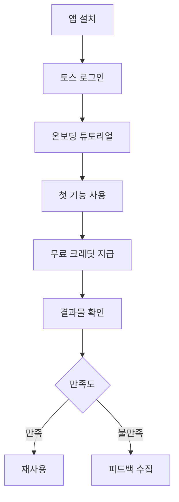
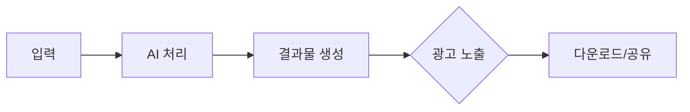
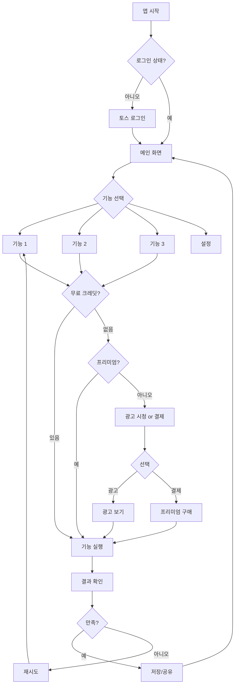
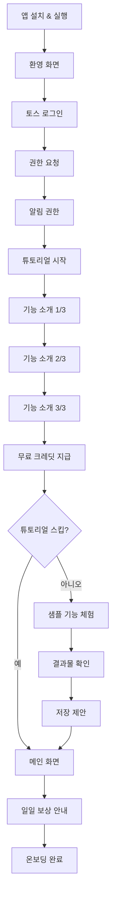
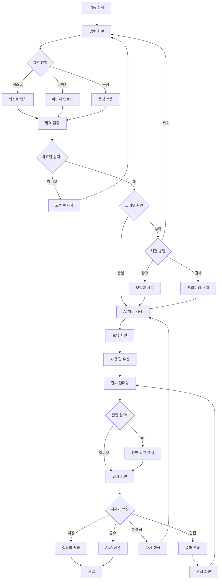
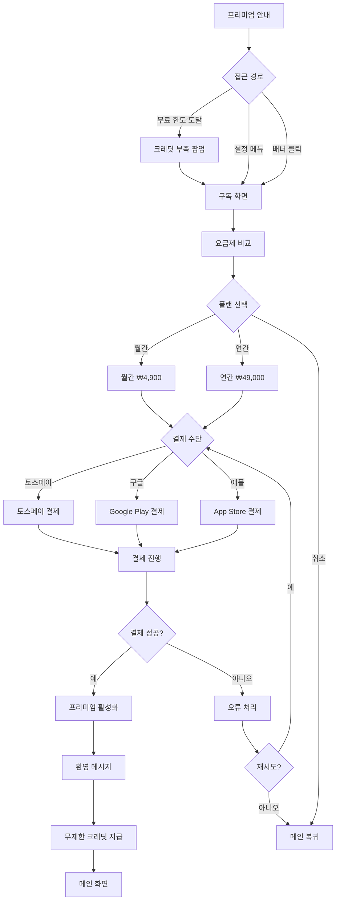
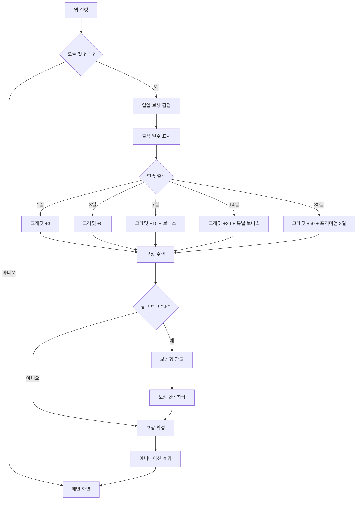
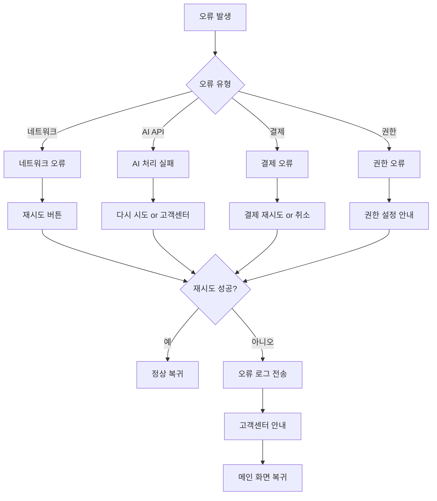

# [앱 이름]

> **카테고리**: [카테고리명]
> **개발 난이도**: ⭐⭐⭐ (1~5)
> **예상 개발 기간**: X주
> **작성일**: 2025-10-27

---

## 📋 목차

1. [개요](#1-개요)
2. [시장 분석 및 경쟁사](#2-시장-분석-및-경쟁사)
3. [핵심 기능 명세](#3-핵심-기능-명세)
4. [사용자 플로우](#4-사용자-플로우)
5. [기술 아키텍처](#5-기술-아키텍처)
6. [비용 최적화 전략](#6-비용-최적화-전략)
7. [수익화 전략](#7-수익화-전략)
8. [개발 로드맵](#8-개발-로드맵)
9. [성공 지표 (KPI)](#9-성공-지표-kpi)
10. [리스크 및 대응 방안](#10-리스크-및-대응-방안)

---

## 1. 개요

### 1.1 한 줄 설명
[앱을 한 문장으로 설명]

### 1.2 문제 정의
**현재 사용자들이 겪는 문제**:
- 문제 1
- 문제 2
- 문제 3

### 1.3 솔루션
**우리 앱이 제공하는 가치**:
- 해결책 1
- 해결책 2
- 해결책 3

### 1.4 타겟 사용자
- **주요 타겟**: 20~40대 [직군/관심사]
- **부가 타겟**: [추가 타겟층]
- **토스 사용자 적합성**: [토스 사용자층과의 시너지 설명]

### 1.5 핵심 가치 제안 (Value Proposition)
1. **[가치 1]**: 구체적 설명
2. **[가치 2]**: 구체적 설명
3. **[가치 3]**: 구체적 설명

---

## 2. 시장 분석 및 경쟁사

### 2.1 시장 규모
- **글로벌 시장**: $X억 (YYYY년)
- **국내 시장**: ₩X억 (YYYY년)
- **성장률**: YoY X% 성장
- **출처**: [시장 조사 자료 링크]

### 2.2 경쟁사 분석

| 경쟁사 | 특징 | 장점 | 단점 | 우리의 차별점 |
|--------|------|------|------|--------------|
| [경쟁사 1] | 설명 | 장점 | 단점 | 차별점 |
| [경쟁사 2] | 설명 | 장점 | 단점 | 차별점 |
| [경쟁사 3] | 설명 | 장점 | 단점 | 차별점 |

### 2.3 시장 포지셔닝
```
고가격 │         [경쟁사 A]
       │
       │   [우리 앱]
       │                [경쟁사 B]
저가격 │ [경쟁사 C]
       └─────────────────────────
         단순       →      복잡
```

### 2.4 시장 진입 전략
- **전략 1**: 설명
- **전략 2**: 설명
- **전략 3**: 설명

---

## 3. 핵심 기능 명세

### 3.1 무료 티어 기능 (Free Tier)

#### 3.1.1 [기능 1]
**설명**: 기능에 대한 상세 설명

**사용자 시나리오**:
```
1. 사용자가 [액션]
2. 앱이 [반응]
3. 결과물 제공: [아웃풋]
```

**기술 구현**:
- **프론트엔드**: [구현 방법]
- **백엔드**: [API 설계]
- **AI 모델**: [사용할 AI]

**제한 사항**:
- 무료: 일/월 X회 제한
- 프리미엄: 무제한

---

#### 3.1.2 [기능 2]
[위와 동일한 형식으로 작성]

---

### 3.2 프리미엄 티어 기능 (Premium Tier)

#### 3.2.1 [프리미엄 기능 1]
**설명**: 프리미엄 전용 기능 상세 설명

**추가 가치**:
- 무료 대비 X배 향상
- 독점 기능: [설명]

---

### 3.3 기능 우선순위

| 우선순위 | 기능명 | 중요도 | 개발 난이도 | MVP 포함 여부 |
|---------|--------|--------|------------|--------------|
| P0 | [필수 기능 1] | ⭐⭐⭐⭐⭐ | ⭐⭐⭐ | ✅ |
| P1 | [중요 기능 1] | ⭐⭐⭐⭐ | ⭐⭐ | ✅ |
| P2 | [부가 기능 1] | ⭐⭐⭐ | ⭐⭐ | ❌ |

---

## 4. 사용자 플로우

### 4.1 신규 사용자 온보딩


### 4.2 핵심 기능 사용 플로우


### 4.3 프리미엄 전환 플로우
```
무료 한도 도달 → 업그레이드 안내 → 가격 선택 → 결제 → 프리미엄 활성화
```

### 4.4 상세 사용자 플로우 다이어그램

#### 4.4.1 전체 앱 사용 플로우


#### 4.4.2 온보딩 플로우 (신규 사용자)


#### 4.4.3 핵심 기능 실행 플로우


#### 4.4.4 프리미엄 구독 플로우


#### 4.4.5 일일 보상 플로우


#### 4.4.6 오류 처리 플로우


### 4.5 상세 UI/UX 와이어프레임

#### 메인 홈 화면
```
┌─────────────────────────────────────────┐
│  [≡]  [앱명]                    [💎30]  │
├─────────────────────────────────────────┤
│                                         │
│  안녕하세요, [사용자명]님 👋              │
│  오늘 [X]번의 무료 크레딧이 남았어요     │
│                                         │
│  ━━━━━━━━ 추천 기능 ━━━━━━━━━━━━      │
│  ┌─────────────────────────────────┐   │
│  │ 🎨 [기능 1]                      │   │
│  │ [간단한 설명]                    │   │
│  │ 인기 1위 🔥                      │   │
│  └─────────────────────────────────┘   │
│                                         │
│  ┌─────────────────────────────────┐   │
│  │ 📝 [기능 2]                      │   │
│  │ [간단한 설명]                    │   │
│  │ NEW ✨                           │   │
│  └─────────────────────────────────┘   │
│                                         │
│  ┌─────────────────────────────────┐   │
│  │ 🎵 [기능 3]                      │   │
│  │ [간단한 설명]                    │   │
│  └─────────────────────────────────┘   │
│                                         │
│  ━━━━━━━━ 최근 생성 ━━━━━━━━━━━━━     │
│  [썸네일1] [썸네일2] [썸네일3] [더보기]  │
│                                         │
└─────────────────────────────────────────┘
  [🏠 홈] [🎨 기능] [📊 기록] [👤 내정보]
          [배너 광고 320x50]
```

#### 기능 입력 화면
```
┌─────────────────────────────────────────┐
│  [←]  [기능명]                  [💎30]  │
├─────────────────────────────────────────┤
│                                         │
│  ┌───────────────────────────────────┐ │
│  │                                   │ │
│  │  [입력 영역]                       │ │
│  │                                   │ │
│  │  예: 텍스트 입력, 이미지 업로드 등  │ │
│  │                                   │ │
│  │  [추가 옵션 버튼]                  │ │
│  │                                   │ │
│  └───────────────────────────────────┘ │
│                                         │
│  ━━━━━━━━ 옵션 설정 ━━━━━━━━━━━━━     │
│  스타일:  [옵션1▼] [옵션2] [옵션3]      │
│  품질:    [저] [중] [고]                │
│  크기:    [작음] [보통] [큼]            │
│                                         │
│  ━━━━━━━━ 크레딧 사용 ━━━━━━━━━━━━    │
│  이 작업은 💎1 크레딧을 사용합니다       │
│  남은 크레딧: 30개 (오늘 무료)           │
│                                         │
│  ┌─────────────────────────────────┐   │
│  │    [✨ 생성하기]                 │   │
│  └─────────────────────────────────┘   │
│                                         │
│  [ 📺 광고 보고 무료로 생성하기 ]        │
│                                         │
└─────────────────────────────────────────┘
```

#### AI 처리 중 화면
```
┌─────────────────────────────────────────┐
│  [×]  처리 중...                        │
├─────────────────────────────────────────┤
│                                         │
│                                         │
│  ┌───────────────────────────────────┐ │
│  │                                   │ │
│  │       [로딩 애니메이션]            │ │
│  │                                   │ │
│  └───────────────────────────────────┘ │
│                                         │
│           AI가 생성 중입니다...          │
│                                         │
│  ━━━━━━━━━━━━━━━━━━━━━ 45%          │
│                                         │
│  예상 소요 시간: 약 10초                 │
│                                         │
│  💡 팁: 이 앱은 [팁 내용]                │
│                                         │
│                                         │
│  [ 취소 ]                               │
│                                         │
└─────────────────────────────────────────┘
```

#### 결과 화면
```
┌─────────────────────────────────────────┐
│  [←]  결과              [💎29]  [⋮]     │
├─────────────────────────────────────────┤
│                                         │
│  ┌───────────────────────────────────┐ │
│  │                                   │ │
│  │                                   │ │
│  │       [생성된 결과물]              │ │
│  │                                   │ │
│  │                                   │ │
│  └───────────────────────────────────┘ │
│                                         │
│  생성 시간: 8초                          │
│  품질: 고품질                            │
│                                         │
│  ━━━━━━━━ 액션 ━━━━━━━━━━━━━━━━━     │
│  ┌─────────────────────────────────┐   │
│  │    [💾 저장하기]                 │   │
│  └─────────────────────────────────┘   │
│                                         │
│  ┌─────────────────────────────────┐   │
│  │    [🔗 공유하기]                 │   │
│  └─────────────────────────────────┘   │
│                                         │
│  [ 🔄 다시 생성 ]  [ ✏️ 편집 ]          │
│                                         │
│  ━━━━━━━━ 만족하셨나요? ━━━━━━━━━━    │
│  😊 좋아요  |  😐 보통  |  😞 별로       │
│                                         │
└─────────────────────────────────────────┘
```

#### 프리미엄 구독 화면
```
┌─────────────────────────────────────────┐
│  [×]  프리미엄 플랜                      │
├─────────────────────────────────────────┤
│                                         │
│  ✨ 무제한으로 사용하세요!               │
│                                         │
│  ━━━━━━━━ 프리미엄 혜택 ━━━━━━━━━━    │
│  ✅ 무제한 크레딧 (광고 없음)            │
│  ✅ 우선 처리 (3배 빠른 생성)            │
│  ✅ 고품질 모드 사용 가능                │
│  ✅ 워터마크 제거                        │
│  ✅ 클라우드 저장 무제한                 │
│                                         │
│  ━━━━━━━━ 요금제 선택 ━━━━━━━━━━━     │
│  ┌─────────────────────────────────┐   │
│  │ 💎 월간 플랜                     │   │
│  │ ₩4,900 / 월                     │   │
│  │                                 │   │
│  │ [ 선택 ▶ ]                      │   │
│  └─────────────────────────────────┘   │
│                                         │
│  ┌─────────────────────────────────┐   │
│  │ 💎 연간 플랜 (가장 인기!) 🔥     │   │
│  │ ₩49,000 / 년 (월 ₩4,083)       │   │
│  │ 2개월 무료!                      │   │
│  │                                 │   │
│  │ [ 선택 ▶ ]                      │   │
│  └─────────────────────────────────┘   │
│                                         │
│  결제 수단: 토스페이, 구글, 애플          │
│                                         │
│  [ 나중에 ]                             │
│                                         │
└─────────────────────────────────────────┘
```

#### 크레딧 부족 팝업
```
┌─────────────────────────────────────────┐
│  [×]  크레딧이 부족합니다                │
├─────────────────────────────────────────┤
│                                         │
│  오늘의 무료 크레딧을 모두 사용했어요     │
│                                         │
│  ━━━━━━━━ 해결 방법 ━━━━━━━━━━━━━     │
│                                         │
│  ┌─────────────────────────────────┐   │
│  │ 📺 광고 보고 크레딧 받기          │   │
│  │ +3 크레딧 (오늘 2/3회 남음)      │   │
│  │                                 │   │
│  │      [광고 보기 ▶]              │   │
│  └─────────────────────────────────┘   │
│                                         │
│  ┌─────────────────────────────────┐   │
│  │ ✨ 프리미엄 구독하기              │   │
│  │ 무제한 사용 (광고 없음)           │   │
│  │ 월 ₩4,900                       │   │
│  │                                 │   │
│  │      [구독하기 ▶]               │   │
│  └─────────────────────────────────┘   │
│                                         │
│  ⏰ 내일 오전 0시에 무료 크레딧 충전     │
│                                         │
│  [ 취소 ]                               │
│                                         │
└─────────────────────────────────────────┘
```

#### 내 정보/설정 화면
```
┌─────────────────────────────────────────┐
│  [←]  내 정보                           │
├─────────────────────────────────────────┤
│                                         │
│  ┌───────────────────────────────────┐ │
│  │ 👤 [사용자명]                      │ │
│  │ user@toss.im                      │ │
│  │ 무료 플랜 → [프리미엄 구독하기 ▶]  │ │
│  └───────────────────────────────────┘ │
│                                         │
│  ━━━━━━━━ 사용 현황 ━━━━━━━━━━━━━━    │
│  오늘 남은 크레딧: 💎 25/30             │
│  총 생성 횟수: 145회                     │
│  가입일: 2025-10-15                     │
│                                         │
│  ━━━━━━━━ 계정 ━━━━━━━━━━━━━━━━━     │
│  - 🔗 토스 계정 연동                     │
│  - 🔔 알림 설정                          │
│  - 🌐 언어: 한국어                       │
│  - 🎨 테마: 자동                         │
│                                         │
│  ━━━━━━━━ 지원 ━━━━━━━━━━━━━━━━━     │
│  - 📧 고객센터                           │
│  - 📜 이용약관                           │
│  - 🔒 개인정보 처리방침                  │
│  - ℹ️ 버전 정보: 1.3.2                  │
│                                         │
│  ━━━━━━━━ 기타 ━━━━━━━━━━━━━━━━━     │
│  - 🗑️ 캐시 삭제                         │
│  - 🚪 로그아웃                           │
│                                         │
└─────────────────────────────────────────┘
```

#### 히스토리/기록 화면
```
┌─────────────────────────────────────────┐
│  [←]  내 작업 기록              [🔍]     │
├─────────────────────────────────────────┤
│                                         │
│  [전체] [저장됨] [공유됨] [삭제됨]       │
│  ────                                   │
│                                         │
│  오늘 (5)                                │
│  ┌─────────────────────────────────┐   │
│  │ [썸네일] 15:23  [기능명]         │   │
│  │ "입력 내용 미리보기..."          │   │
│  │ [⋮]                              │   │
│  └─────────────────────────────────┘   │
│                                         │
│  ┌─────────────────────────────────┐   │
│  │ [썸네일] 14:10  [기능명]         │   │
│  │ "입력 내용 미리보기..."          │   │
│  │ [⋮]                              │   │
│  └─────────────────────────────────┘   │
│                                         │
│  어제 (8)                                │
│  ┌─────────────────────────────────┐   │
│  │ [썸네일] 23:45  [기능명]         │   │
│  │ "입력 내용 미리보기..."          │   │
│  │ [⋮]                              │   │
│  └─────────────────────────────────┘   │
│                                         │
│  이번 주 (27)                            │
│  ┌─────────────────────────────────┐   │
│  │ [썸네일] 10/25  [기능명]         │   │
│  │ "입력 내용 미리보기..."          │   │
│  │ [⋮]                              │   │
│  └─────────────────────────────────┘   │
│                                         │
└─────────────────────────────────────────┘
```

#### 일일 보상 팝업
```
┌─────────────────────────────────────────┐
│  [×]  일일 보상 🎁                       │
├─────────────────────────────────────────┤
│                                         │
│         연속 출석 3일차!                 │
│                                         │
│  ┌─────┐ ┌─────┐ ┌─────┐ ┌─────┐      │
│  │ ✅   │ │ ✅   │ │ 🎁   │ │ 🔒   │      │
│  │Day 1│ │Day 2│ │Day 3│ │Day 4│      │
│  │ +3💎│ │ +3💎│ │ +5💎│ │ +5💎│      │
│  └─────┘ └─────┘ └─────┘ └─────┘      │
│                                         │
│  ┌─────┐ ┌─────┐ ┌─────┐              │
│  │ 🔒   │ │ 🔒   │ │ 🔒   │              │
│  │Day 5│ │Day 6│ │Day 7│              │
│  │ +5💎│ │ +8💎│ │+10💎│              │
│  └─────┘ └─────┘ └─────┘              │
│                                         │
│  오늘의 보상                             │
│  ┌─────────────────────────────────┐   │
│  │                                 │   │
│  │        💎 +5 크레딧              │   │
│  │                                 │   │
│  └─────────────────────────────────┘   │
│                                         │
│  ┌─────────────────────────────────┐   │
│  │ 📺 광고 보고 2배로 받기!          │   │
│  │ → 💎 +10 크레딧                  │   │
│  │                                 │   │
│  │      [광고 보기 ▶]              │   │
│  └─────────────────────────────────┘   │
│                                         │
│  [그냥 받기]                             │
│                                         │
└─────────────────────────────────────────┘
```

#### 공유 화면
```
┌─────────────────────────────────────────┐
│  [×]  공유하기                           │
├─────────────────────────────────────────┤
│                                         │
│  ┌───────────────────────────────────┐ │
│  │                                   │ │
│  │     [미리보기 이미지]              │ │
│  │                                   │ │
│  └───────────────────────────────────┘ │
│                                         │
│  ━━━━━━━━ 공유 옵션 ━━━━━━━━━━━━━     │
│                                         │
│  ┌─────────────────────────────────┐   │
│  │ 📱 토스 피드에 공유               │   │
│  │ 보상: 💎 +2 크레딧 (1일 1회)     │   │
│  └─────────────────────────────────┘   │
│                                         │
│  ┌─────────────────────────────────┐   │
│  │ 💬 카카오톡                      │   │
│  └─────────────────────────────────┘   │
│                                         │
│  ┌─────────────────────────────────┐   │
│  │ 📷 인스타그램 스토리              │   │
│  └─────────────────────────────────┘   │
│                                         │
│  ┌─────────────────────────────────┐   │
│  │ 🔗 링크 복사                     │   │
│  └─────────────────────────────────┘   │
│                                         │
│  ┌─────────────────────────────────┐   │
│  │ 💾 이미지로 저장                 │   │
│  └─────────────────────────────────┘   │
│                                         │
└─────────────────────────────────────────┘
```

### 4.6 UI/UX 디자인 원칙

#### 1. AI 앱 최적화
- **빠른 응답**: AI 처리 중 진행률 표시 + 예상 시간
- **명확한 입력**: 예시 및 가이드 제공
- **결과 만족도**: 평가 및 피드백 수집
- **재생성 용이**: 빠른 재시도 옵션

#### 2. 터치 최적화
- **최소 터치 영역**: 44x44pt (iOS), 48x48dp (Android)
- **버튼 간격**: 최소 8pt 이상
- **스와이프 제스처**: 히스토리 넘기기, 삭제 등

#### 3. 크레딧 시스템 가시화
- **항상 표시**: 상단 바에 현재 크레딧 표시
- **사용 전 확인**: 크레딧 소비량 명시
- **충전 방법**: 광고/구독 명확히 제시

#### 4. 시각적 피드백
- **처리 중**: 로딩 애니메이션 + 진행률 + 팁
- **성공**: 결과 페이드인 + 햅틱 피드백
- **오류**: 명확한 오류 메시지 + 해결 방법

#### 5. 접근성
- **색상 대비**: WCAG AA 기준 (4.5:1)
- **폰트 크기**: 최소 14pt (본문), 18pt (제목)
- **다크 모드**: 시스템 설정 따름

#### 6. 광고 배치 원칙
- **배너 광고**: 하단 고정 (콘텐츠 방해 최소화)
- **전면 광고**: 결과 확인 후 (자연스러운 타이밍)
- **보상형 광고**:
  - 크레딧 부족 시 제안
  - 일일 보상 2배
  - 명확한 가치 제안 (크레딧 +3)

#### 7. 온보딩 플로우
```
1. 환영 화면 (3초)
   ↓
2. 토스 로그인
   ↓
3. 권한 요청 (알림)
   ↓
4. 튜토리얼 (스킵 가능)
   - 기능 소개 3개
   - 샘플 체험
   ↓
5. 무료 크레딧 지급
   ↓
6. 메인 화면 진입
```

---

## 5. 기술 아키텍처

### 5.1 전체 아키텍처 다이어그램
```
┌─────────────────────────────────────────────┐
│          React Native 앱 (Expo)             │
│  - UI/UX (Tamagui / NativeWind)             │
│  - 상태 관리 (Zustand)                        │
│  - 캐싱 (React Query)                        │
└─────────────────┬───────────────────────────┘
                  │
        ┌─────────▼─────────┐
        │   Firebase Auth   │ (무료)
        │   토스 로그인 API  │
        └─────────┬─────────┘
                  │
        ┌─────────▼─────────────────────────────┐
        │  Vercel Edge Functions / CF Workers   │
        │  - API 라우팅                          │
        │  - AI 모델 호출                        │
        │  - 사용량 제한 (Rate Limiting)         │
        └─────────┬─────────────────────────────┘
                  │
        ┌─────────▼─────────┐
        │  Google Gemini 2.5 │ (무료)
        │  또는 Groq Llama   │
        └─────────┬─────────┘
                  │
        ┌─────────▼─────────────────┐
        │   Firebase Firestore      │ (무료)
        │   - 사용자 데이터          │
        │   - 생성 이력              │
        └───────────────────────────┘
```

### 5.2 기술 스택 상세

#### 5.2.1 프론트엔드
- **플랫폼**: React Native (Expo SDK 51+)
- **UI 라이브러리**: Tamagui / React Native Paper
- **스타일링**: NativeWind (Tailwind for RN)
- **상태 관리**: Zustand (전역) + React Query (서버 상태)
- **라우팅**: Expo Router (파일 기반)
- **폼 처리**: React Hook Form + Zod 검증
- **애니메이션**: React Native Reanimated

#### 5.2.2 백엔드 (서버리스)
- **컴퓨팅**: Vercel Edge Functions (100만 실행/월 무료)
- **대안**: Cloudflare Workers (1,000만 요청/월 무료)
- **API 스타일**: tRPC (타입 안전 통신)
- **검증**: Zod 스키마

#### 5.2.3 데이터베이스
- **주 DB**: Firebase Firestore (1GB + 150만 읽기/월 무료)
- **대안**: Cloudflare D1 (5GB + 1.5억 읽기/월 무료)
- **캐싱**: React Query (클라이언트 사이드, 5분 staleTime)
- **구현 방식**: 트랜잭션 기반 쓰기, 인덱스 최적화

#### 5.2.4 AI/ML
- **텍스트 생성**: Google Gemini 2.5 (무료 무제한)
- **대화형 AI**: Groq Llama 3.1 (14,400 요청/일 무료)
- **이미지 처리**: Hugging Face Inference API (무료)
- **음성 인식**: Google Speech-to-Text (60분/월 무료)
- **폴백 전략**: 1순위 Gemini → 2순위 Groq → 무료 한도 초과 시 사용 제한

#### 5.2.5 파일 저장소
- **저장소**: Cloudflare R2 (10GB 무료, 대역폭 무제한)
- **대안**: Firebase Storage (5GB 무료)
- **최적화**: 클라이언트 사이드 압축 (expo-image-manipulator)
- **포맷**: 이미지 WebP, 문서 PDF

#### 5.2.6 인증
- **기본**: Firebase Auth (무료 무제한)
- **토스 연동**: 토스 앱인토스 로그인 API (OAuth 2.0)
- **세션 관리**: Firebase Session (자동 갱신)
- **보안**: mTLS 인증서 (토스페이 결제 시)

#### 5.2.7 모니터링
- **에러 추적**: Sentry (5,000 이벤트/월 무료)
- **분석**: Google Analytics 4 (완전 무료)
- **성능**: Firebase Performance Monitoring (무료)
- **로그**: Cloudflare Logs (무료)

### 5.3 API 설계

#### 5.3.1 핵심 엔드포인트

**1. AI 생성 API**
- **엔드포인트**: `POST /api/generate`
- **요청 데이터**: 사용자 ID, 입력 텍스트, 옵션(스타일, 길이)
- **응답 데이터**: 생성 결과, 남은 크레딧, 생성 ID
- **구현 방식**: tRPC + Zod 스키마 검증
- **처리 시간**: 평균 3-8초

**2. 사용자 크레딧 조회**
- **엔드포인트**: `GET /api/user/credits`
- **요청 데이터**: 사용자 ID (인증 토큰)
- **응답 데이터**: 남은 크레딧, 일일 한도, 리셋 시간
- **구현 방식**: Firestore 쿼리 + React Query 캐싱 (5분)
- **캐싱 전략**: 클라이언트 사이드 캐시로 API 호출 최소화

**3. 히스토리 조회**
- **엔드포인트**: `GET /api/history?limit=20&offset=0`
- **요청 데이터**: 페이지네이션 파라미터 (limit, offset)
- **응답 데이터**: 생성 이력 배열(ID, 입력, 결과, 생성 시간), 전체 개수
- **구현 방식**: Firestore 쿼리 + 복합 인덱스 최적화
- **정렬**: createdAt 역순 (최신순)

### 5.4 데이터 모델

#### 5.4.1 Firestore 컬렉션 구조

**users 컬렉션**
- **기본 정보**: userId (Firebase UID), email, displayName
- **토스 연동**: tossUserId (선택적)
- **티어**: tier ("free" | "premium")
- **크레딧**: remaining (남은 크레딧), limit (일일 한도), resetAt (리셋 시간)
- **구독**: plan (monthly/yearly), startedAt, expiresAt, provider (toss/google/apple)
- **타임스탬프**: createdAt, lastActiveAt
- **인덱스**: userId (primary), email (unique)

**generations 컬렉션**
- **식별자**: generationId, userId
- **데이터**: input (입력 텍스트), result (생성 결과)
- **메타**: model ("gemini-2.5" | "llama-3.1"), tokensUsed, processingTime (ms)
- **타임스탬프**: createdAt
- **인덱스**: userId + createdAt (복합 인덱스)
- **TTL**: 90일 후 자동 삭제 (비용 절감)

**analytics 컬렉션 (일일 집계)**
- **날짜**: date (YYYY-MM-DD)
- **사용자**: totalGenerations, uniqueUsers
- **수익**: premiumConversions, adRevenue
- **집계 방식**: 매일 자정 Cloud Function으로 자동 집계

### 5.5 보안 설계

#### 5.5.1 인증 & 권한
- **Firebase Auth**: 이메일/소셜 로그인
- **토스 mTLS**: 토스페이 결제 시 필수
- **Rate Limiting**: Cloudflare Workers로 IP별 요청 제한
- **API Key 관리**: Vercel Environment Variables

#### 5.5.2 데이터 보호
- **전송 암호화**: HTTPS (TLS 1.3)
- **저장 암호화**: Firestore 자동 암호화
- **민감 정보**: 개인정보는 암호화 후 저장

---

## 6. 비용 최적화 전략

### 6.1 서버 비용 제로 목표

#### 6.1.1 무료 티어 활용 전략
| 서비스 | 무료 한도 | 예상 사용량 (MAU 10K) | 여유분 |
|--------|----------|---------------------|--------|
| Vercel Edge Functions | 100만 실행/월 | 30만 실행 | 70만 (70%) |
| Firebase Firestore | 150만 읽기/월 | 120만 읽기 | 30만 (20%) |
| Google Gemini 2.5 | 무제한 | 무제한 | ✅ |
| Cloudflare R2 | 10GB 저장 | 2GB | 8GB (80%) |

#### 6.1.2 클라이언트 사이드 처리 극대화
**서버 부하 제거 전략**:
1. **PDF 생성**: react-pdf (클라이언트에서 생성)
2. **이미지 압축**: expo-image-manipulator (로컬 처리)
3. **데이터 캐싱**: React Query (5분 캐시)
4. **오프라인 지원**: AsyncStorage (로컬 DB)

#### 6.1.3 AI API 비용 절감 전략

**1. 프롬프트 최적화**
- 불필요한 텍스트 제거로 토큰 30% 절약
- 템플릿 기반 프롬프트 재사용
- 구현: 입력 전처리 함수로 자동 압축

**2. 무료 API 우선 폴백 전략**
- 1순위: Google Gemini 2.5 (무제한 무료)
- 2순위: Groq Llama 3.1 (14,400 요청/일 무료)
- 3순위: 유료 API (비상 시만 사용)
- 구현: 순차적 폴백 로직, 실패 시 자동 전환

**3. 결과 캐싱**
- 동일 입력 해시값으로 재활용 (React Query)
- 캐싱 기간: 24시간
- 예상 절감: API 호출 40% 감소
- 구현: 입력 해시 → 캐시 조회 → API 호출

### 6.2 확장 시 비용 예측

| MAU | API 호출 | Firestore 읽기 | 예상 비용 |
|-----|---------|---------------|----------|
| 10,000 | 40,000 | 120,000 | **₩0** ✅ |
| 30,000 | 120,000 | 360,000 | **₩0** ✅ |
| 50,000 | 200,000 | 600,000 | ₩5,000 (Firestore 초과분) |
| 100,000 | 400,000 | 1,200,000 | ₩15,000 |

### 6.3 비용 최소화 대응 방안 (MAU 50,000+ 대응)

#### 방안 1: Cloudflare D1 마이그레이션
- **전환 계획**: Firestore → Cloudflare D1
- **D1 무료 한도**: 1.5억 읽기/월 (Firestore의 100배)
- **예상 비용**: MAU 100만까지 ₩0
- **마이그레이션 방법**: 점진적 데이터 이전, 듀얼 쓰기 방식
- **구현 시점**: MAU 50,000 도달 시

#### 방안 2: 사용량 제한 강화
- **무료 티어 제한**: 일 3회 / 월 30회
- **제한 방식**: 서버 사이드 검증
- **사용자 안내**: 한도 도달 시 광고 시청 또는 프리미엄 전환 유도
- **예상 효과**: API 호출 30% 감소

#### 방안 3: 캐싱 강화
- **캐싱 전략**: React Query staleTime 10분, cacheTime 30분
- **캐시 대상**: 사용자 프로필, 히스토리, 설정
- **무효화 정책**: 데이터 변경 시 즉시 무효화
- **예상 효과**: API 호출 50% 감소

### 6.4 제로 비용 가능 여부
**결론**: ✅ **가능** (MAU 30,000까지 완전 무료)
- MAU 50,000+ 시 월 ₩5,000~₩15,000 예상 (극히 저렴)

---

## 7. 수익화 전략

### 7.1 수익 모델 개요

#### 7.1.1 하이브리드 모델
```
총 사용자 100%
├─ 무료 사용자 70% → 광고 수익
└─ 프리미엄 사용자 3% → 구독 수익
   나머지 27% → 이탈 또는 전환 대기
```

### 7.2 광고 수익화 (AdMob + GA4)

#### 7.2.1 광고 배치 전략
| 광고 타입 | 배치 위치 | 노출 빈도 | 예상 eCPM | 예상 수익 (MAU 10K) |
|----------|----------|----------|----------|-------------------|
| **배너 광고** | 화면 하단 고정 | 항상 표시 | ₩500-2,000 | 월 60만원 |
| **전면 광고** | 기능 완료 후 (생성 완료) | 2회당 1번 | ₩3,000-10,000 | 월 180만원 |
| **보상형 광고** | 무료 크레딧 지급 (+5회) | 사용자 선택 | ₩10,000-25,000 | 월 240만원 |
| **합계** | - | - | - | **월 480만원** |

#### 7.2.2 AdMob 통합 계획

**전면 광고 (Interstitial)**
- **SDK**: expo-ads-admob
- **표시 타이밍**: 기능 완료 후 (2회당 1번)
- **주요 플로우**: setAdUnitID → requestAdAsync → showAdAsync
- **에러 핸들링**: 광고 로드 실패 시 사용자 플로우 유지
- **테스트 ID**: 개발 중 테스트 광고 ID 사용

**보상형 광고 (Rewarded)**
- **SDK**: expo-ads-admob
- **보상**: 크레딧 +5개
- **이벤트**: rewardedVideoUserDidEarnReward 리스너
- **보상 지급**: 광고 시청 완료 시 서버 검증 후 지급
- **일일 제한**: 최대 3회까지 시청 가능

#### 7.2.3 GA4 이벤트 트래킹

**주요 트래킹 이벤트**
- **광고 노출**: ad_impression (광고 타입, 유닛 ID, eCPM)
- **광고 클릭**: ad_click (광고 타입, 예상 수익)
- **결제 완료**: purchase (상품 ID, 금액, 통화)
- **기능 사용**: feature_used (기능명, 소요 시간)

**구현 방식**
- SDK: @react-native-firebase/analytics
- 이벤트 발생 시점: 각 액션 완료 후 즉시
- 파라미터: 표준 GA4 이벤트 형식 준수
- 분석: Looker Studio 대시보드로 시각화

### 7.3 인앱 결제 (구독 수익)

#### 7.3.1 가격 정책
| 플랜 | 가격 | 할인율 | 혜택 | 목표 전환율 |
|------|------|-------|------|-----------|
| **월간 프리미엄** | ₩4,900 | - | 무제한 생성 + 광고 제거 | 2% |
| **연간 프리미엄** | ₩49,000 | 17% (월 ₩4,083) | 월간 + 독점 기능 | 1% |
| **전체 전환율** | - | - | - | **3%** |

#### 7.3.2 플랫폼별 결제 통합

**토스페이 (웹/앱인토스)**
- **SDK**: @tosspayments/payment-sdk
- **인증**: mTLS 클라이언트 인증서 필수
- **결제 플로우**: requestPayment → 사용자 결제 → successUrl/failUrl 리다이렉트
- **파라미터**: amount, orderId, orderName, successUrl, failUrl
- **검증**: 서버 사이드 결제 검증 (webhook)

**Google Play 인앱결제**
- **SDK**: expo-in-app-purchases
- **상품 ID**: premium_monthly, premium_yearly
- **결제 플로우**: connectAsync → getProductsAsync → purchaseItemAsync
- **영수증 검증**: Google Play Developer API로 서버 검증
- **구독 관리**: 자동 갱신, 취소, 환불 처리

**Apple In-App Purchase**
- **SDK**: expo-in-app-purchases (Android와 동일 API)
- **상품 ID**: premium_monthly, premium_yearly
- **결제 플로우**: connectAsync → purchaseItemAsync
- **영수증 검증**: App Store Server API로 서버 검증
- **구독 관리**: 자동 갱신, StoreKit 2 지원

### 7.4 수익 예측 시뮬레이션

#### 7.4.1 보수적 시나리오 (MAU 10,000)

**광고 수익 계산**
- 배너 광고: MAU 10,000 × 70% × 30일 × eCPM ₩1,000 × 노출률 0.2% = 월 60만원
- 전면 광고: MAU 10,000 × 70% × 30일 × 0.5회 × eCPM ₩5,000 = 월 180만원
- 보상형 광고: MAU 10,000 × 70% × 30일 × 0.3회 × eCPM ₩15,000 = 월 240만원
- **총 광고 수익**: 월 480만원

**구독 수익 계산**
- 월간 플랜: MAU 10,000 × 2% × ₩4,900 = 월 98만원
- 연간 플랜: MAU 10,000 × 1% × ₩49,000 / 12 = 월 49만원
- **총 구독 수익**: 월 147만원

**총 수익**: 월 627만원

#### 7.4.2 낙관적 시나리오 (MAU 60,000, 바이럴 성공)

**광고 수익**: 월 480만원 × 6 × 0.8 (참여도 증가) = 월 2,304만원
**구독 수익**: 월 147만원 × 6 × 1.2 (전환율 증가) = 월 1,058만원
**총 수익**: 월 3,362만원

### 7.5 ARPU 및 LTV 계산

#### 7.5.1 ARPU (Average Revenue Per User)
- **계산식**: (광고 수익 + 구독 수익) / MAU
- **MAU 10,000 기준**: (480만원 + 147만원) / 10,000
- **결과**: ₩627 per user/month

#### 7.5.2 LTV (Lifetime Value)
- **계산식**: ARPU × 평균 사용 기간 × (1 - 이탈률)
- **평균 사용 기간**: 6개월 (보수적 추정)
- **이탈률**: 30%
- **계산**: ₩627 × 6 × 0.7
- **결과**: ₩2,633 per user

---

## 8. 개발 로드맵

### 8.1 Phase 1: MVP 개발 (2주)

#### Week 1: 핵심 기능 구현
- [ ] **Day 1-2**: 프로젝트 셋업
  - Expo 프로젝트 생성
  - Firebase 설정
  - Vercel 프로젝트 생성
  - 기본 UI 컴포넌트 구성

- [ ] **Day 3-5**: AI 기능 통합
  - Google Gemini API 연동
  - AI 프롬프트 최적화
  - 결과물 생성 로직
  - 에러 핸들링

- [ ] **Day 6-7**: 사용자 인증 & DB
  - Firebase Auth 연동
  - Firestore 데이터 모델 구현
  - 사용자 크레딧 시스템
  - 히스토리 저장

#### Week 2: UI/UX 완성 및 테스트
- [ ] **Day 8-10**: UI/UX 구현
  - 메인 화면 디자인
  - 입력/출력 화면
  - 결과물 표시 및 다운로드
  - 로딩 상태 & 에러 화면

- [ ] **Day 11-12**: 테스트 & 버그 수정
  - 기능 테스트
  - 성능 최적화
  - 버그 수정

- [ ] **Day 13-14**: 배포 준비
  - EAS Build 설정
  - 토스 앱인토스 콘솔 등록
  - 내부 테스트 배포

### 8.2 Phase 2: 수익화 통합 (1주)

#### Week 3: AdMob & 결제
- [ ] **Day 15-16**: AdMob 통합
  - AdMob 계정 생성
  - 광고 유닛 설정
  - SDK 연동 (배너, 전면, 보상형)
  - 광고 테스트

- [ ] **Day 17-18**: 인앱 결제
  - 토스페이 연동
  - Google Play Billing
  - Apple IAP
  - 구독 관리 로직

- [ ] **Day 19-20**: GA4 트래킹
  - Firebase Analytics 설정
  - 커스텀 이벤트 정의
  - 퍼널 분석 설정

- [ ] **Day 21**: 통합 테스트
  - 결제 플로우 테스트
  - 광고 노출 확인
  - 분석 데이터 검증

### 8.3 Phase 3: 검수 및 런칭 (1주)

#### Week 4: 검수 제출 및 런칭
- [ ] **Day 22-23**: 토스 앱인토스 검수 제출
  - 4단계 검수 준비
    1. 운영 검수 (서비스 정책)
    2. 디자인 검수 (UI/UX)
    3. 기능 검수 (QA)
    4. 보안 검수 (mTLS, 개인정보)

- [ ] **Day 24-25**: 검수 피드백 반영
  - 수정 사항 적용
  - 재제출

- [ ] **Day 26-27**: 런칭 준비
  - 마케팅 소재 제작
  - 런칭 이벤트 기획
  - 고객 지원 준비

- [ ] **Day 28**: 정식 런칭 🚀
  - 토스 앱인토스 앱 공개
  - 런칭 모니터링
  - 초기 사용자 피드백 수집

### 8.4 Phase 4: 최적화 및 확장 (지속)

#### Month 2-3: 성과 분석 및 개선
- [ ] **Week 5-6**: 데이터 분석
  - GA4 대시보드 분석
  - MAU, DAU, 리텐션 추적
  - 전환율 분석
  - 이탈 지점 파악

- [ ] **Week 7-8**: A/B 테스트
  - 광고 배치 최적화
  - 가격 정책 실험
  - UI/UX 개선 실험

- [ ] **Week 9-12**: 기능 확장
  - 사용자 요청 기능 추가
  - 프리미엄 기능 강화
  - 성능 최적화

---

## 9. 성공 지표 (KPI)

### 9.1 목표 KPI (6개월 후)

| 지표 | 보수적 목표 | 낙관적 목표 | 측정 방법 |
|------|------------|------------|----------|
| **MAU** | 10,000 | 60,000 | GA4 |
| **DAU/MAU 비율** | 20% | 30% | GA4 |
| **D1 리텐션** | 40% | 60% | GA4 Retention Report |
| **D7 리텐션** | 20% | 40% | GA4 Retention Report |
| **D30 리텐션** | 10% | 20% | GA4 Retention Report |
| **프리미엄 전환율** | 2% | 5% | 구독 데이터 |
| **ARPU** | ₩627 | ₩1,200 | 총 수익 / MAU |
| **월 매출** | ₩627만 | ₩3,362만 | AdMob + 결제 합산 |
| **eCPM** | ₩3,000 | ₩8,000 | AdMob 대시보드 |
| **세션당 광고 노출** | 2.5회 | 3.0회 | GA4 |

### 9.2 성장 단계별 마일스톤

#### Milestone 1: 첫 1,000명 (Month 1)
- **목표**: 제품-시장 적합성(Product-Market Fit) 검증
- **핵심 지표**:
  - D7 리텐션 > 30%
  - 평균 세션 길이 > 3분
  - 초기 프리미엄 전환율 > 1%

#### Milestone 2: 10,000 MAU (Month 3)
- **목표**: 수익 모델 검증
- **핵심 지표**:
  - 월 매출 > ₩500만
  - ARPU > ₩500
  - 서버 비용 여전히 ₩0

#### Milestone 3: 50,000 MAU (Month 6)
- **목표**: 스케일링 및 수익성 달성
- **핵심 지표**:
  - 월 매출 > ₩2,000만
  - 서버 비용 < ₩10만 (순이익 99%+)
  - D30 리텐션 > 15%

### 9.3 모니터링 대시보드

#### GA4 주요 리포트
1. **실시간 리포트**: 현재 활성 사용자, 인기 화면
2. **사용자 획득 리포트**: 유입 경로, 캠페인 성과
3. **참여도 리포트**: 세션, 스크린뷰, 이벤트
4. **수익화 리포트**: 광고 수익, 구매 이벤트
5. **리텐션 리포트**: 코호트 분석, 이탈률

#### 커스텀 대시보드 (Looker Studio)
```
┌─────────────────────────────────────┐
│  주요 지표 요약 (오늘/어제/지난주)    │
│  - MAU / DAU                         │
│  - 신규 사용자                        │
│  - 프리미엄 전환                      │
│  - 광고 수익                          │
└─────────────────────────────────────┘
┌─────────────────────────────────────┐
│  사용자 퍼널                          │
│  설치 → 가입 → 첫 사용 → 재사용       │
└─────────────────────────────────────┘
┌─────────────────────────────────────┐
│  수익 분석                            │
│  - 광고 수익 (배너/전면/보상형)        │
│  - 구독 수익 (월간/연간)              │
│  - ARPU 추세                         │
└─────────────────────────────────────┘
```

---

## 10. 리스크 및 대응 방안

### 10.1 기술 리스크

#### Risk 1: AI API 비용 폭증
**발생 가능성**: 중 (무료 API가 유료 전환 시)
**영향도**: 높음

**대응 방안**:
1. **다중 AI 공급자**: Gemini → Groq → OpenRouter 순차 폴백
2. **사용량 모니터링**: 일일 API 호출량 알림 설정
3. **캐싱 강화**: 동일 입력 결과 재활용 (30% 절감)
4. **프롬프트 최적화**: 토큰 사용량 50% 감소

#### Risk 2: 서버 부하 급증
**발생 가능성**: 낮음 (서버리스 자동 확장)
**영향도**: 중

**대응 방안**:
1. **Cloudflare Workers**: 1,000만 요청/월까지 무료
2. **Rate Limiting**: 사용자당 분당 요청 제한
3. **CDN 캐싱**: 정적 에셋 캐싱으로 부하 감소

#### Risk 3: AI 품질 문제
**발생 가능성**: 중 (부적절한 콘텐츠 생성)
**영향도**: 높음 (평판 손상)

**대응 방안**:
1. **콘텐츠 필터링**: Google Perspective API (유해성 검사)
2. **사용자 신고 시스템**: 부적절한 결과 신고 기능
3. **프롬프트 가드레일**: "안전한 결과만 생성하도록" 지시

---

### 10.2 비즈니스 리스크

#### Risk 4: 낮은 프리미엄 전환율
**발생 가능성**: 높음 (일반적으로 1-3%)
**영향도**: 중

**대응 방안**:
1. **가치 강조**: 프리미엄 혜택 명확히 표시
2. **무료 체험**: 7일 무료 체험 제공
3. **A/B 테스트**: 가격, 혜택, 메시지 최적화
4. **리마인더**: 무료 한도 도달 시 업그레이드 유도

#### Risk 5: 경쟁사 등장
**발생 가능성**: 높음
**영향도**: 중

**대응 방안**:
1. **빠른 출시**: 선점 효과 (First Mover Advantage)
2. **차별화**: 토스 앱인토스 독점, 토스페이 통합
3. **네트워크 효과**: 사용자 데이터로 개인화 강화
4. **지속적 개선**: 월 1회 기능 업데이트

#### Risk 6: 사용자 이탈
**발생 가능성**: 중
**영향도**: 높음

**대응 방안**:
1. **푸시 알림**: 사용 유도 (주 1-2회)
2. **이메일 마케팅**: 신규 기능 안내
3. **리텐션 캠페인**: 이탈 위험군에게 특별 혜택
4. **사용자 피드백**: 정기적인 설문조사

---

### 10.3 법률/규제 리스크

#### Risk 7: 개인정보 보호 위반
**발생 가능성**: 낮음 (규정 준수 시)
**영향도**: 매우 높음 (서비스 중단)

**대응 방안**:
1. **개인정보처리방침**: 명확한 고지
2. **최소 수집**: 필요한 정보만 수집
3. **암호화**: 민감 정보 저장 시 암호화
4. **GDPR 대응**: EU 사용자 별도 동의

#### Risk 8: 지적재산권 침해
**발생 가능성**: 낮음
**영향도**: 높음

**대응 방안**:
1. **AI 생성 콘텐츠**: 저작권 면책 조항
2. **사용자 책임**: 사용자가 생성한 콘텐츠 책임 명시
3. **콘텐츠 필터**: 유명 브랜드/인물 차단

---

### 10.4 운영 리스크

#### Risk 9: 고객 지원 부담
**발생 가능성**: 중
**영향도**: 중

**대응 방안**:
1. **FAQ 자동화**: 챗봇으로 자주 묻는 질문 답변
2. **커뮤니티**: 사용자 포럼 운영 (상호 지원)
3. **자동 응답**: 이메일 자동 분류 및 템플릿 답변

#### Risk 10: 서비스 장애
**발생 가능성**: 낮음
**영향도**: 높음

**대응 방안**:
1. **모니터링**: Sentry (에러 실시간 알림)
2. **Uptime 모니터링**: Vercel, Firebase 상태 추적
3. **Fallback**: AI API 장애 시 대체 공급자 자동 전환
4. **상태 페이지**: status.yourapp.com (장애 공지)

---

## 📝 부록

### A. 참고 자료
- [토스 앱인토스 공식 문서](https://developers-apps-in-toss.toss.im/)
- [Google Gemini API Docs](https://ai.google.dev/docs)
- [AdMob 시작 가이드](https://developers.google.com/admob)
- [Firebase 무료 티어 한도](https://firebase.google.com/pricing)

### B. 관련 문서
- [memories/TOSS_APPS_IN_TOSS_REFERENCE.md](../../memories/TOSS_APPS_IN_TOSS_REFERENCE.md)
- [plans/MONETIZATION_STRATEGY.md](../MONETIZATION_STRATEGY.md)
- [plans/ZERO_COST_ARCHITECTURE.md](../ZERO_COST_ARCHITECTURE.md)
- [plans/AI_APP_100_IDEAS.md](../AI_APP_100_IDEAS.md)

### C. 변경 이력
| 날짜 | 버전 | 변경 내용 |
|------|------|----------|
| 2025-10-27 | 1.0 | 초기 문서 작성 |

---

**문의**: 기획 수정이 필요하면 언제든지 요청해주세요.
